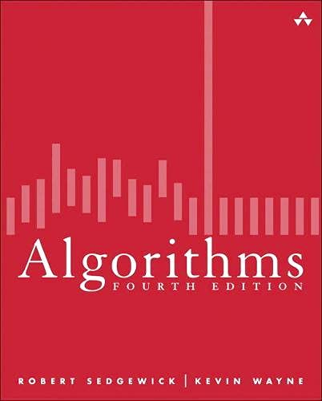

# 알고리즘

### 개정 4판 Robert Sedgewick, Kevin Wayne 저

### 알고리즘

- 컴퓨터 프로그램으로 구현할 수 있는 유한하고, 결정적이며 효과적인 방법론
- 컴퓨터 과학의 분야이자 중추

#### 데이터 구조 자료 구조

- 알고리즘과 데이터 구조는 실과 바늘
- 알고리즘 구현의 부산물이자, 최종 산출물

#### 알고리즘을 공부하는 이유

- 하드웨어의 투자를 최소화하고 성능 향상
- 기본적인 알고리즘을 직접 구현하는 것도 이해도를 높여줌
- 알고리즘 분석학 algorithm analysis : 알고리즘의 성능을 전문으로 연구하는 분야

#### 알고리즘 증가 오더 함수

| 함수    | 설명   | 예시           | 비고           |    
|-------|------|--------------|--------------|
| 1     | 상수   | `a = b + c;` | 두 수의 덧셈      |
| logN  | 로그   | 이진탐색         | 절반으로 분할      |
| N     | 선형   | 루프           | 최댓값 찾기       |
| NlogN | 선형로그 | 분할 정복        | 병합 정렬, 퀵 정렬  |
| N^2   | 제곱   | 2중 반복문       | 모든 짝 조합 검사   |
| N^3   | 세제곱  | 3중 반복문       | 모든 조합 트리플 검사 |
| 2^N   | 지수   | 완전 탐색        | 모든 부분집합 검사   |

## Contents

1. 기초 개념
2. [정렬](contents/2_정렬/README.md)
3. 탐색 알고리즘
4. 그래프
5. 문자열
6. 맥락

