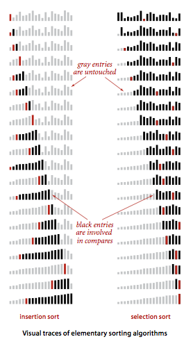
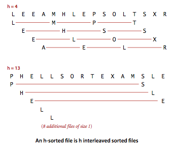
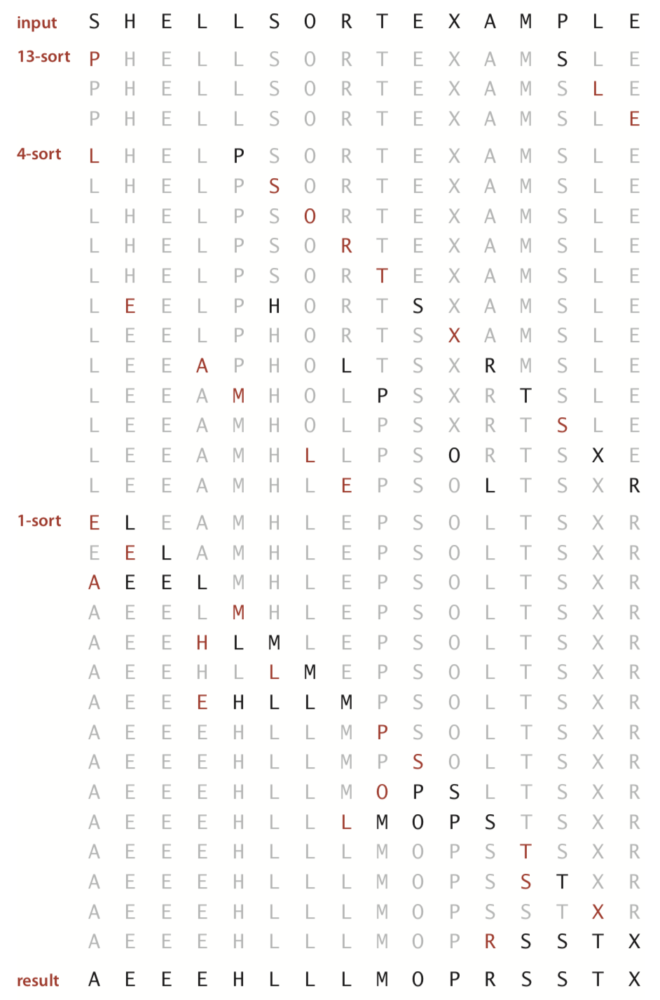
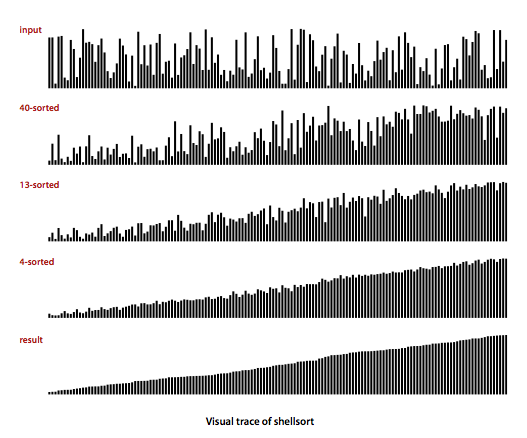

# 1. 기초적인 정렬 방법들

- 게임의 원칙
- 선택 정렬
- 삽입 정렬
- 정렬 알고리즘의 시각화
- 두 정렬 알고리즘의 비교
- 셀(shell)-정렬

---

## 게임의 원칙

```java
public class Example {
    public static void sort(Comparable[] a) {
        // See Algorithms 2.1, 2.2, 2.3, 2.4, 2.5, or 2.7.
    }

    private static boolean less(Comparable v, Comparable w) {
        return v.compareTo(w) < 0;
    }

    private static void exch(Comparable[] a, int i, int j) {
        Comparable swap = a[i];
        a[i] = a[j];
        a[j] = swap;
    }

    private static void show(Comparable[] a) {
        // Print the array, on a single line.
        for (int i = 0; i < a.length; i++)
            System.out.println(a[i] + " ");
        System.out.println();
    }

    public static boolean isSorted(Comparable[] a) {
        // Test whether the array entries are in order.
        for (int i = 1; i < a.length; i++)
            if (less(a[i], a[i - 1]))
                return false;
        return true;
    }

    public static void main(String[] args) {
        // Read strings from standard input, sort them, and print.
        String[] a = new String[]{"c", "a", "b", "d", "e", "f", "g", "h", "i", "j", "k"};
        sort(a);
        assert isSorted(a);
        show(a);
    }
}

```

### 인증

- `assert` : `boolean` 표현식이 `false`이면 `AssertionError`를 던짐
- **정렬 이후 정렬 검증 구문을 추가하는 것이 바람직**

### 실행 시간

- 성능 테스트
- 성능 차이에 대한 가설 수립 -> 실험적으로 가설을 증명할 도구 준비

### 추가 메모리

- 정렬 알고리즘을 위해 필요한 추가 메모리 용량
- 타입 1. 입력 데이터가 저장된 메모리에 직접 작업됨
    - 함수 stack, 인스턴스 변수 외 추가 메모리 필요 없음
- 타입 2. 입력 데이터를 복제 -> 복제 데이터로 정렬
    - 입력 데이터만큼의 추가 메모리 필요

### 데이터의 타입

- `Comparable` 인터페이스 구현체면 효과적으로 정렬 가능 (`sort()` 메서드의 인자로 전달 가능)

```java
public class Date implements Comparable<Date> {
    private final int month, day, year;

    public Date(int m, int d, int y) {
        month = m;
        day = d;
        year = y;
    }

    public int compareTo(Date that) {
        if (this.year < that.year) return -1;
        if (this.year > that.year) return +1;
        if (this.month < that.month) return -1;
        if (this.month > that.month) return +1;
        if (this.day < that.day) return -1;
        if (this.day > that.day) return +1;
        return 0;
    }
}
``` 

#### Java 관례 : `v.compareTo(w)`의 결과

- `v.compareTo(w)`
    - `v < w` : -1
    - `v = w` : 0
    - `v > w` : +1

## 선택 정렬

- 배열 안에 가장 작은 항목을 찾아서 첫 번째 항목과 교환
- 그 다음으로 작은 항목을 찾아 두번쨰 항목과 교환
- 모든 배열이 정렬될 때까지 반복

```java
public class Selection {

    public static void sort(Comparable[] a) {
        // a[]를 오름차순으로 정렬

        int N = a.length;

        for (int i = 0; i < N; i++) {
            // a[i]를 a[i+1..N]에서 가장 작은 원소와 교환
            int min = i; // 가장 작은 원소의 인덱스
            for (int j = i + 1; j < N; j++) {
                if (less(a[j], a[min])) min = j;
            }
            exch(a, i, min);
        }
    }

    public static void main(String[] args) {
        String[] a = new String[]{"c", "a", "b", "d", "e", "f", "g", "h", "i", "j", "k"};
        sort(a);
        assert isSorted(a);
        show(a);
    }

}
```

### 실행 시간이 입력에 민감하다

- 배열을 순회하면서 최솟값을 찾는 절차는 다음 순회에서 작은 항목이 어딨는지 추가정보 주지 않음
- 최악 : 대부분의 정렬되어있는 경우에도 원소 수 만큼의 비교 연산이 필요

### 데이터의 이동을 최소화한다

- 교환횟수는 배열의 크기에 **선형 비례** _N_

## 삽입 정렬

- 원소를 선택해 적절한 위치에 삽입
- 삽입 시 오른쪽 항목을 한칸씩 오른쪽으로 이동
- 원소를 순회하며 원소 왼쪽을 정렬 상태를 만듦
- **최초 배열 정렬 상태에 의존**
    - 정렬되어있을 수록 빨리 끝남
    - 역순쌍 개수가 작을수록

```java
public class Insertion {

    public static void sort(Comparable[] a) {
        // a[]를 오름차순으로 정렬

        int N = a.length;

        for (int i = 1; i < N; i++) {
            // a[i]를 [i-1], [i-2], ... 에서 적절한 위치에 삽입
            for (int j = i; j > 0 && less(a[j], a[j - 1]); j--) {
                exch(a, j, j - 1);
            }
        }
    }

    public static void main(String[] args) {
        String[] a = new String[]{"c", "a", "b", "d", "e", "f", "g", "h", "i", "j", "k"};
        sort(a);
        assert isSorted(a);
        show(a);
    }
}

```

#### 삽입 정렬이 적합한 경우 : 이미 정렬된 배열

- 원소의 위치가 정렬 최종위치에서 멀지 않은 경우
- 정렬된 큰 배열에 작은 배열을 이어 붙인 경우
- 정렬 위치에서 벗어낫 원소 수가 적은 경우

#### 최적화 : 큰항목들을 배열 오른쪽으로 이동 -> 내부 loop 접근 횟수 최소화

- TODO

## 정렬 알고리즘의 시각화



- 삽입정렬은 선택정렬보다 비교횟수가 적음 (평균적으로)

## 두 정렬 알고리즘의 비교

- 삽입정렬, 선택정렬 모두 비교횟수가 입력 크기에 비례 : **최악의 경우에도 _N^2_**
- 삽입정렬은 선택정렬보다 2배 빠름

```java

public class SortCompare {

    public static double time(String alg, Comparable[] a) {
        double start = System.currentTimeMillis();

        if ("Insertion".equals(alg)) {
            Insertion.sort(a);
        }
        if ("Selection".equals(alg)) {
            Selection.sort(a);
        }

        double end = System.currentTimeMillis();

        return end - start;
    }

    public static double timeRandomInput(String alg, int lengthArr, int cntArr) {

        double total = 0.0;
        Double[] a = new Double[lengthArr];

        for (int t = 0; t < cntArr; t++) {
            for (int i = 0; i < lengthArr; i++) {
                a[i] = Math.random();
            }
            total += time(alg, a);
        }

        return total;
    }

    public static void main(String[] args) {
        String algInsertion = "Insertion";
        String algSelection = "Selection";

        int lengthArr = 1000; // 배열의 길이
        int cntArr = 100; // 배열의 개수

        double t1 = timeRandomInput(algInsertion, lengthArr, cntArr);
        double t2 = timeRandomInput(algSelection, lengthArr, cntArr);

        System.out.println("Insertion: " + t1);
        System.out.println("Selection: " + t2);

    }
}

```

```bash
Insertion: 66.0
Selection: 81.0
```

## 셀(shell)-정렬

### 삽입 정렬의 한계

- 삽입 정렬 기반
- 삽입 정렬은 큰 배열에 대해 성능이 떨어짐
    - 가장 작은 원소가 가장 끝에 있다면?
    - 가장 작은 원소가 제자리로 갈때까지 N-1번의 교환 연산이 필요

### h-정렬




- 서로 교차하며 존재하는 h개의 독립된 부분 정렬 시퀀스
- `h` : 간격 (gap)
- h-정렬 시퀀스 : `h` 단위로 정렬된 부분 배열
- `h=4` 정렬
    - 시퀀스 1 : [0], [4], [8], [12]
    - 시퀀스 2 : [1], [5], [9], [13]
    - 시퀀스 3 : [2], [6], [10], [14]
    - 시퀀스 4 : [3], [7], [11], [15]
- `h=13` 정렬
    - 시퀀스 1 : [0], [13]
    - 시퀀스 2 : [1], [14]
    - 시퀀스 3 : [2], [15]

### 셀 정렬



```java

public class Shell {

    public static void sort(Comparable[] a) {
        int N = a.length;
        int h = 1;

        // h-정렬의 간격 설정
        // ..., 121, 40, 13, 4, 1
        while (h < N / 3) {
            h = 3 * h + 1;
        }

        // h-정렬
        while (h >= 1) {
            for (int i = h; i < N; i++) {
                for (int j = i; j >= h && less(a[j], a[j - h]); j -= h) {
                    exch(a, j, j - h);
                }
            }
            h = h / 3;
        }
    }

    public static void main(String[] args) {
        // Read strings from standard input, sort them, and print.
        String[] a = new String[]{"c", "a", "b", "d", "e", "f", "g", "h", "i", "j", "k"};
        sort(a);
        assert isSorted(a);
        show(a);
    }
}
```



### 셸정렬 성능

- 셸 정렬의 성능은 아직까지 연구되지 않음
- 꽤 큰 배열에서도 적ㅈ절한 성능을 보여줌
