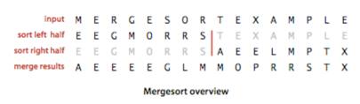
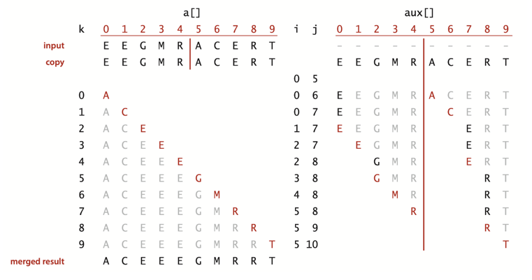
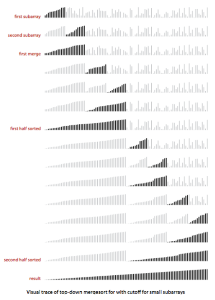
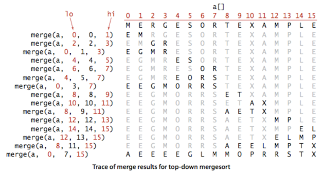

# 2. 병합 정렬

- 즉석 (in-place) 병합의 추상화
- 하향식 (top-down) 병합 정렬
- 상향식 (bottom-up) 병합 정렬
- 정렬의 복잡도

---



- 병합 : 두개의 정렬된 배열을 하나의 큰 정렬된 배열로 합침
- 즉, 배열 정렬시 반으로 나누어 각각 절반에 대해 재귀적으로 정렬을 수행한 다음 결과 병합
- 크기가 _N_ 인 배열을 정렬하는데 _NlogN_ 시간 소요
- 단점 : _N_ 만큼의 메모리 공간이 필요

## 즉석 (in-place) 병합의 추상화

1. 병합 결과를 담을 새로운 배열을 선언
2. 분할된 두 병렬을 하나의 배열로 병합
    - 병합 시, 양쪽 배열의 첫번째 원소를 비교하여 더 작은 원소를 결과 배열에 추가

- 문제점 : 배열이 클수록 1번에서 선언할 배열의 크기가 커짐
- 해결방법 : 원본 배열 안에서 분할하고, 병합 결과를 원본 배열에 저장



````
// a 배열의 정렬된 a[lo..mid]와 정렬된 a[mid+1..hi]를 병합
private static void merge(Comparable[] a, int lo, int mid, int hi) {

  int i = lo, j = mid + 1;

  for (int k = lo; k <= hi; k++) {
      // a[lo..hi]를 aux[lo..hi]에 복사
      aux[k] = a[k];
  }

  for (int k = lo; k <= hi; k++) {
      // 병합된 결과를 a[lo..hi]에 저장
      if (i > mid) a[k] = aux[j++]; // 왼쪽 절반 소진
      else if (j > hi) a[k] = aux[i++]; // 오른쪽 절반 소진
      else if (less(aux[j], aux[i])) a[k] = aux[j++]; // 오른쪽이 더 작으면 오른쪽 원소 삽입
      else a[k] = aux[i++]; // 왼쪽이 더 작으면 왼쪽 원소 삽입
  }
}
````

## 하향식 (top-down) 병합 정렬



```java
public class Merge {

    private static Comparable[] aux; // 병합을 위한 작업용 임시 배열

    public static void sort(Comparable[] a) {
        aux = new Comparable[a.length]; // 임시 배열 생성
        sort(a, 0, a.length - 1); // 재귀 호출
    }

    private static void sort(Comparable[] a, int lo, int hi) {
        if (hi <= lo) return; // 종료 조건

        int mid = lo + (hi - lo) / 2; // 중간 지점 계산

        sort(a, lo, mid); // 왼쪽 절반 정렬
        sort(a, mid + 1, hi); // 오른쪽 절반 정렬

        merge(a, lo, mid, hi); // 병합
    }

    private static void merge(Comparable[] a, int lo, int mid, int hi) {

        int i = lo, j = mid + 1;

        for (int k = lo; k <= hi; k++) {
            // a[lo..hi]를 aux[lo..hi]에 복사
            aux[k] = a[k];
        }

        for (int k = lo; k <= hi; k++) {
            // 병합된 결과를 a[lo..hi]에 저장
            if (i > mid) a[k] = aux[j++]; // 왼쪽 절반 소진
            else if (j > hi) a[k] = aux[i++]; // 오른쪽 절반 소진
            else if (less(aux[j], aux[i])) a[k] = aux[j++]; // 오른쪽이 더 작으면 오른쪽 원소 삽입
            else a[k] = aux[i++]; // 왼쪽이 더 작으면 왼쪽 원소 삽입
        }
    }

    public static void main(String[] args) {
        String[] a = new String[]{"M", "E", "R", "G", "E", "S", "O", "R", "T", "E", "X", "A", "M", "P", "L", "E"};
        sort(a);
        assert Example.isSorted(a);
        Example.show(a);
    }
}
```

````
sort(a, 0, 15)
    sort(a, 0, 7)
        sort(a, 0, 3)
            sort(a, 0, 1)
                merge(a, 0, 0, 1)
            sort(a, 2, 3)
                merge(a, 2, 2, 3)
        sort(a, 4, 7)
            sort(a, 4, 5)
                merge(a, 4, 4, 5)
            sort(a, 6, 7)
                merge(a, 6, 6, 7)
        merge(a, 0, 3, 7)
    sort(a, 8, 15)
        sort(a, 8, 11)
                sort(a, 8, 9)
                    merge(a, 8, 8, 9)
                sort(a, 10, 11)
                    merge(a, 10, 10, 11)
        sort(a, 12, 15)
            sort(a, 12, 13)
                merge(a, 12, 12, 13)
            sort(a, 14, 15)
                merge(a, 14, 14, 15)
            merge(a, 8, 11, 15)
    merge(a, 0, 7, 15)
````



- 부분 배열 a[lo..hi]를 정렬하기 위해 sort(a, lo, hi)를 호출하면
    1. a[lo..mid]와 a[mid+1..hi]로 분할
    2. 각각을 재귀적으로 정렬
    3. 정렬된 두 배열을 병합
- 장점 : 매우 큰 배열에 대해서 실행시간이 logN에 비례
    - 매우 큰 배열에 대해서도 적용 가능
- 단점 : 임시 배열을 저장할 추가 메모리 공간 필요
    - 메모리 절약이 중요하다면 다른 정렬 알고리즘 사용

### 작은 부분 배열에 삽입 정렬 이용하기

- 작은 배열이면 삽입 정렬 (혹은 선택정렬)이 더 단순해서 삽입 정렬이 더 빠를 수 있음
- 작은 부분배열 (크기가 15 이하)에 대해서는 삽입 정렬이 병합 정렬보다 10~15% 더 빠름

```java

@State(Scope.Thread)
@BenchmarkMode(Mode.AverageTime)
@OutputTimeUnit(TimeUnit.MICROSECONDS)
public class CompareSortingMerge {

    private Double[] generateRandomArray(int i) {
        Double[] arr = new Double[i];
        for (int j = 0; j < i; j++) {
            arr[j] = Math.random();
        }
        return arr;
    }

    @Benchmark
    public void sorting_insertion() {
        Double[] arr = generateRandomArray(15);
        Insertion.sort(arr);
    }

    @Benchmark
    public void sorting_merge() {
        Double[] arr = generateRandomArray(15);
        Merge.sort(arr);
    }

    @Benchmark
    public void sorting_insertion_big() {
        Double[] arr = generateRandomArray(1000);
        Insertion.sort(arr);
    }

    @Benchmark
    public void sorting_merge_big() {
        Double[] arr = generateRandomArray(1000);
        Merge.sort(arr);
    }

}
```

```text
Benchmark                                  Mode  Cnt    Score     Error  Units
CompareSortingMerge.sorting_insertion_big  avgt    5  514.804 ± 346.030  us/op
CompareSortingMerge.sorting_merge_big      avgt    5  107.246 ±   1.642  us/op
CompareSortingMerge.sorting_merge          avgt    5    0.733 ±   0.010  us/op
CompareSortingMerge.sorting_insertion      avgt    5    0.416 ±   0.009  us/op
```

### 배열이 이미 정렬된 상태인지 확인하기

- 이미 정렬되어있다면 병합 과정을 생략하고 바로 원본 배열을 반환
- `a[mid] <= a[mid+1]` 이면 이미 정렬된 상태로 간주, `merge()`를 호출하지 않고 바로 반환

### 임시 작업 배열로의 복제 제거 (TODO.)

- sort()에 메서드 호출 2개 이용
    - 하나 : 원본 배열을 입력으로 받아, 정렬 결과를 임시배열에 넣음
    - 둘 : 입시 배열을 입력으로 받아, 정렬 결과를 원본 배열에 넣음
- 재귀 호출이 원본 배열과 임시 배열을 번갈아가며 사용하도록 함

## 상향식 (bottom-up) 병합 정렬

## 정렬의 복잡도

