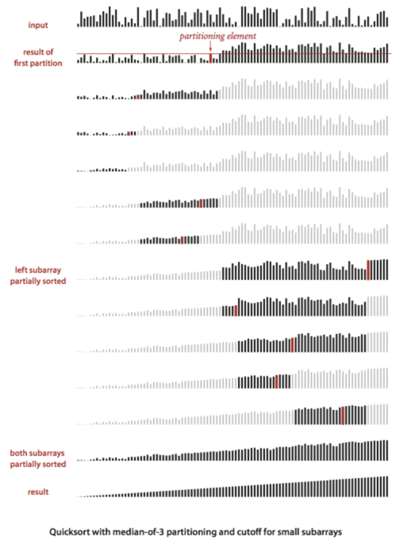
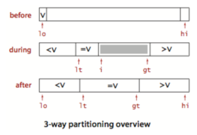
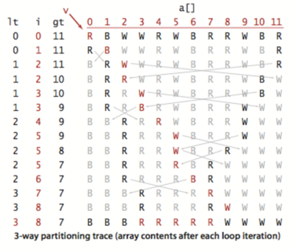
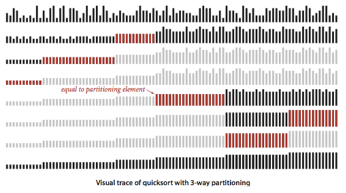

# 3. 퀵 정렬

- 기본 알고리즘
- 성능 특성
- 알고리즘의 개선

---

- 가장 널리 사용되는 정렬 알고리즘
- 장점
    - 구현이 쉬움
    - 다양한 형태의 input
    - 응용 상황에서 다른 정렬 알고리즘보다 빠름
    - 추가적인 메모리 사용 안함 (in-place sorting)
- 크기 N인 배열의 정렬 평균 NlogN
- 단점
    - 부주의한 구현으로 기대 성능 못 냄
    - 잘못 구현하면 N^2

## 기본 알고리즘


- 분할 정복 알고리즘 : 배열을 분할 (partitioning) 하고 각 배열을 독립적으로 정렬
- vs 병합 정렬
    - 병합 정렬 : 부분 배열을 정렬 후 다시 병합
    - 퀵 정렬 : 부분 배열을 정렬하면 전체 배열도 정렬됨

```java
import org.algorithm.lib.StdRandom;

public class Quick {

    public static void sort(Comparable[] a) {
        StdRandom.shuffle(a); // 입력 배열을 섞는다.
        sort(a, 0, a.length - 1);
    }

    private static void sort(Comparable[] a, int lo, int hi) {
        if (hi <= lo) return; // 배열의 크기가 1 이하면 종료

        int j = partition(a, lo, hi); // 분할

        sort(a, lo, j - 1); // 왼쪽 부분 배열을 정렬
        sort(a, j + 1, hi); // 오른쪽 부분 배열을 정렬
    }
}

```


### `partition()` : 재배열, 분할

- 한번의 분할 작업마다 항목 하나씩 위치가 확정됨

#### 조건

- `a[j]`의 `j`는 전체 배열 `a`에서 최종 정렬 후 위치
- `a[lo]` ~ `a[j-1]`은 `a[j]`보다 작거나 같은 원소들
- `a[j+1]` ~ `a[hi]`는 `a[j]`보다 큰 원소들

#### 구현


1. 임의의 항목 `a[lo]`를 분할 기준으로 선택
2. `a[lo]`를 최종 위치로 이동시킴
    1. 배열의 왼쪽 끝부터 `a[lo]` 보다 크거나 같은 원소를 찾을 때까지 스캔
    2. 배열의 오른쪽 끝부터 `a[lo]` 보다 작거나 같은 원소를 찾을 때까지 스캔
    3. 두 원소를 교환
    4. 1~3을 반복
    5. 두 스캔이 엇갈리면 `a[lo]`와 `a[j]` (`a[lo]`보다 작거나 같은 원소 중 가장 오른쪽 원소)를 교환
    6. index `j` 반환

```java

public class Quick {

    public static void sort(Comparable[] a) {
        StdRandom.shuffle(a); // 입력 배열을 섞는다.
        sort(a, 0, a.length - 1);
    }

    private static void sort(Comparable[] a, int lo, int hi) {
        if (hi <= lo) return; // 배열의 크기가 1 이하면 종료

        int j = partition(a, lo, hi); // 분할

        sort(a, lo, j - 1); // 왼쪽 부분 배열을 정렬
        sort(a, j + 1, hi); // 오른쪽 부분 배열을 정렬
    }

    // a[]를 a[lo..j-1], a[j], a[j+1..hi]로 분할하고 j를 반환
    private static int partition(Comparable[] a, int lo, int hi) {
        int i = lo, j = hi + 1; // 왼쪽과 오른쪽 스캔 인덱스
        Comparable v = a[lo]; // 분할 기준 원소

        // 좌/우 끝에서 시작해서 서로 교차할 때까지 반복
        while (true) {
            while (less(a[++i], v)) if (i == hi) break; // 왼쪽부터 v보다 같거나 큰 원소 찾기
            while (less(v, a[--j])) if (j == lo) break; // 오른쪽부터 v보다 같거나 작은 원소 찾기
            if (i >= j) break; // 인덱스가 교차하면 종료
            exch(a, i, j);
        }

        exch(a, lo, j); // v를 a[j]와 교환
        return j; // a[lo..j-1] <= a[j] <= a[j+1..hi]를 만족하도록 분할
    }

    public static void main(String[] args) {
        String[] a = new String[]{"Q", "U", "I", "C", "K", "S", "O", "R", "T", "E", "X", "A", "M", "P", "L", "E"};
        sort(a);
        assert isSorted(a);
        show(a);

    }
}
```


### 즉석 (in-place) 분할

- 추가적인 작업용 배열 사용 시 구현은 쉬워짐
- 단점 1. 분할된 배열을 원본 배열에 복제해 넣는 오버헤드
- 재귀 메서드 안에서 분할 마다 새로운 배열을 생성하면 수행시간 증가

### 경계선 넘지 않기

- `a[lo]`가 최대/최솟 값이라면, 배열의 경계를 넘어가지 않도록 조건 필요
- `(j == lo)` 는 불필요
    - `a[lo]` 가 배열의 가장 좌축, 자기보다 자기 자신이 더 작을 수는 없음 (while 종료)
- TODO. 오른쪽 경계 검사 생략하기

### 무작위성의 유지

- 입력 배열을 알고리즘 진행 전에 무작위로 섞기
- 혹은, `parition()` 안에서 `v`를 무작위로 선택하기

### 루프의 종료

- 루프의 종료조건을 가지는 것에 매우 신경써야함
- 포인터가 서로 교차 했는지 올바르게 검사하기
- `v` 와 동일한 값을 가지는 원소가 있을 수 있는 것을 고려할 것

### 분할 기준 항목과 동일한 키를 가지는 배열 항목 다루기

- 좌측부터 크거나 같은 항목이 있을 때까지 스캔
- 우측부터 작거나 같은 항목이 있을 때까지 스캔
- 단점 : `v` 와 동일한 값을 가지는 항목과 교환하는 횟수가 발생
- 장점 : 특정 활용 환경에서 N^2 시간이 걸리는 것을 막음 (TODO. 왜?)

### 재귀 호출의 종료

- 재귀 호출에 종료조건을 반드시 가져야함
- 퀵정렬의 가장 많은 실수 : 무한 루프에 빠지는 것
- 매 루프마다 반드시 항목 하나는 정위치에 가야함
    - 재위치에 갈 로직이 잘못되면 무한 루프에 빠짐

## 성능 특성

- 퀵 정렬의 성능은 수학적으로 매우 정확하게 기술 가능
- 짧은 내부 루프
    - `partition()` 에서 단순하게 `v` 와 배열의 값을 비교
    - 병합 정렬, 셸정렬이 느린 이유 : 내부 루프에서 데이터 이동까지 함 (TODO. 왜?)
- 적은 수의 비교 연산 : 배열을 얼마나 잘 분할하느냐?
    - 즉, 어떤 항목을 `v`로 선택하느냐?
- 잠재적 문제점 : 분할이 균형있게 이루어지지 않으면 극단적으로 비효율
    - e.g. 첫번째 부분 배열의 `v`가 가장 작은 원소 -> 두번째 부분 배열의 `v`가 가장 작은 원소 -> ...
        - 이러면 `partition()` 마다 한개의 항목만 정렬됨 -> input이 크면 `parition()` 호출 횟수가 많아짐
        - 그렇기 때문에 최초에 입력 배열을 무작위로 섞는 것이 중요
- 결론 : 퀵 정렬은 데이터의 이동이 훨씬 적음
    - 더 많은 비교연산을 수행함에도 불구
    - 퀵 정렬이 병합 정렬보다 빠름

```java

@State(Scope.Thread)
@BenchmarkMode(Mode.AverageTime)
@OutputTimeUnit(TimeUnit.MICROSECONDS)
public class CompareSortingQuickMerge {

    private Double[] generateRandomArray(int i) {
        Double[] arr = new Double[i];
        for (int j = 0; j < i; j++) {
            arr[j] = Math.random();
        }
        return arr;
    }

    @Benchmark
    public void sorting_merge() {
        Double[] arr = generateRandomArray(1000);
        Merge.sort(arr);
    }

    @Benchmark
    public void sorting_quick() {
        Double[] arr = generateRandomArray(1000);
        Quick.sort(arr);
    }

}
```

```text
Benchmark                               Mode  Cnt    Score   Error  Units
CompareSortingQuickMerge.sorting_merge  avgt    5  109.097 ± 1.204  us/op
CompareSortingQuickMerge.sorting_quick  avgt    5   83.490 ± 1.173  us/op
```

#### 가장 좋은 경우

- 매 `partition()` 마다 정확히 반반씩 분할 : 비교 연산 횟수가 분할 정복 재귀 동작과 같아짐

## 알고리즘의 개선

- 퀵-정렬은 1960년대 C.A.R. Hoare에 의해 개발됨
- 그 이후 많이 연구되고 개선됨
- 더 빠른 알고리즘은 희망 없는 파랑새 찾기와 다를 바 없음
- 그럼에도 불구, 정렬 알고리즘의 성능개선이 필요하다면 다음을 고려해보길

### 삽입 정렬로의 컷오프 전환

- 작은 부분배열에서는 퀵 정렬보다 삽입 정렬이 더 빠름
- 문제점 : 재귀동작으로 인해 작은 부분배열에서 반드시 퀵 정렬 `sort()` 호출
- 개선 : 작은 부분배열에 대해서 삽입 정렬을 수행하도록 변경
- 작은 부분배열 : 길이 5 ~ 15

```
private static void sort(Comparable[] a, int lo, int hi) {
    // if (hi <= lo) return; // 배열의 크기가 1 이하면 종료
    if (hi <= lo + M) { 
        Insertion.sort(a, lo, hi); 
        return; 
    } // 삽입 정렬로 전환

    int j = partition(a, lo, hi); // 분할
    
    sort(a, lo, j - 1); // 왼쪽 부분 배열을 정렬
    sort(a, j + 1, hi); // 오른쪽 부분 배열을 정렬
}
````

### 3-중앙값 분할

- 분할 기준 `v` 를 작은 크기 샘플의 중앙값으로 이용
- 중앙값 계산 추가 비용 발생
- 개선 : 랜덤 3개를 선택해 중앙값을 구함



### 엔트로피 최적 정렬

- 대부분의 데이터가 중복 키라면?
- e.g. 부분배열이 모두 같은 데이터면 굳이 정렬할 필요 없음
- 개선결과 : 중복키가 많을 수록 선형 로그에서 선형으로 개선됨 (logN -> N)

#### 개선 아이디어 : `partition()` 을 세부분으로 하기 (`v` 보다 작은, 같은, 큰)



- 왼쪽에서 오른쪽으로 한번만 배열순회를 함
- `a[lo..lt-1]` : `v` 보다 작은 원소들
- `a[lt..i-1]` : `v` 와 같은 원소들
- `a[gt+1..hi]` : `v` 보다 큰 원소들
- `i`를 `lo`에서 시작해서 아래 세가지 조건 검사, 실행
- `a[i]`가 `v`보다 작으면, `a[lt]`와 `a[i]`를 교환하고 `lt`와 `i`를 증가
- `a[i]`가 `v`보다 크면, `a[gt]`와 `a[i]`를 교환하고 `gt`를 감소
- `a[i]`가 `v`와 같으면, `i`를 증가

```java

public class Quick3way {

    private static void sort(Comparable[] a, int lo, int hi) {
        if (hi <= lo) return;
        int lt = lo, i = lo + 1, gt = hi;
        Comparable v = a[lo];

        while (i <= gt) {
            int cmp = a[i].compareTo(v);
            if (cmp < 0) exch(a, lt++, i++);
            else if (cmp > 0) exch(a, i, gt--);
            else i++;
        }
        // a[lo..lt-1] < v = a[lt..gt] < a[gt+1..hi]를 만족

        sort(a, lo, lt - 1);
        sort(a, gt + 1, hi);
    }
}

```






