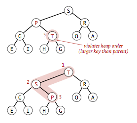
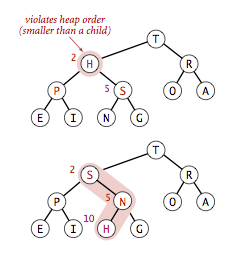
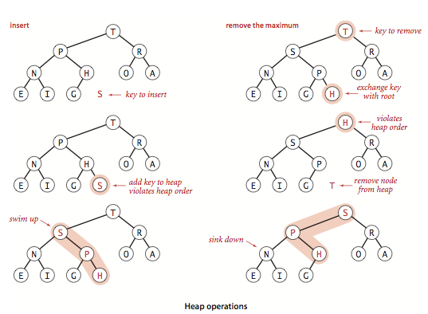
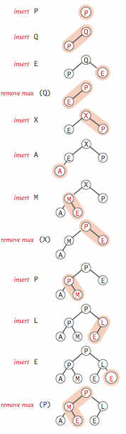
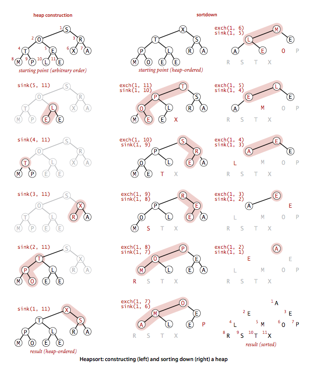
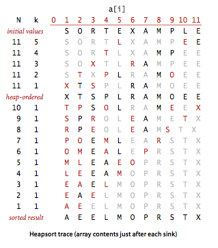

# 4. 우선순위 큐 (Priority Queues)

- API
- 기초적인 구현
- 힙(heap)의 정의
- 힙을 이용한 알고리즘
- 힙-정렬

---

- 꼭 모든 키가 정렬된 뒤 알고리즘을 수행할 필요가 없을 때
- 부분적인 항목에서 가장 큰 키를 찾음 -> ... (다른 로직 수행) -> 부분적인 항목에서 가장 큰 키를 찾음 -> ... (다른 로직 수행) -> ...
- e.g. 스마트폰의 여러 프로세스 중 전화가 오면 전화 앱이 가장 먼저 구동됨

### 우선순위 큐 (Priority Queues)

- 최댓값 항목 삭제 (꺼내기), 새로운 항목 추가 를 지원하는 데이터 타입
- 이진 힙 (binary heap) : 전통적인 우선순위 큐
    - 배열에 항목을 저장하되 삽입/최댓값 항목 삭제 작업이 logN 시간 안에 이루어지도록 구현
- 응용 상황
    - 시뮬레이션에서 키 (이벤트의 타이밍)를 시간순서에 맞추어 처리
    - 작업 스케줄링에서 키(작업 우선순위) 중 우선순위가 높은 작업을 먼저 처리
- 우선순위 큐를 이용한 정렬 알고리즘
    - 항목들을 모두 큐에 넣음 작은 순서대로 꺼내면 정렬 완료
    - 힙-정렬 : 힙을 이용한 우선순위 큐

## API

- 우선순위 큐의 2가지 연산 : 최댓값 항목 삭제 + 삽입
- 최댓값 항목 삭제 연산 : 가장 큰 키값을 가진 임의의 항목을 삭제
    - `delMax()`
- 삽입 연산 : 새로운 항목을 삽입
    - `insert()`
- `MaxPQ.delMax()` : `MaxPQ` 큐에서 최댓값 항목을 삭제
- `MinPQ.delMin()` : `MinPQ` 큐에서 최솟값 항목을 삭제

| API                  | 설명                                |
|----------------------|-----------------------------------|
| `MaxPQ()`            | 최댓값 항목 삭제 + 삽입 연산을 지원하는 우선순위 큐 생성 |
| `MaxPQ(int max)`     | 큐의 최대 크기를 지정하며 생성                 |
| `MaxPQ(Key[] a)`     | `a[]`의 항목들로 구성된 우선순위 큐 생성         |
| `void insert(Key v)` | 우선순위 큐에 `v`를 삽입                   |
| `Key max()`          | 우선순위 큐에서 최댓값을 리턴                  |
| `Key delMax()`       | 우선순위 큐에서 최댓값을 삭제하고 리턴             |
| `boolean isEmpty()`  | 우선순위 큐가 비어있는지 검사                  |
| `int size()`         | 우선순위 큐에 들어있는 항목의 개수를 리턴           |

### 우선순위 큐 클라이언트

- 매우 큰 _N_ 개의 문자열을 스트림으로 입력받아 가장 긴 _M_ 개의 문자열을 출력
    - e.g. 1억개의 문자열 중에서 가장 긴 10개의 문자열을 출력하기
    - 스트림 : 금융 거래정보, 서비스 요청 정보, 과학 실험 결과 등등
- 입력 스트림이 너무 크면 모두 정렬하는 것은 비효율적
- 접근방법 : 새로 들어온 키를 그간 쌓여진 M개의 가장 큰 키와 비교

```java
public class TopM {

    public static void main(String[] args) {
        // 입력 스트림에서 최댓값 항목 M개의 라인을 출력
        int M = Integer.parseInt(args[0]);
        MinPQ<Transaction> pq = new MinPQ<Transaction>(M + 1);

        while (StdIn.hasNextLine()) {
            // 우선순위 큐에 M개 이상의 항목이 들어가면 가장 작은 항목을 삭제
            pq.insert(new Transaction(StdIn.readLine()));
            if (pq.size() > M) {
                pq.delMin();
            }
        }

        Stack<Transaction> stack = new Stack<Transaction>();
        while (!pq.isEmpty()) {
            stack.push(pq.delMin());
        }

        stack.forEach(System.out::println);
    }
}

```

#### N개의 항목 스트림에서 가장 큰 M개를 찾는 비용

| 클라이언트        | 시간      | 공간  |
|--------------|---------|-----|
| 정렬           | _NlogN_ | _N_ |
| 기초적인 우선순위 큐  | _NM_    | _M_ |
| 힙 기반의 우선순위 큐 | _NlogN_ | _M_ |

## 기초적인 구현

| 데이터 구조   | 삽입     | 최댓값 항목 삭제 |
|----------|--------|-----------|
| 배열 (정렬)  | _N_    | 1         |
| 배열 (비정렬) | 1      | _N_       |
| 힙        | _logN_ | _logN_    |

- 비정렬 시퀀스 : Lazy
    - 필요할떄까지 (`pop()`) 정렬 작업을 미룸
- 정렬 시퀀스 : Eager
    - 삽입할 때마다 (`push()`) 정렬 작업을 수행
- 힙은 삽입/삭제 모두 logN 시간 안에 수행

### 배열 표현 (비정렬)

- stack을 기반으로 가장 단순하게 구현
- 삽입 : stack에 `push()`
- 최댓값 항목 삭제
    - 선택정렬 내부 루프의 최댓값 키 찾기
    - stack 의 `pop()` 에서 항목을 삭제

```java
public class TopM {
    public static void main(String[] args) {
        // 입력 스트림에서 최댓값 항목 M개의 라인을 출력
        int M = Integer.parseInt(args[0]);
        MinPQ<Transaction> pq = new MinPQ<Transaction>(M + 1);

        while (StdIn.hasNextLine()) {
            // 우선순위 큐에 M개 이상의 항목이 들어가면 가장 작은 항목을 삭제
            pq.insert(new Transaction(StdIn.readLine()));
            if (pq.size() > M) {
                pq.delMin();
            }
        }

        Stack<Transaction> stack = new Stack<Transaction>();
        while (!pq.isEmpty()) {
            stack.push(pq.delMin());
        }

        stack.forEach(System.out::println);
    }
}
```

### 배열 표현 (정렬 상태)

- 가장 큰 항목이 항상 오른쪽 끝에 있게 하기
- 최댓값 항목 삭제 : stack의 `pop()`
- 삽입 시 큰 항목을 우측으로 한 칸씩 옮겨서 키들이 배열에 정렬된 상태로 존재하게 함

### 연결리스트 표현

- `pop()` 이 최댓값을 찾게 하고, `push()` 가 키 값을 역순으로 저장하게 하기


## 힙(heap)의 정의

- 이진 힙(binary heap)은 우선순위 큐의 기본 동작을 효율적으로 하게 해주는 자료구조
- 이진 힙에서 키들을 배열에 저장 시 각 키는 차례대로 자신에게 추가적으로 연결된 다른 두 키보다 크거나 같음
    - 마치, 이진 트리에서 각 키의 갓ㄴ언을 따라 더 작은 두 키가 연결됨
- **힙 정렬 : 이진 트리에서 두 자식 노드가 부모 노드보다 작으면 이 이진트리는 힙-정렬 되었다**
- **힙 정렬된 이진 트리의 가장 큰 키는 루트노드다**

### 이진 힙의 표현


- 키마다 링크가 3개 필요 (상위 1, 하위 2)
- 링크보다 이진 트리가 더 표현이 편함
- 루트 노드를 위치 시키고, 아래로 (왼->오) 내려가면서 자식 노드를 채워나감
- 이진 힙 (binary heap) : 힙 정렬된 완전 이진 트리 노드들이 레벨 순서대로 나열된 배열
    - (단, 루트 노드는 a[1]에 위치)


- a[K] 의 자식 노드는 a[2K] 와 a[2K+1] 이다
- a[K] 의 부모 노드는 a[K/2] 이다

#### 크기가 N인 완전 이진 트리의 높이는 logN에 가깝다

- 장점 1. 삽입, 최대 항목 삭제 작업을 logN 시간 안에 수행
- 장점 2. 포인터가 필요 없고, 트리 위아래를 탐색할 떄 logN 시간 안에 수행

## 힙을 이용한 알고리즘

- 크기 N인 힙은 크기 N+1 인 private 배열 `pq[]`를 사용
    - `pq[1]~pq[N]` : 실제 원소
- **힙 복구 작업 (reheapifying)** : 힙 조건을 만족하지 않는 단순 작업 진행 후 다시 힙을 순회하면서 조건에 만족하게 하는 재작업

````
// 원소 i와 j 비교
private boolean less(int i, int j){
    return pq[i].compareTo(pq[j]) < 0;
}

// 원소 i와 j 교환
private void exch(int i, int j){
    Key t = pq[i];
    pq[i] = pq[j];
    pq[j] = t;
}
````

- 경우의 수 1. 특정 노드의 우선순위가 증가되면 (or 리프 노드에 새로운 노드가 추가된 경우), 힙을 거슬러 올라가면서 힙의순서 수정
- 경우의 수 2. 특정 노드의 우선순위가 낮아지면 (e.g. 루트 노드를 더 작은 노드로 수정했을 떄), 힙을 내려가면서 힙의 순서를 수정

### 상향식 힙 복구 (swim)



- 특정 노드가 부모 노드보다 커졌을 때
- 복구 방법 : 해당 노드를 부모 노드와 교환
    - 교환 후에는 해당 노드가 자식 노드들보다 큰 상태가 됨
    - 그래도 바뀐 위치의 부모보다 자신이 클 수 있음
    - 반복적으로 힙을 올라가면서 교환 (더 큰 노드를 만나거나, 루트노드를 만나면 중단)
- `swim()` 에서 메서드 안에서 힙 순서가 어긋나는 경우는 위치 `k`의 노드가 부모보다 큰 경우 하나로만 되도록 관리
    - 위치가 `k`인 노드의 부모노드는 `k/2`에 위치
- 예시 : 힙이 회사의 조직도라면? 신규 사원 입사 시
    - 신규 사원의 직급에 맞는 위치를 찾을 때까지 반복해서 승진해서 위치

````
// 상향식 힙 복구 구현
// k : 복구해야하는 노드의 인덱스 k
private void swim(int k){

    // (루트노드가 아님 and 부모보다 큰 경우) 반복
    while (k > 1 && less(k/2, k)) {
        exch(k/2, k); // 부모와 교환
        k = k/2;
    }
}
````

### 하향식 힙 복구 (sink)



- 특정 노드가 자식 노드 중 하나보다 작아졌을 때
- 복구 방법 : 해당 노드를 자식 노드중 더 큰 노드와 교환
    - 반복적으로 힙을 내려가면서 (두 자식 노드 모두 부모보다 작거나 같을때까지) 반복
- `sink()` 에서 `k` 노드의 자식의 위치는 `2k`, `2k+1`
- 예시 : 힙이 회사의 조직도라면? 차장이 퇴사하고 과장이 입사했을 때,
    1. 차장 노드 제거 후 과장 노드로 대체
    2. 과장 노드를 부하직원 쪽으로 반복해서 힙 복구 (재위치)

````
// 하향식 힙 복구의 구현
// k : 복구해야하는 노드의 인덱스 k
private void sink(int k){
    
    // 자식노드보다 같거나 작으면 반복
    while (2*k <= N) {
        int j = 2*k; // 자식 노드
        if(j < N && less(j, j+1)) j++; //자식노드랑 비교 후, 형제노드와 비교
        if(!less(k, j)) break; //자식노드보다 크면 break
         
        exch(k, j); // 자식이랑 교환
        k = j;
    }
}

````

### 삽입

1. 배열의 끝에 새로운 키 추가
2. 힙 사이즈 늘림
3. `swim()` (상향식 복구)

### 최대 항목 삭제

1. 루트노드 (가장 큰 항목)에서 꺼냄
2. 힙의 바닥에 있는 항목을 루트노드로 이동
3. 힙의 크기 줄임
4. 루트 노드로 `sink()` (하향식 복구)



```java

public class MaxPQ<Key extends Comparable<Key>> {

    private Key[] pq; // 힙 정렬된 완전 이진 트리
    private int N = 0; // pq[1..N]만 사용, pq[0]은 비워둠

    public MaxPQ(int maxN) {
        this.pq = (Key[]) new Comparable[maxN + 1];
    }

    public boolean isEmpty() {
        return N == 0;
    }

    public int size() {
        return N;
    }

    /**
     * N을 증분하여, 마지막 인덱스에 새로운 키 삽입
     *
     * @param v
     */
    public void insert(Key v) {
        pq[++N] = v;
        swim(N);
    }

    /**
     * 루트노드를 꺼내고, 마지막 항목을 루트노드로 옮긴 후 하향식 복구
     *
     * @return
     */
    public Key delMax() {
        Key max = pq[1]; // 루트 노드
        exch(1, N--); // 마지막 항목과 교환
        pq[N + 1] = null; // 로이터링 방지 (로이터링 : 안쓰는 메모리 점유)
        sink(1);
        return max;
    }

    private void swim(int k) {

        while (k > 1 && less(k / 2, k)) {
            exch(k / 2, k);
            k = k / 2;
        }
    }

    private void sink(int k) {
        while (2 * k <= N) {
            int j = 2 * k;
            if (j < N && less(j, j + 1)) j++;
            if (!less(k, j)) break;

            exch(k, j);
            k = j;
        }
    }

    private boolean less(int i, int j) {
        return pq[i].compareTo(pq[j]) < 0;
    }

    private void exch(int i, int j) {
        Key t = pq[i];
        pq[i] = pq[j];
        pq[j] = t;
    }
}
```



#### 명제 : N개의 키를 가진 우선순위 큐에서 삽입 작업은 1+logN 이하의 비교연산을 소모, 최대 키 삭제 작업은 2logN이하의 비교연산 소모

- 두 작업 모두 루트노드부터 리프노드까지 경로 사용
- 링크 수는 logN 이하
- 최대 키 항목 삭제 작업은 노드마다 2개의 비교연산 수행
    - 비교연산 1. 자식 노드 2개 중 더 큰 자식 노드 판별
    - 비교연산 2. 자식노드 상승 여부 판별

### 다중 힙

- 3중 트리 방식으로 힙코드 작성 가능
- 위치 `k` 보다 같거나 큰 항목을 `3k-1, 3k, 3k+1` 에 위치
- 임의의 값 `d` 만큼의 `d`중 트리 가능
- trade-off : `d` 가 클수록
    - 트리 높이가 낮아짐
    - `d` 개의 자식 중 가장 큰 항목을 찾는 비용 증가

### 배열 크기 조정

- 배열의 크기를 자동으로 조절하는 방법 : `insert()`, `delMax()` 배열의 크기를 2배로 늘리고, 줄임
- 클라이언트는 힙의 크기를 신경 쓰지 않아도 됨

### 키 값의 불변성

- 클라이언트는 키 값을 변경 할 수 없다고 가정해야함
    - 키 값을 수정하면 힙의 정렬이 어긋남
- 클라이언트가 무슨 작업을 하건 힙의 정렬을 유지하도록 코딩 가능
    - 성능 저하

### 인덱스 방식 우선순위 큐

- 클라이언트에게 우선순위 큐의 항목에 직접 접근을 허용해야할 수도 있음
- 방법 : 각 항목마다 정수로된 식별자로 인덱스값 부여

| 메서드                            | 설명                                          |
|--------------------------------|---------------------------------------------|
| IndexMinPQ(int maxN)           | 용량이 maxN인 우선순위 큐, 생성 가능한 인덱스 범위는 0~(maxN-1) |
| void insert(int i, key key)    | 인덱스 i에 key 삽입                               |
| void changeKye(int i, Key key) | 인덱스 i의 key 변경                               |
| boolean contains(int i)        | 인덱스 i에 key 존재 여부                            |
| void delete(int i)             | 인덱스 i의 key 삭제                               |
| Key minKey()                   | 가장 작은 키                                     |
| int minIndex()                 | 가장 작은 인덱스                                   |
| int delMin()                   | 가장 작은 키와 인덱스 삭제                             |
| boolean isEmpty()              | 우선순위 큐가 비어있는가                               |
| int size()                     | 우선순위 큐의 저장된 키 개수                            |
| Key keyOf(int i)               | 인덱스 i의 키                                    |

- `IndexMinPQ` : 가장 작은 키에 빠르게 접근 가능한 특수 배열

#### 크기 N인 힙의 인덱스 기반 우선순위 큐 최악 조건

| 작업          | 비교 횟수 증가 오더 |
|-------------|-------------|
| insert()    | logN        |
| changeKey() | logN        |
| contains()  | 1           |
| delete()    | logN        |
| minKey()    | 1           |
| minIndex()  | 1           |
| delMin()    | logN        |

```java
public class IndexMaxPQ<Key extends Comparable<Key>> implements Iterable<Integer> {
    private int maxN;        // maximum number of elements on PQ
    private int n;           // number of elements on PQ
    private int[] pq;        // binary heap using 1-based indexing
    private int[] qp;        // inverse of pq - qp[pq[i]] = pq[qp[i]] = i
    private Key[] keys;      // keys[i] = priority of i

    /**
     * Initializes an empty indexed priority queue with indices between {@code 0}
     * and {@code maxN - 1}.
     *
     * @param  maxN the keys on this priority queue are index from {@code 0} to {@code maxN - 1}
     * @throws IllegalArgumentException if {@code maxN < 0}
     */
    public IndexMaxPQ(int maxN) {
        if (maxN < 0) throw new IllegalArgumentException();
        this.maxN = maxN;
        n = 0;
        keys = (Key[]) new Comparable[maxN + 1];    // make this of length maxN??
        pq = new int[maxN + 1];
        qp = new int[maxN + 1];                   // make this of length maxN??
        for (int i = 0; i <= maxN; i++)
            qp[i] = -1;
    }

    /**
     * Returns true if this priority queue is empty.
     *
     * @return {@code true} if this priority queue is empty;
     *         {@code false} otherwise
     */
    public boolean isEmpty() {
        return n == 0;
    }

    /**
     * Is {@code i} an index on this priority queue?
     *
     * @param  i an index
     * @return {@code true} if {@code i} is an index on this priority queue;
     *         {@code false} otherwise
     * @throws IllegalArgumentException unless {@code 0 <= i < maxN}
     */
    public boolean contains(int i) {
        validateIndex(i);
        return qp[i] != -1;
    }

    /**
     * Returns the number of keys on this priority queue.
     *
     * @return the number of keys on this priority queue
     */
    public int size() {
        return n;
    }

    /**
     * Associate key with index i.
     *
     * @param  i an index
     * @param  key the key to associate with index {@code i}
     * @throws IllegalArgumentException unless {@code 0 <= i < maxN}
     * @throws IllegalArgumentException if there already is an item
     *         associated with index {@code i}
     */
    public void insert(int i, Key key) {
        validateIndex(i);
        if (contains(i)) throw new IllegalArgumentException("index is already in the priority queue");
        n++;
        qp[i] = n;
        pq[n] = i;
        keys[i] = key;
        swim(n);
    }

    /**
     * Returns an index associated with a maximum key.
     *
     * @return an index associated with a maximum key
     * @throws NoSuchElementException if this priority queue is empty
     */
    public int maxIndex() {
        if (n == 0) throw new NoSuchElementException("Priority queue underflow");
        return pq[1];
    }

    /**
     * Returns a maximum key.
     *
     * @return a maximum key
     * @throws NoSuchElementException if this priority queue is empty
     */
    public Key maxKey() {
        if (n == 0) throw new NoSuchElementException("Priority queue underflow");
        return keys[pq[1]];
    }

    /**
     * Removes a maximum key and returns its associated index.
     *
     * @return an index associated with a maximum key
     * @throws NoSuchElementException if this priority queue is empty
     */
    public int delMax() {
        if (n == 0) throw new NoSuchElementException("Priority queue underflow");
        int max = pq[1];
        exch(1, n--);
        sink(1);

        assert pq[n + 1] == max;
        qp[max] = -1;        // delete
        keys[max] = null;    // to help with garbage collection
        pq[n + 1] = -1;        // not needed
        return max;
    }

    /**
     * Returns the key associated with index {@code i}.
     *
     * @param  i the index of the key to return
     * @return the key associated with index {@code i}
     * @throws IllegalArgumentException unless {@code 0 <= i < maxN}
     * @throws NoSuchElementException no key is associated with index {@code i}
     */
    public Key keyOf(int i) {
        validateIndex(i);
        if (!contains(i)) throw new NoSuchElementException("index is not in the priority queue");
        else return keys[i];
    }

    /**
     * Change the key associated with index {@code i} to the specified value.
     *
     * @param  i the index of the key to change
     * @param  key change the key associated with index {@code i} to this key
     * @throws IllegalArgumentException unless {@code 0 <= i < maxN}
     */
    public void changeKey(int i, Key key) {
        validateIndex(i);
        if (!contains(i)) throw new NoSuchElementException("index is not in the priority queue");
        keys[i] = key;
        swim(qp[i]);
        sink(qp[i]);
    }

    /**
     * Change the key associated with index {@code i} to the specified value.
     *
     * @param  i the index of the key to change
     * @param  key change the key associated with index {@code i} to this key
     * @throws IllegalArgumentException unless {@code 0 <= i < maxN}
     * @deprecated Replaced by {@code changeKey(int, Key)}.
     */
    @Deprecated
    public void change(int i, Key key) {
        validateIndex(i);
        changeKey(i, key);
    }

    /**
     * Increase the key associated with index {@code i} to the specified value.
     *
     * @param  i the index of the key to increase
     * @param  key increase the key associated with index {@code i} to this key
     * @throws IllegalArgumentException unless {@code 0 <= i < maxN}
     * @throws IllegalArgumentException if {@code key <= keyOf(i)}
     * @throws NoSuchElementException no key is associated with index {@code i}
     */
    public void increaseKey(int i, Key key) {
        validateIndex(i);
        if (!contains(i)) throw new NoSuchElementException("index is not in the priority queue");
        if (keys[i].compareTo(key) == 0)
            throw new IllegalArgumentException("Calling increaseKey() with a key equal to the key in the priority queue");
        if (keys[i].compareTo(key) > 0)
            throw new IllegalArgumentException("Calling increaseKey() with a key that is strictly less than the key in the priority queue");

        keys[i] = key;
        swim(qp[i]);
    }

    /**
     * Decrease the key associated with index {@code i} to the specified value.
     *
     * @param  i the index of the key to decrease
     * @param  key decrease the key associated with index {@code i} to this key
     * @throws IllegalArgumentException unless {@code 0 <= i < maxN}
     * @throws IllegalArgumentException if {@code key >= keyOf(i)}
     * @throws NoSuchElementException no key is associated with index {@code i}
     */
    public void decreaseKey(int i, Key key) {
        validateIndex(i);
        if (!contains(i)) throw new NoSuchElementException("index is not in the priority queue");
        if (keys[i].compareTo(key) == 0)
            throw new IllegalArgumentException("Calling decreaseKey() with a key equal to the key in the priority queue");
        if (keys[i].compareTo(key) < 0)
            throw new IllegalArgumentException("Calling decreaseKey() with a key that is strictly greater than the key in the priority queue");
        keys[i] = key;
        sink(qp[i]);
    }

    /**
     * Remove the key on the priority queue associated with index {@code i}.
     *
     * @param  i the index of the key to remove
     * @throws IllegalArgumentException unless {@code 0 <= i < maxN}
     * @throws NoSuchElementException no key is associated with index {@code i}
     */
    public void delete(int i) {
        validateIndex(i);
        if (!contains(i)) throw new NoSuchElementException("index is not in the priority queue");
        int index = qp[i];
        exch(index, n--);
        swim(index);
        sink(index);
        keys[i] = null;
        qp[i] = -1;
    }

    // throw an IllegalArgumentException if i is an invalid index
    private void validateIndex(int i) {
        if (i < 0) throw new IllegalArgumentException("index is negative: " + i);
        if (i >= maxN) throw new IllegalArgumentException("index >= capacity: " + i);
    }

    /***************************************************************************
     * General helper functions.
     ***************************************************************************/
    private boolean less(int i, int j) {
        return keys[pq[i]].compareTo(keys[pq[j]]) < 0;
    }

    private void exch(int i, int j) {
        int swap = pq[i];
        pq[i] = pq[j];
        pq[j] = swap;
        qp[pq[i]] = i;
        qp[pq[j]] = j;
    }


    /***************************************************************************
     * Heap helper functions.
     ***************************************************************************/
    private void swim(int k) {
        while (k > 1 && less(k / 2, k)) {
            exch(k, k / 2);
            k = k / 2;
        }
    }

    private void sink(int k) {
        while (2 * k <= n) {
            int j = 2 * k;
            if (j < n && less(j, j + 1)) j++;
            if (!less(k, j)) break;
            exch(k, j);
            k = j;
        }
    }


    /**
     * Returns an iterator that iterates over the keys on the
     * priority queue in descending order.
     * The iterator doesn't implement {@code remove()} since it's optional.
     *
     * @return an iterator that iterates over the keys in descending order
     */
    public Iterator<Integer> iterator() {
        return new HeapIterator();
    }

    private class HeapIterator implements Iterator<Integer> {
        // create a new pq
        private IndexMaxPQ<Key> copy;

        // add all elements to copy of heap
        // takes linear time since already in heap order so no keys move
        public HeapIterator() {
            copy = new IndexMaxPQ<Key>(pq.length - 1);
            for (int i = 1; i <= n; i++)
                copy.insert(pq[i], keys[pq[i]]);
        }

        public boolean hasNext() {
            return !copy.isEmpty();
        }

        public void remove() {
            throw new UnsupportedOperationException();
        }

        public Integer next() {
            if (!hasNext()) throw new NoSuchElementException();
            return copy.delMax();
        }
    }

    /**
     * Unit tests the {@code IndexMaxPQ} data type.
     *
     * @param args the command-line arguments
     */
    public static void main(String[] args) {
        // insert a bunch of strings
        String[] strings = {"it", "was", "the", "best", "of", "times", "it", "was", "the", "worst"};

        IndexMaxPQ<String> pq = new IndexMaxPQ<String>(strings.length);
        for (int i = 0; i < strings.length; i++) {
            pq.insert(i, strings[i]);
        }

        // print each key using the iterator
        for (int i : pq) {
            StdOut.println(i + " " + strings[i]);
        }

        StdOut.println();

        // increase or decrease the key
        for (int i = 0; i < strings.length; i++) {
            if (StdRandom.bernoulli(0.5))
                pq.increaseKey(i, strings[i] + strings[i]);
            else
                pq.decreaseKey(i, strings[i].substring(0, 1));
        }

        // delete and print each key
        while (!pq.isEmpty()) {
            String key = pq.maxKey();
            int i = pq.delMax();
            StdOut.println(i + " " + key);
        }
        StdOut.println();

        // reinsert the same strings
        for (int i = 0; i < strings.length; i++) {
            pq.insert(i, strings[i]);
        }

        // delete them in random order
        int[] perm = new int[strings.length];
        for (int i = 0; i < strings.length; i++)
            perm[i] = i;
        StdRandom.shuffle(perm);
        for (int i = 0; i < perm.length; i++) {
            String key = pq.keyOf(perm[i]);
            pq.delete(perm[i]);
            StdOut.println(perm[i] + " " + key);
        }

    }
}
```

### 인덱스 기반 우선순위 큐의 클라이언트

- 인덱스 기반 우선순위 큐를 사용하여 다중 병합 문제 해결
- 복수의 정렬된 입력 스트림을 병합해서 하나의 정렬된 스트림으로 출력
    - 공간이 충분하다면, 두 스트림을 모두 배열에 저장하여 정렬하면 됨
- 우선순위 큐를 사용하면, 공간 크기에 상관 없이 정렬 후 출력 가능

```java

public class Multiway {

    // This class should not be instantiated.
    private Multiway() {
    }

    // merge together the sorted input streams and write the sorted result to standard output
    private static void merge(In[] streams) {
        int n = streams.length;
        IndexMinPQ<String> pq = new IndexMinPQ<String>(n);
        for (int i = 0; i < n; i++)
            if (!streams[i].isEmpty())
                pq.insert(i, streams[i].readString());

        // Extract and print min and read next from its stream.
        while (!pq.isEmpty()) {
            StdOut.print(pq.minKey() + " ");
            int i = pq.delMin();
            if (!streams[i].isEmpty())
                pq.insert(i, streams[i].readString());
        }
        StdOut.println();
    }


    /**
     *  Reads sorted text files specified as command-line arguments;
     *  merges them together into a sorted output; and writes
     *  the results to standard output.
     *  Note: this client does not check that the input files are sorted.
     *
     * @param args the command-line arguments
     */
    public static void main(String[] args) {
        int n = args.length;
        In[] streams = new In[n];
        for (int i = 0; i < n; i++)
            streams[i] = new In(args[i]);
        merge(streams);
    }
}
```

1. 복수의 정렬된 스트림을 받음
2. `streams[]` 초기화 작업
3. 반복루프
    1. 큐에서 가장 작은 문자열 출력 후 해당 항목을 큐에서 삭제
    2. 입력 스트림에서 새로운 문자열을 가져와 큐에 추가

## 힙-정렬

- 우선순위 큐를 이용하여 정렬 메서드를 만듦
- 최솟값 우선 순위 큐에 모든 항목을 삽입 -> `delMin()` (최소 항복 삭제)을 반복 호출하여 정렬된 순서로 꺼냄
    - 비정렬된 배열을 사용하는 우선순위 큐 : 선택 정렬 사용
    - 정렬된 배열을 사용하는 우선순위 큐 : 삽입 정렬 사용
    - 힙을 사용하는 우선순위 큐 : 힙 정렬 사용
- 힙-정렬 = 힙 구성 (heap construction) + 정렬 취합 (sortdown)
    - 힙 구성 : 원본 배열을 힙으로서 재배치
    - 정렬 취합 : 힙에서 내림차순으로 항목을 꺼내 정렬된 결과 생성
        - e.g. 최대항목을 반복해서 삭제하여 정렬된 배열 생성

#### 힙 정렬의 이용

- 힙 정렬은 시간, 공간 양쪽에서 모두 최적 성능 (상수)을 내는 유일한 알고리즘
- 최악의 조건에서 ~2NlogN 비교연산, 상수 크기의 추가 공간 사용 보증
- 메모리 공간이 제한적인 환경 (임베디드, 저가형 모바일 기기)에서 힙-정렬을 많이 사용
- 전형적인 현대 시스템에서는 거의 사용되지 않음
    - 캐시 활용률을 떨어뜨림
    - 배열의 인접 항목끼리 비교하는 상황이 드물기 때문에 퀵-정렬, 병합 정렬, 셸정렬에 비해 캐시 미스 횟수가 훨씬 많음
    - 우선순위 큐 구현에는 힙을 이용함
        - 대용량 데이터 삽입, 최대/최소값에서 로그성능을 보증

### 힙 구성

- N개의 항목이 주어졌을 때 힙을 구성하는 것은 NlogN의 시간이 걸림
- 배열을 왼쪽부터 오른쪽으로 순회하며 `swim()` 을 이용해 순회중인 현재 항목이 힙을 만족하는 완전트리인지 검사
    - 우선순위 큐에서 삽입 작업을 연속으로 하는 것과 같음
- 개선된 방법 : 오른쪽에서 왼쪽으로 순회하면서 `sink()` 사용해 부분 힙이 생성되게 함
    - 즉, 배열의 모든 위치가 작은 부분 힙의 루트가 되도록 함
    - 노드 `k`의 두 자식 노드가 힙이라면 `k`에 `sink()`를 호출하면 `k`를 루트로 하는 힙이 생성됨
    - 순회는 배열의 중간 `k/2` 부터 시작
        - 크기 1짜리 부분힙은 순서 복구 작업이 필요 없기 때문

```java
public class HeapSort {

    public static void sort(Comparable[] a) {
        int N = a.length - 1;

        // 힙 구성 : a[1]부터 a[N]까지 힙으로 만들기 (정렬)
        for (int k = N / 2; k >= 1; k--) {
            sink(a, k, N);
        }

        // 정렬 취합 : 힙에서 가장 큰 항목인 a[1]과 a[N]을 교환, a[0]부터 a[N-1]까지 정렬된 배열 생성
        while (N > 1) {
            exch(a, 1, N--);
            sink(a, 1, N);
        }

    }


    private static void sink(Comparable[] a, int k, int N) {

        while (2 * k <= N) {
            int j = 2 * k;
            if (j < N && less(a, j, j + 1)) j++;
            if (!less(a, k, j)) break;

            exch(a, k, j);
            k = j;
        }
    }

    private static boolean less(Comparable[] a, int v, int w) {
        return a[v].compareTo(a[w]) < 0;
    }


    public static void main(String[] args) {

        String[] a = new String[]{null, "S", "O", "R", "T", "E", "X", "A", "M", "P", "L", "E"};
        sort(a);
        assert isSorted(a);
        show(a);
    }


}

```





### 정렬 취합

- 힙 구성 후에는 정렬 취합을 수행
- 힙-정렬의 대부분 작업에 해당
- 힙에 남아있는 항목들 중 가장 큰 항목을 꺼내어 삭제하면서, 힙이 줄어들고, 빈 배열의 위치에 집어넣음

### 바닥까지 sink()한 후 다시 swim()하기

- 정렬 취합 작업에서 대부분의 항목들이 힙의 바닥에 도달
- 항목이 제 위치에 도달했는지 검사하는 작업을 생략할 수 없을까?
- 어차피 바닥에 내려갈 확률이 높으므로 `sink()`에서 두 자식 중 큰 항목을 위로 올림
    - 추가적인 상태 저장, 추적 필요
- 효과 : 비교 횟수를 점근적으로 2배 줄임, 병합 정렬에 비교횟수가 근접하게 됨
    - 문자열같이 길이가 긴 키가 사용되어 비교 연산 비용이 클때 효과가 있음