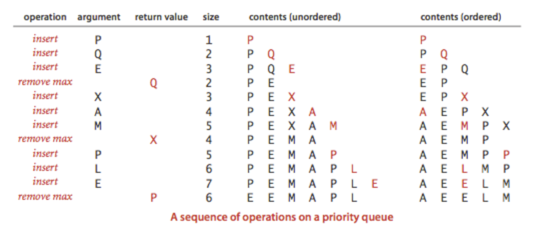
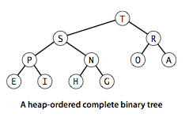
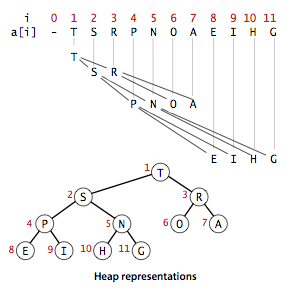

# 4. 우선순위 큐 (Priority Queues)

- API
- 기초적인 구현
- 힙(heap)의 정의
- 힙을 이용한 알고리즘
- 힙-정렬

---

- 꼭 모든 키가 정렬된 뒤 알고리즘을 수행할 필요가 없을 때
- 부분적인 항목에서 가장 큰 키를 찾음 -> ... (다른 로직 수행) -> 부분적인 항목에서 가장 큰 키를 찾음 -> ... (다른 로직 수행) -> ...
- e.g. 스마트폰의 여러 프로세스 중 전화가 오면 전화 앱이 가장 먼저 구동됨

### 우선순위 큐 (Priority Queues)

- 최댓값 항목 삭제 (꺼내기), 새로운 항목 추가 를 지원하는 데이터 타입
- 이진 힙 (binary heap) : 전통적인 우선순위 큐
    - 배열에 항목을 저장하되 삽입/최댓값 항목 삭제 작업이 logN 시간 안에 이루어지도록 구현
- 응용 상황
    - 시뮬레이션에서 키 (이벤트의 타이밍)를 시간순서에 맞추어 처리
    - 작업 스케줄링에서 키(작업 우선순위) 중 우선순위가 높은 작업을 먼저 처리
- 우선순위 큐를 이용한 정렬 알고리즘
    - 항목들을 모두 큐에 넣음 작은 순서대로 꺼내면 정렬 완료
    - 힙-정렬 : 힙을 이용한 우선순위 큐

## API

- 우선순위 큐의 2가지 연산 : 최댓값 항목 삭제 + 삽입
- 최댓값 항목 삭제 연산 : 가장 큰 키값을 가진 임의의 항목을 삭제
    - `delMax()`
- 삽입 연산 : 새로운 항목을 삽입
    - `insert()`
- `MaxPQ.delMax()` : `MaxPQ` 큐에서 최댓값 항목을 삭제
- `MinPQ.delMin()` : `MinPQ` 큐에서 최솟값 항목을 삭제

| API                  | 설명                                |
|----------------------|-----------------------------------|
| `MaxPQ()`            | 최댓값 항목 삭제 + 삽입 연산을 지원하는 우선순위 큐 생성 |
| `MaxPQ(int max)`     | 큐의 최대 크기를 지정하며 생성                 |
| `MaxPQ(Key[] a)`     | `a[]`의 항목들로 구성된 우선순위 큐 생성         |
| `void insert(Key v)` | 우선순위 큐에 `v`를 삽입                   |
| `Key max()`          | 우선순위 큐에서 최댓값을 리턴                  |
| `Key delMax()`       | 우선순위 큐에서 최댓값을 삭제하고 리턴             |
| `boolean isEmpty()`  | 우선순위 큐가 비어있는지 검사                  |
| `int size()`         | 우선순위 큐에 들어있는 항목의 개수를 리턴           |

### 우선순위 큐 클라이언트

- 매우 큰 _N_ 개의 문자열을 스트림으로 입력받아 가장 긴 _M_ 개의 문자열을 출력
    - e.g. 1억개의 문자열 중에서 가장 긴 10개의 문자열을 출력하기
    - 스트림 : 금융 거래정보, 서비스 요청 정보, 과학 실험 결과 등등
- 입력 스트림이 너무 크면 모두 정렬하는 것은 비효율적
- 접근방법 : 새로 들어온 키를 그간 쌓여진 M개의 가장 큰 키와 비교

```java
public class TopM {

    public static void main(String[] args) {
        // 입력 스트림에서 최댓값 항목 M개의 라인을 출력
        int M = Integer.parseInt(args[0]);
        MinPQ<Transaction> pq = new MinPQ<Transaction>(M + 1);

        while (StdIn.hasNextLine()) {
            // 우선순위 큐에 M개 이상의 항목이 들어가면 가장 작은 항목을 삭제
            pq.insert(new Transaction(StdIn.readLine()));
            if (pq.size() > M) {
                pq.delMin();
            }
        }

        Stack<Transaction> stack = new Stack<Transaction>();
        while (!pq.isEmpty()) {
            stack.push(pq.delMin());
        }

        stack.forEach(System.out::println);
    }
}

```

#### N개의 항목 스트림에서 가장 큰 M개를 찾는 비용

| 클라이언트        | 시간      | 공간  |
|--------------|---------|-----|
| 정렬           | _NlogN_ | _N_ |
| 기초적인 우선순위 큐  | _NM_    | _M_ |
| 힙 기반의 우선순위 큐 | _NlogN_ | _M_ |

## 기초적인 구현

| 데이터 구조   | 삽입     | 최댓값 항목 삭제 |
|----------|--------|-----------|
| 배열 (정렬)  | _N_    | 1         |
| 배열 (비정렬) | 1      | _N_       |
| 힙        | _logN_ | _logN_    |

- 비정렬 시퀀스 : Lazy
    - 필요할떄까지 (`pop()`) 정렬 작업을 미룸
- 정렬 시퀀스 : Eager
    - 삽입할 때마다 (`push()`) 정렬 작업을 수행
- 힙은 삽입/삭제 모두 logN 시간 안에 수행

### 배열 표현 (비정렬)

- stack을 기반으로 가장 단순하게 구현
- 삽입 : stack에 `push()`
- 최댓값 항목 삭제
    - 선택정렬 내부 루프의 최댓값 키 찾기
    - stack 의 `pop()` 에서 항목을 삭제

```java
public class TopM {
    public static void main(String[] args) {
        // 입력 스트림에서 최댓값 항목 M개의 라인을 출력
        int M = Integer.parseInt(args[0]);
        MinPQ<Transaction> pq = new MinPQ<Transaction>(M + 1);

        while (StdIn.hasNextLine()) {
            // 우선순위 큐에 M개 이상의 항목이 들어가면 가장 작은 항목을 삭제
            pq.insert(new Transaction(StdIn.readLine()));
            if (pq.size() > M) {
                pq.delMin();
            }
        }

        Stack<Transaction> stack = new Stack<Transaction>();
        while (!pq.isEmpty()) {
            stack.push(pq.delMin());
        }

        stack.forEach(System.out::println);
    }
}
```

### 배열 표현 (정렬 상태)

- 가장 큰 항목이 항상 오른쪽 끝에 있게 하기
- 최댓값 항목 삭제 : stack의 `pop()`
- 삽입 시 큰 항목을 우측으로 한 칸씩 옮겨서 키들이 배열에 정렬된 상태로 존재하게 함

### 연결리스트 표현

- `pop()` 이 최댓값을 찾게 하고, `push()` 가 키 값을 역순으로 저장하게 하기



## 힙(heap)의 정의

- 이진 힙(binary heap)은 우선순위 큐의 기본 동작을 효율적으로 하게 해주는 자료구조
- 이진 힙에서 키들을 배열에 저장 시 각 키는 차례대로 자신에게 추가적으로 연결된 다른 두 키보다 크거나 같음
    - 마치, 이진 트리에서 각 키의 갓ㄴ언을 따라 더 작은 두 키가 연결됨
- **힙 정렬 : 이진 트리에서 두 자식 노드가 부모 노드보다 작으면 이 이진트리는 힙-정렬 되었다**
- **힙 정렬된 이진 트리의 가장 큰 키는 루트노드다**

### 이진 힙의 표현



- 키마다 링크가 3개 필요 (상위 1, 하위 2)
- 링크보다 이진 트리가 더 표현이 편함
- 루트 노드를 위치 시키고, 아래로 (왼->오) 내려가면서 자식 노드를 채워나감
- 이진 힙 (binary heap) : 힙 정렬된 완전 이진 트리 노드들이 레벨 순서대로 나열된 배열
    - (단, 루트 노드는 a[1]에 위치)



- a[K] 의 자식 노드는 a[2K] 와 a[2K+1] 이다
- a[K] 의 부모 노드는 a[K/2] 이다

#### 크기가 N인 완전 이진 트리의 높이는 logN에 가깝다

- 장점 1. 삽입, 최대 항목 삭제 작업을 logN 시간 안에 수행
- 장점 2. 포인터가 필요 없고, 트리 위아래를 탐색할 떄 logN 시간 안에 수행

## 힙을 이용한 알고리즘

## 힙-정렬