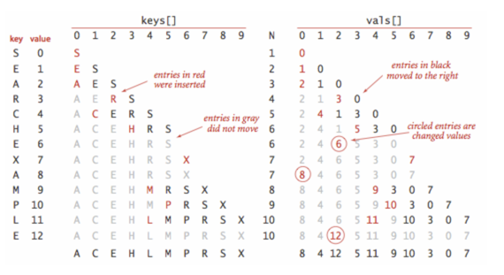

# 1. 심볼 테이블

- API
- 순차 심볼 테이블
- 클라이언트 예
- 비순차 연결 리스트에서의 순차 탐색
- 정렬된 배열에서의 이진 탐색
- 이진 탐색의 분석
- 미리 보기

---

### 심볼 테이블의 정의

- 키/값 쌍에 대한 데이터 구조
- 삽입, 탐색 지원
- 삽입 (put) : 테이블에 새로운 쌍을 저장
- 탐색 (get) : 주어진 키와 연관된 값을 찾음

### 특징

- 심볼테이블의 주 목적 : 키를 값과 연관시켜 키를 통해 값을 탐색하는 것
- 심볼 테이블을 구성하는 몇가지 방법 들
- 심볼 테이블을 구현하기 위해 삽입, 탐색, 데이터 구조 생성 및 조작 등의 알고리즘 구현 필요
- Java를 포함한 많은 언어들이 심볼 테이블을 자체적으로 제공

## API

- 심볼 테이블은 전형적인 추상 데이터 타입
- `public class ST <Key, Value>`

| 멤버                             | 설명                                 |
|--------------------------------|------------------------------------|
| `ST()`                         | 심볼 테이블 생성                          |
| `void put(Key key, Value val)` | 키/값 쌍을 테이블에 넣는다. 값이 null이면 해당 키 삭제 |
| `Value get(Key key)`           | 키에 해당하는 값을 찾음. 없으면 null 리턴         |
| `void delete(Key key)`         | 키를 테이블에서 삭제 (값도 삭제)                |
| `boolean contains(Key key)`    | 키에 해당하는 값이 존재하는가                   |
| `boolean isEmpty()`            | 테이블이 비었는가                          |
| `int size()`                   | 테이블에 저장된 키/값 쌍 개수                  |
| `Iterable<Key keys>`           | 테이블의 모든 키                          |

### 제네릭

- 항목에 타입에 관계없이 적용 가능하도록 제네릭 사용
- 심볼 테이블의 키를 명시적으로 별도의 타입으로 취급
- 키가 `Comparable`를 지원할 때 기능 확장 가능

### 중복 키

#### 구현 관례

- 키 하나에는 하나의 값만 연관 (즉, 테이블에 중복 키 없음)
- 클라이언트가 이미 존재하는 키에 대해 삽입하면 기존 쌍 대체됨

#### 추상 연관 배열

- 키가 배열의 인덱스, 값이 배열의 항목인 배열
- 심볼테이블은 배열로 치면 추상 연관 배열

### Null 키

- 키는 절대 null일 수 없음
- null을 넣으려하면 runtime exception 발생

### Null 값

- 키에 연관된 값으로 null 사용 안함
- 효과 1. 테이블에 존재하지 않는 키에 대해 `get()`은 null 리턴
- 효과 2. 키/값 쌍을 삭제할 때 `put()`에 null

### 삭제

- 삭제하는 방법 2가지 존재
- 방법 1. lazy 삭제 방법 : 테이블에 해당 키를 null로 두었다가 나중에 한번에 삭제
    - `put(key, null)`
    - default 구현
- 방법 2. eager 삭제 방법 : 테이블에서 키를 즉시 삭제
    - `delete()`와 같이 API를 만들어 클라이언트에 제공
    - null 값을 가지는 키가 테이블에 존재하지 않는것을 보장

````
// eager 삭제시 put() 구현 내부의 방어적 코드
if (val == null) {
    delete(key);
    return;
}
````

### 편의 메서드

| 메서드                         | 디폴트 구현                     |
|-----------------------------|----------------------------|
| `void delete(Key key)`      | `put(key, null);`          |
| `boolean contains(Key key)` | `return get(key) != null;` |
| `boolean isEmpty()`         | `return size() == 0;`      |

### 반복자

- 키를 순회할 수 있는 `Iterable<key>` 타입을 반환하는 `keys()`

### 키의 동일성

- 객체의 동일성 : Object를 상속받아 구현한 `equals()` 반환 값이 true
- 클라이언트가 직접 정의한 키라면 `equals()` 오버라이딩 해야함
- 키타입을 정의할 때는 불변 타입으로 하는 것이 바람직함
    - 일관성 보증을 위함

## 순차 심볼 테이블

- 많은 경우 키는 `Comparable`을 구현한 타입
- 키 간의 순서를 활용해 `put()`, `get()` 등의 메서드를 효율적으로 구현
- 심볼테이블의 키를 순차적으로(정렬상태) 저장 가능

`public class ST<Key extends Comparable<Key>, Value>`

| 메서드                                  | 설명                                 |
|--------------------------------------|------------------------------------|
| `ST()`                               | 순차 심볼 테이블 생성                       |
| `void put(Key key, Value val)`       | 키/값 쌍을 테이블에 넣는다. 값이 null이면 해당 키 삭제 |
| `Value get(Key key)`                 | 키에 해당하는 값을 찾음. 없으면 null 리턴         |
| `void delete(Key key)`               | 키를 테이블에서 삭제 (값도 삭제)                |
| `boolean contains(Key key)`          | 키에 해당하는 값이 존재하는가                   |
| `boolean isEmpty()`                  | 테이블이 비었는가                          |
| `int size()`                         | 테이블에 저장된 키/값 쌍 개수                  |
| `Key min()`                          | 테이블에서 가장 작은 키                      |
| `Key max()`                          | 테이블에서 가장 큰 키                       |
| `Key floor(Key key)`                 | 키보다 작거나 같은 키 중 가장 큰 키              |
| `Key ceiling(Key key)`               | 키보다 크거나 같은 키 중 가장 작은 키             |
| `int rank(Key key)`                  | 키보다 작은 키의 개수                       |
| `Key select(int k)`                  | 테이블에서 k번째 순위 키                     |
| `void deleteMin()`                   | 테이블에서 가장 작은 키 삭제                   |
| `int size(Key lo, Key hi)`           | [lo..hi] 사이의 키 개수                  |
| `Iterable<Key> keys(Key lo, Key hi)` | [lo..hi] 사이의 키들을 순회하는 반복자 (정렬 상태)  |
| `Iterable<Key> keys()`               | 테이블의 모든 키 (정렬 상태)                  |


### 최대, 최소

- 가장 흔한 질의는 가장 작은키, 가장 큰 키 찾기
- `IndexMinPQ` 처럼 동작 가능
    - 우선순위 큐와 달리 심볼테이블은 중복 키 허용 안함

### floor, ceiling 메서드

- 특저 키를 기준으로 작거나 같은 키 중 가장 큰 키, 크거나 같은 키 중 가장 작은 키 찾기
- floor (내림), ceiling (올림) 연산

### rank, select 메서드

- `rank()`, `select()` : 새로운 키가 순서에 맞는지 검사할 때 사용
- 0과 `size()-1` 사이 모든 값 i에 대해 `i == rank(select(i))`가 성립
- 모든 키에 대해 `Key == select(rank(Key))`가 성립

### 범위 조회

- 어떤 범위 안에 키가 몇개 존재하는가?
- 어떤 키가 주어진 범위 안에 속하는가?
- `size()`, `keys()` 사용

### 예외 상황

- 키를 리턴해야하는데 못하는 상황이라면 관례적으로 exception 발생
    - 다른 방법으로 null 리턴하거나 특정 키를 리턴하는 방법도 있음
- `min()`, `max()`, `deleteMin()` 등의 메서드에서 예외발생

### 편의 메서드

````
void deleteMin(){
    delete(min());
}

void deleteMax(){
    delete(max());
}

int size(Key lo, Key hi){
    if (hi.compareTo(lo) < 0) return 0;
    else if (contains(hi)) return rank(hi) - rank(lo) + 1;
    else return rank(hi) - rank(lo);
}

Iterable<Key> keys(){
    return keys(min(), max());
}
````

### 키의 동일성 (다시 살펴보기)

- Java에서는 모든 `Comparable` 타입에 대해 `compareTo()`, `equals()` 가 서로 일관성을 가지게 하는 것이 관례
- 즉, `a.compareTo(b) == 0`이면 `a.equals(b)`도 true
- 잠재적인 모호성을 피하기 위해 `equals()` 대신 `compareTo()` 사용

### 비용 모델

- 탐색 비용 모델 : 심볼 테이블의 구현 성능을 알아볼 때 비교 연산 횟수 (`equals()`, `compareTo()`)를 측정
- 보통 비교 연산은 내부 루프에 존재
    - 드물게 내부 루프에 비교 연산이 없는 경우, 배열 접근 횟수로 헤아림

## 클라이언트 예

- 심볼 테이블 구현과 관련된 클라이언트 코드

### 테스트 클라이언트

````java
public class TstClient {
    public static void main(String[] args) {
        ST<String, Integer> st = new ST<String, Integer>();

        for (int i = 0; !StdIn.isEmpty(); i++) {
            String key = StdIn.readString();
            st.put(key, i);
        }

        for (String s : st.keys()) {
            StdOut.println(s + " " + st.get(s));
        }
    }
}

````

- 알고리즘
    1. 클라이언트는 표준 입력으로부터 문자열의 나열을 입력 받음
    2. i번째 문자열 값이 i와 연관되도록 심볼테이블 구성
    3. 테이블 내용 출력
- 전제 1. 입력 문자열은 문자 하나
- 전제 2. 마지막 인덱스를 키와 연관 지음 (관례)
    - e.g. "ABCDABC" 를 입력받았을 때 A -> 4, B -> 2, ...

### 성능 측정 클라이언트

- 표준 입력으로 문자열을 입력 받아 문자열의 등장빈도를 헤아려 가장많이 등장한 문자열을 출력하는 클라이언트

````java

public class FrequencyCounter {
    public static void main(String[] args) {
        int distinct = 0, words = 0;
        int minlen = Integer.parseInt(args[0]);
        ST<String, Integer> st = new ST<>();

        // compute frequency counts
        while (!StdIn.isEmpty()) {
            String key = StdIn.readString();
            if (key.length() < minlen) continue;
            words++;
            if (st.contains(key)) {
                st.put(key, st.get(key) + 1);
            } else {
                st.put(key, 1);
                distinct++;
            }
        }

        // find a key with the highest frequency count
        String max = "";
        st.put(max, 0);
        for (String word : st.keys()) {
            if (st.get(word) > st.get(max))
                max = word;
        }

        StdOut.println(max + " " + st.get(max));
        StdOut.println("distinct = " + distinct);
        StdOut.println("words    = " + words);
    }

}

````

- 입력이 매우 크다면 어떻게 개선하겠는가?
- `get()`, `put()` 작업이 뒤섞인 매우 큰 테이블을 적절히 구현할 수 있는가?
- 대규모 테이블에서 많은 수의 `get()` 을 감당할 수 있는가?

#### 심볼테이블 응용 공통점

- 탐색 (`get()`)과 삽입 (`put()`)이 뒤섞여있음
- 서로 다른 키가 적지 않음 (테이블의 크기가 작지 않음)
- 삽입(`put()`)보다 탐색(`get()`)이 더 자주 일어남
- 탐색/삽입 작업의 패턴이 예측 가능

## 비순차 연결 리스트에서의 순차 탐색

- 탐색 성공 (search hit) : 키를 찾아 value 리턴
- 탐색 실패 (search miss) : null 리턴
- 무작위 탐색 성공 (random search hit) : 테이블에 존재하는 키를 찾을 때, 존재하는 키라면 꼭 선형시간은 아님

```java
public class SequentialSearchST<Key, Value> {
    private Node first; // linked list의 head

    // linked list node 구조
    private class Node {
        Key key;
        Value val;
        Node next;

        public Node(Key key, Value val, Node next) {
            this.key = key;
            this.val = val;
            this.next = next;
        }
    }

    // key를 찾아 value 리턴
    public Value get(Key key) {
        for (Node x = first; x != null; x = x.next) {
            if (key.equals(x.key)) {
                return x.val;
            }
        }
        return null;
    }

    // 키 찾기
    // 존재하면 value 업데이트
    // 없으면 새로운 노드 추가
    public void put(Key key, Value val) {
        for (Node x = first; x != null; x = x.next) {
            if (key.equals(x.key)) {
                x.val = val;
                return;
            }
        }
        first = new Node(key, val, first);
    }
}
```


- 데이터가 클수록 탐색 시간이 증가

## 정렬된 배열에서의 이진 탐색

- 배열 1 : 키 배열
- 배열 2 : 값 배열
- 정렬된 상태로 배열에 저장, `get()`을 빠르게 수행
- `rank()` : input 키보다 작은 키가 몇개 있는지 리턴
- `put()` 시 `rank()`를 이용해 삽입 위치 결정
- 단점 : 배열이 클때 너무 느림



```java


public class BinarySearchST<Key extends Comparable<Key>, Value> {
    private static final int INIT_CAPACITY = 2;
    private Key[] keys;
    private Value[] vals;
    private int n = 0;

    /**
     * Initializes an empty symbol table.
     */
    public BinarySearchST() {
        this(INIT_CAPACITY);
    }

    /**
     * Initializes an empty symbol table with the specified initial capacity.
     *
     * @param capacity the maximum capacity
     */
    public BinarySearchST(int capacity) {
        keys = (Key[]) new Comparable[capacity];
        vals = (Value[]) new Object[capacity];
    }

    // resize the underlying arrays
    private void resize(int capacity) {
        assert capacity >= n;
        Key[] tempk = (Key[]) new Comparable[capacity];
        Value[] tempv = (Value[]) new Object[capacity];
        for (int i = 0; i < n; i++) {
            tempk[i] = keys[i];
            tempv[i] = vals[i];
        }
        vals = tempv;
        keys = tempk;
    }

    /**
     * Returns the number of key-value pairs in this symbol table.
     *
     * @return the number of key-value pairs in this symbol table
     */
    public int size() {
        return n;
    }

    /**
     * Returns true if this symbol table is empty.
     *
     * @return {@code true} if this symbol table is empty;
     * {@code false} otherwise
     */
    public boolean isEmpty() {
        return size() == 0;
    }


    /**
     * Does this symbol table contain the given key?
     *
     * @param key the key
     * @return {@code true} if this symbol table contains {@code key} and
     * {@code false} otherwise
     * @throws IllegalArgumentException if {@code key} is {@code null}
     */
    public boolean contains(Key key) {
        if (key == null) throw new IllegalArgumentException("argument to contains() is null");
        return get(key) != null;
    }

    /**
     * Returns the value associated with the given key in this symbol table.
     *
     * @param key the key
     * @return the value associated with the given key if the key is in the symbol table
     * and {@code null} if the key is not in the symbol table
     * @throws IllegalArgumentException if {@code key} is {@code null}
     */
    public Value get(Key key) {
        if (key == null) throw new IllegalArgumentException("argument to get() is null");
        if (isEmpty()) return null;
        int i = rank(key);
        if (i < n && keys[i].compareTo(key) == 0) return vals[i];
        return null;
    }

    /**
     * Returns the number of keys in this symbol table strictly less than {@code key}.
     *
     * @param key the key
     * @return the number of keys in the symbol table strictly less than {@code key}
     * @throws IllegalArgumentException if {@code key} is {@code null}
     */
    public int rank(Key key) {
        if (key == null) throw new IllegalArgumentException("argument to rank() is null");

        int lo = 0, hi = n - 1;
        while (lo <= hi) {
            int mid = lo + (hi - lo) / 2;
            int cmp = key.compareTo(keys[mid]);
            if (cmp < 0) hi = mid - 1;
            else if (cmp > 0) lo = mid + 1;
            else return mid;
        }
        return lo;
    }


    /**
     * Inserts the specified key-value pair into the symbol table, overwriting the old
     * value with the new value if the symbol table already contains the specified key.
     * Deletes the specified key (and its associated value) from this symbol table
     * if the specified value is {@code null}.
     *
     * @param key the key
     * @param val the value
     * @throws IllegalArgumentException if {@code key} is {@code null}
     */
    public void put(Key key, Value val) {
        if (key == null) throw new IllegalArgumentException("first argument to put() is null");

        if (val == null) {
            delete(key);
            return;
        }

        int i = rank(key);

        // key is already in table
        if (i < n && keys[i].compareTo(key) == 0) {
            vals[i] = val;
            return;
        }

        // insert new key-value pair
        if (n == keys.length) resize(2 * keys.length);

        for (int j = n; j > i; j--) {
            keys[j] = keys[j - 1];
            vals[j] = vals[j - 1];
        }
        keys[i] = key;
        vals[i] = val;
        n++;

        assert check();
    }

    /**
     * Removes the specified key and associated value from this symbol table
     * (if the key is in the symbol table).
     *
     * @param key the key
     * @throws IllegalArgumentException if {@code key} is {@code null}
     */
    public void delete(Key key) {
        if (key == null) throw new IllegalArgumentException("argument to delete() is null");
        if (isEmpty()) return;

        // compute rank
        int i = rank(key);

        // key not in table
        if (i == n || keys[i].compareTo(key) != 0) {
            return;
        }

        for (int j = i; j < n - 1; j++) {
            keys[j] = keys[j + 1];
            vals[j] = vals[j + 1];
        }

        n--;
        keys[n] = null;  // to avoid loitering
        vals[n] = null;

        // resize if 1/4 full
        if (n > 0 && n == keys.length / 4) resize(keys.length / 2);

        assert check();
    }

    /**
     * Removes the smallest key and associated value from this symbol table.
     *
     * @throws NoSuchElementException if the symbol table is empty
     */
    public void deleteMin() {
        if (isEmpty()) throw new NoSuchElementException("Symbol table underflow error");
        delete(min());
    }

    /**
     * Removes the largest key and associated value from this symbol table.
     *
     * @throws NoSuchElementException if the symbol table is empty
     */
    public void deleteMax() {
        if (isEmpty()) throw new NoSuchElementException("Symbol table underflow error");
        delete(max());
    }


    /***************************************************************************
     *  Ordered symbol table methods.
     ***************************************************************************/

    /**
     * Returns the smallest key in this symbol table.
     *
     * @return the smallest key in this symbol table
     * @throws NoSuchElementException if this symbol table is empty
     */
    public Key min() {
        if (isEmpty()) throw new NoSuchElementException("called min() with empty symbol table");
        return keys[0];
    }

    /**
     * Returns the largest key in this symbol table.
     *
     * @return the largest key in this symbol table
     * @throws NoSuchElementException if this symbol table is empty
     */
    public Key max() {
        if (isEmpty()) throw new NoSuchElementException("called max() with empty symbol table");
        return keys[n - 1];
    }

    /**
     * Return the kth smallest key in this symbol table.
     *
     * @param k the order statistic
     * @return the {@code k}th smallest key in this symbol table
     * @throws IllegalArgumentException unless {@code k} is between 0 and
     *                                  <em>n</em>–1
     */
    public Key select(int k) {
        if (k < 0 || k >= size()) {
            throw new IllegalArgumentException("called select() with invalid argument: " + k);
        }
        return keys[k];
    }

    /**
     * Returns the largest key in this symbol table less than or equal to {@code key}.
     *
     * @param key the key
     * @return the largest key in this symbol table less than or equal to {@code key}
     * @throws NoSuchElementException   if there is no such key
     * @throws IllegalArgumentException if {@code key} is {@code null}
     */
    public Key floor(Key key) {
        if (key == null) throw new IllegalArgumentException("argument to floor() is null");
        int i = rank(key);
        if (i < n && key.compareTo(keys[i]) == 0) return keys[i];
        if (i == 0) throw new NoSuchElementException("argument to floor() is too small");
        else return keys[i - 1];
    }

    /**
     * Returns the smallest key in this symbol table greater than or equal to {@code key}.
     *
     * @param key the key
     * @return the smallest key in this symbol table greater than or equal to {@code key}
     * @throws NoSuchElementException   if there is no such key
     * @throws IllegalArgumentException if {@code key} is {@code null}
     */
    public Key ceiling(Key key) {
        if (key == null) throw new IllegalArgumentException("argument to ceiling() is null");
        int i = rank(key);
        if (i == n) throw new NoSuchElementException("argument to ceiling() is too large");
        else return keys[i];
    }

    /**
     * Returns the number of keys in this symbol table in the specified range.
     *
     * @param lo minimum endpoint
     * @param hi maximum endpoint
     * @return the number of keys in this symbol table between {@code lo}
     * (inclusive) and {@code hi} (inclusive)
     * @throws IllegalArgumentException if either {@code lo} or {@code hi}
     *                                  is {@code null}
     */
    public int size(Key lo, Key hi) {
        if (lo == null) throw new IllegalArgumentException("first argument to size() is null");
        if (hi == null) throw new IllegalArgumentException("second argument to size() is null");

        if (lo.compareTo(hi) > 0) return 0;
        if (contains(hi)) return rank(hi) - rank(lo) + 1;
        else return rank(hi) - rank(lo);
    }

    /**
     * Returns all keys in this symbol table as an {@code Iterable}.
     * To iterate over all of the keys in the symbol table named {@code st},
     * use the foreach notation: {@code for (Key key : st.keys())}.
     *
     * @return all keys in this symbol table
     */
    public Iterable<Key> keys() {
        return keys(min(), max());
    }

    /**
     * Returns all keys in this symbol table in the given range,
     * as an {@code Iterable}.
     *
     * @param lo minimum endpoint
     * @param hi maximum endpoint
     * @return all keys in this symbol table between {@code lo}
     * (inclusive) and {@code hi} (inclusive)
     * @throws IllegalArgumentException if either {@code lo} or {@code hi}
     *                                  is {@code null}
     */
    public Iterable<Key> keys(Key lo, Key hi) {
        if (lo == null) throw new IllegalArgumentException("first argument to keys() is null");
        if (hi == null) throw new IllegalArgumentException("second argument to keys() is null");

        Queue<Key> queue = new Queue<Key>();
        if (lo.compareTo(hi) > 0) return queue;
        for (int i = rank(lo); i < rank(hi); i++)
            queue.enqueue(keys[i]);
        if (contains(hi)) queue.enqueue(keys[rank(hi)]);
        return queue;
    }


    /***************************************************************************
     *  Check internal invariants.
     ***************************************************************************/

    private boolean check() {
        return isSorted() && rankCheck();
    }

    // are the items in the array in ascending order?
    private boolean isSorted() {
        for (int i = 1; i < size(); i++)
            if (keys[i].compareTo(keys[i - 1]) < 0) return false;
        return true;
    }

    // check that rank(select(i)) = i
    private boolean rankCheck() {
        for (int i = 0; i < size(); i++)
            if (i != rank(select(i))) return false;
        for (int i = 0; i < size(); i++)
            if (keys[i].compareTo(select(rank(keys[i]))) != 0) return false;
        return true;
    }


    /**
     * Unit tests the {@code BinarySearchST} data type.
     *
     * @param args the command-line arguments
     */
    public static void main(String[] args) {
        BinarySearchST<String, Integer> st = new BinarySearchST<String, Integer>();
        for (int i = 0; !StdIn.isEmpty(); i++) {
            String key = StdIn.readString();
            st.put(key, i);
        }
        for (String s : st.keys())
            StdOut.println(s + " " + st.get(s));
    }
}
```

### 이진탐색

- 이진탐색은 키를 찾는데 필요한 비교 횟수가 logN

````
// 이진탐색 rank (재귀)
public int rank(Key key) {
   if(hi < lo) return lo;
    int mid = lo + (hi - lo) / 2;
    int cmp = key.compareTo(keys[mid]);
    if (cmp < 0) return rank(key, lo, mid - 1);
    else if (cmp > 0) return rank(key, mid + 1, hi);
    else return mid;
}

// 이진탐색 rank (비재귀)
public int rank(Key key) {
    int lo = 0, hi = n - 1;
    while (lo <= hi) {
        int mid = lo + (hi - lo) / 2;
        int cmp = key.compareTo(keys[mid]);
        if (cmp < 0) hi = mid - 1;
        else if (cmp > 0) lo = mid + 1;
        else return mid;
    }
    return lo;
}
````

### 기타 작업들

- 키들이 정렬된 상태로 저장되기 때문에 순서기반 작업들이 간단히 구현됨
- e.g. `select(k)` 는 return `keys[k]`

## 이진 탐색의 분석

- 명제 : N개의 키를 대상으로 할 때 정렬된 배열의 이진 탐색은 최대 logN + 1번 비교를 수행
- 명제 : 크기 N인 정렬된 배열에 새로운 키 삽입 시, 최악의 경우 2N번의 배열 접근이 필요
- `celing()`은 한번의 `rank()` 호출로 구현 가능
- `min()`, `max()`, `select()` 는 상수 시간에 구현 가능

#### `BinarySearchST`의 성능

| 메서드                              | 실행 시간 증가 오너 |
|----------------------------------|-------------|
| `put()`                          | N           |
| `get()`                          | logN        |
| `delete()`                       | N           |
| `contains()`                     | logN        |
| `size()`, `min()`, `max()`       | 1           |
| `floor()`, `ceiling()`  `rank()` | logN        |
| `select()`                       | 1           |
| `deleteMin()`                    | N           |
| `deleteMax()`                    | 1           |

## 미리 보기

| 알고리즘 (데이터 구조)     | 최악 조건 비용 > N번 삽입 > search | 최악 조건 비용 > N번 삽입 > insert | 보통 경우 무작위적 N번 삽입 > search hit | 보통 경우 무작위적 N번 삽입 > search insert | 순차 작업 효율 지원 여부 |
|-------------------|---------------------------|---------------------------|-------------------------------|----------------------------------|----------------|
| 순차 탐색 (비순차 연결리스트) | N                         | N                         | N/2                           | N                                | no             |
| 이진 탐탐색 (순차 배열)    | logN                      | 2N                        | logN                          | N                                | yes            |

- 이진 탐색이 일반적으로 선형 탐색보다 빠름
    - 삽입 작업이 허용되지 않는 정적 테이블일 경우 사전에 테이블을 초기화하고 정렬해두는게 좋음
    - 정적 테이블이 아니어도, 대량의 탐색작업이 일어나기 전에 초기화/정렬 작업하는 것이 바람직
- 한계 : 탐색과 삽입을 모두 빠르게 할 수 있는 심볼테이블이 아님
    - 해결 : 이진 탐색 트리, 해시 테이블

| 기반 데이터 구조      | 구현                                          | 장점                         | 단점                                      |
|----------------|---------------------------------------------|----------------------------|-----------------------------------------|
| 연결 리스트 (순차 탐색) | SequentialSearchST                          | 작은 ST에 최적                  | 큰 ST에 비효율적                              |
| 순차 배열 (이진 탐색)  | BinarySearchST                              | 최적의 탐색, 공간 성능, 순서 기반 작업    | 삽입 비효율적                                 |
| 이진 탐색 트리       | BST                                         | 구현이 쉬움, 순서 기반 작업           | 링크를 위한 소요 공간 보증 없음                      |
| 균형 BST         | RedBlackBST                                 | 최적의 탐색, 공간 성능, 순서 기반 작업    | 링크를 위한 공간                               |
| 해시 테이블         | SeparateChainingHashST, LinearProbingHashST | 흔한 데이터타입들에 대한 최적의 탐색/삽입 성능 | 타입 별 해시 필요, 비순서 기반 작업, 링크와 공백 항목을 위한 공간 |
