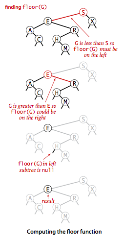
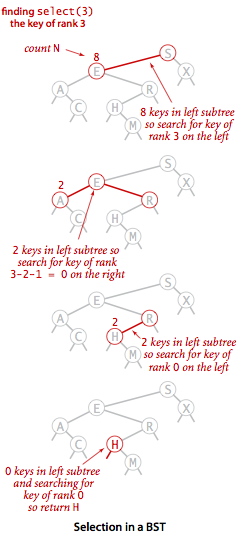
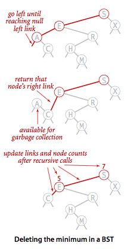
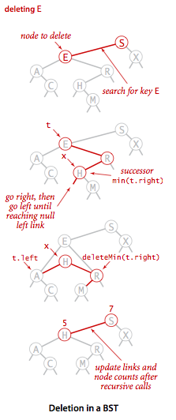

# 2. 이진 탐색 트리 (Binary Search Tree)

- 기본 구현
- 분석
- 순서 기반 메서드와 삭제

---


- 노드마다 2개의 링크를 사용하고, 이진 탐색 트리 데이터 구조를 기반으로 구현
- => 연결리스트의 우수한 삽입 작업 + 정렬된 배열의 효율적인 탐색
- 이러한 심볼 테이블 구현은 현대 컴퓨터 과학에서 가장 중요한 기초가 되는 알고리즘으로 인정받고 있음

#### BST 요약

- 심볼 테이블로서 rank, select, delete, 범위 기반 탐색 작업 지원
- 많은 프로그래머들이 사용
- 구현이 어렵지 않음
- 실제 응용환경에서 탐색, 삽입 모두 빠른 성능을 보여줌
- 전제조건 : 키 삽입이 무작위에 근접해야함
    - 무작위적이지 않은 동작을 유발하는 것은 어려움

| 알고리즘 (데이터 구조)      | 최악 조건 비용 (search) | 최악 조건비용 (insert) | 평균 조건 비용 (search hit) | 평균 조건 비용 (insert) | 정력 기반 작업의 효율성 |
|--------------------|-------------------|------------------|-----------------------|-------------------|---------------|
| 순차 탐색 (비순차 연결 리스트) | N                 | N                | N/2                   | N                 | NO            |
| 이진 탐색 (순차 배열)      | logN              | N                | logN                  | N/2               | YES           |
| 이진 탐색 트리 (BST)     | N                 | N                | 1.39logN              | 1.39logN          | YES           |     

#### BST, 용어 정의

- 링크 (link) : 노드를 연결하는 참조
    - 각 링크는 공백 겍체 (null link) 와 연결 or 다른 노드와 연결
    - 부모 링크 : 이진 트리에서 어떤 노드든 하나의 들어오는 링크를 가질 수 있도록 제한한 링크
    - 왼쪽 링크, 오른쪽 링크 : 나가는 링크는 정확히 2개 존재
- 노드 (node) : 키와 값으로 구성된 객체
    - 왼쪽 자식, 오른쪽 자식 : 왼쪽 링크, 오른쪽 링크로 연결된 각 노드
- 이진 탐색 트리 (BST)의 정의
    - 각 노드가 Comparable 키, 연관된 값을 가짐
    - 임의의 키는 왼쪽 부분 트리의 키들보다 크고, 오른쪽 부분 트리의 키들보다 작음

#### BST 표현


- 노드 안에는 키를 표시
- 연결 관계 표현 : "A는 E의 왼쪽 자식"
- 선은 노드의 연결을 의미
- 노드 옆에 노드의 키와 연관된 값 표시 (생략 가능)
- 공백 링크는 짧은 선분으로 표시

## 기본 구현

### 표현 방식

```java
public class BST<Key extends Comparable<Key>, Value> {

    // 중첩 클래스로 노드 정의
    private class Node {
        private Key key;           // sorted by key
        private Value val;         // associated data
        private Node left, right;  // left and right subtrees
        private int size;          // number of nodes in subtree
    }

    private int size(Node x) {
        if (x == null) return 0;
        else return x.size;
    }

    // ...

}
```

- 유연성 : 어떤 키 집합에 대한 BST 표현 방식은 여러개가 있음
    - 같은 키 집합이엉도 BST 가 여러개 존재할 수 있음
- 정렬 : 모든 키를 왼쪽 부분 트리의 노드들은 기준 키 왼쪽에, 오른쪽 부분 트리의 노드들은 기준 키 오른쪽에 위치
    - 항상 정렬된 키 목록을 얻어올 수 있음

### 탐색


- 키가 존재하면 연관되 값 리턴, 존재하지 않으면 null 리턴
- 재귀 탐색 가능 : BST는 재귀적인 구조
    - 트리가 공백이면 탐색 실패
    - 탐색 키가 뿌리 노드와 같으면 탐색 성공
    - 두경우 모두 아니면, 적합한 부분 트리로 재귀적으로 내려가며 탐색
        - 작으면 왼쪽, 크면 오른쪽

```java
public class BST<Key extends Comparable<Key>, Value> {

    // ...

    /**
     * Returns the value associated with the given key.
     *
     * @param key the key
     * @return the value associated with the given key if the key is in the symbol table
     * and {@code null} if the key is not in the symbol table
     * @throws IllegalArgumentException if {@code key} is {@code null}
     */
    public Value get(Key key) {
        return get(root, key);
    }

    private Value get(Node x, Key key) {
        if (key == null) throw new IllegalArgumentException("calls get() with a null key");
        if (x == null) return null;
        int cmp = key.compareTo(x.key);
        if (cmp < 0) return get(x.left, key);
        else if (cmp > 0) return get(x.right, key);
        else return x.val;
    }
    // ...

}
```

### 삽입


- 탐색 (`get()`) 작업에서 키를 찾지 못하면 새로운 노드로 바꿔주기

```java
public class BST<Key extends Comparable<Key>, Value> {

    // ...

    /**
     * Inserts the specified key-value pair into the symbol table, overwriting the old
     * value with the new value if the symbol table already contains the specified key.
     * Deletes the specified key (and its associated value) from this symbol table
     * if the specified value is {@code null}.
     *
     * @param key the key
     * @param val the value
     * @throws IllegalArgumentException if {@code key} is {@code null}
     */
    public void put(Key key, Value val) {
        if (key == null) throw new IllegalArgumentException("calls put() with a null key");
        if (val == null) {
            delete(key);
            return;
        }
        root = put(root, key, val);
        assert check();
    }

    private Node put(Node x, Key key, Value val) {
        if (x == null) return new Node(key, val, 1);
        int cmp = key.compareTo(x.key);
        if (cmp < 0) x.left = put(x.left, key, val);
        else if (cmp > 0) x.right = put(x.right, key, val);
        else x.val = val;
        x.size = 1 + size(x.left) + size(x.right);
        return x;
    }

    // ...

}
```

### 재귀

- 재귀 이전 : 주어진 키를 노드의 키와 비교해 왼쪽 (혹은 오른쪽)으로 내려감
- 재귀 이후 : 트리를 거슬로 올라감
    - `get()` 에서는 `return` 문으로 연이어 상위 호출로 되돌아감
    - `put()` 에서는 `return` 문으로 연이어 상위 호출로 되돌아가면서 `size` 필드를 갱신
- 기초적인 BST는 비재귀 방식으로 구현할 수 있기도 함

## 분석


- BST 알고리즘의 실행시간은 트리 모양에 종속적
- 완전한 균형의 BST는 N개의 노드가 있을 떄 뿌리와 null 링크 사이에 ~lgN개의 노드가 있음
- 최악의 경우 경로 N개의 노드를 모두 탐색해야함

### 명제 : N개의 무작위 키를 가진 BST 탐색 성공은 평균적으로 ~2lnN회의 비교연산 소요

- 탐색 성공시 소요된 비교연산 횟수는 노드 깊이 + 1
- 내부 경로 거리 : 모든 노드들에 대한 깊이를 더한 값

### 명제 : N개의 무작위 키로 형성된 BST에서 삽입, 탐색 실패 상황은 평균적으로 ~2lnN회의 비교연산 소요

- 평균적으로 삽입과 탐색 실패는 탐색 성공보다 한번 더 많은 비교연산 소요

### 실험


- 많은 응용 상황에서 BST 무작위 키 모델은 적합함
- 오차 요인
    - 테이블이 작을 떄 작업들을 완전히 랜덤하지 않을 수 있음
    - 키가 무작위이지 않음
    - 근사 수식 2lnN이 충분히 정확할만큼 테이블이 크지 않음

## 순서 기반 메서드와 삭제

- BST가 널리 사용되는 이유 중 하나 : 키가 정렬되 상태로 유지됨
- 그래서 다양한 순서 기반 심볼 테이블 API 구현 가능
- 키의 상대적인 순서를 활용해 값에 접근 가능

### 최소, 최대

- 만약 루트 노드의 왼쪽 링크가 null이면, 루트 노드가 최소 키
- 루트노드의 왼족 링크가 null이 아니면, 왼쪽 부분 트리의 최소 키가 최소 키
- 최대 키도 비슷한 방식으로 구현 가능
    - 루트 노드의 오른쪽 링크가 null이면, 루트 노드가 최대 키
    - 루트 노드의 오른쪽 링크가 null이 아니면, 오른쪽 부분 트리의 최대 키가 최대 키
- 최소/최대를 찾기 위해 재귀적으로 내려가는 방식

### floor()와 ceiling()



- 탐색 키가 루트노드보다 작다 -> 왼쪽 부분 트리에서 탐색 (존재한다면 무조건 왼쪽에 있음)
- 탐색 키가 루트노드보다 크다 -> 오른쪽 부분 트리에서 탐색 (오른쪽에 있을 수도 있고, 없을 수도 있음)
- floor : 탐색 키보다 작거나 같은 키 중 가장 큰 키
- ceiling : 탐색 키보다 크거나 같은 키 중 가장 작은 키

### select()



- `select()` 를 위해 인스턴스 변수 N이 그 노드를 뿌리노드로 부분 트리 노드 개수를 저장
- 만일 순위 _k_ 인 키를 찾을 때
    - BST에 탐색 키보다 작은 키가 _k_ 개 있어야함
    - 왼쪽 부분트리 키 개수 _t_가  _k_ 보다 크다면 왼쪽 부분트리에서 _k_ 번째 키를 찾음
    - _t_ 가 _k_ 와 같다면 뿌리노드의 키가 _k_ 번째 키
    - _t_ 가 _k_ 보다 작다면 오른쪽 부분트리에서 _k-t-1_ 번째 키를 찾음

```
/**
 * Returns the smallest key in the symbol table.
 *
 * @return the smallest key in the symbol table
 * @throws NoSuchElementException if the symbol table is empty
 */
public Key min() {
    if (isEmpty()) throw new NoSuchElementException("calls min() with empty symbol table");
    return min(root).key;
}

private Node min(Node x) {
    if (x.left == null) return x;
    else return min(x.left);
}

/**
 * Returns the largest key in the symbol table less than or equal to {@code key}.
 *
 * @param key the key
 * @return the largest key in the symbol table less than or equal to {@code key}
 * @throws NoSuchElementException   if there is no such key
 * @throws IllegalArgumentException if {@code key} is {@code null}
 */
public Key floor(Key key) {
    if (key == null) throw new IllegalArgumentException("argument to floor() is null");
    if (isEmpty()) throw new NoSuchElementException("calls floor() with empty symbol table");
    Node x = floor(root, key);
    if (x == null) throw new NoSuchElementException("argument to floor() is too small");
    else return x.key;
}

private Node floor(Node x, Key key) {
    if (x == null) return null;
    int cmp = key.compareTo(x.key);
    if (cmp == 0) return x;
    if (cmp < 0) return floor(x.left, key);
    Node t = floor(x.right, key);
    if (t != null) return t;
    else return x;
}

```

### rank()

- `select()` 와 반대로 탐색 키의 순위를 구하여 리턴
- 구현 방식은 `select()` 와 비슷
- 만약 탐색 키가 루트노드 키와 같다면 왼쪽 부분트리의 크기를 리턴
- 작다면 왼쪽 부분트리에서 재귀적으로 탐색
- 크다면 오른쪽 부분트리에서 재귀적으로 탐색
    - t (왼쪽 부분트리 크기) + 1 (루트노드) + 오른쪽 부분트리에서의 순위

```
/**
 * Return the number of keys in the symbol table strictly less than {@code key}.
 *
 * @param key the key
 * @return the number of keys in the symbol table strictly less than {@code key}
 * @throws IllegalArgumentException if {@code key} is {@code null}
 */
public int rank(Key key) {
    if (key == null) throw new IllegalArgumentException("argument to rank() is null");
    return rank(key, root);
}

// Number of keys in the subtree less than key.
private int rank(Key key, Node x) {
    if (x == null) return 0;
    int cmp = key.compareTo(x.key);
    if (cmp < 0) return rank(key, x.left);
    else if (cmp > 0) return 1 + size(x.left) + rank(key, x.right);
    else return size(x.left);
}

```

### 최소 / 최대 삭제

- `delete()` 는 BST에서 가장 구현이 어려운 메서드

### deleteMin()



- BST에서 가장 작은 키를 가진 노드 삭제
- node를 받아 node 링크를 리턴하는 재귀 메서드 생성

1. 왼쪽 링크가 null인 노드를 찾을떄까지 반복
2. 찾은 노드로의 링크를 찾은 노드의 오른쪽 링크로 바꿈
3. 삭제된 노드는 링크가 (참조) 없기 때문에 GC에 의해 삭제됨
4. 재귀적으로 루트까지 올라가며 `size` 필드 갱신

### 삭제



- 근후행 (sucessor) :  순위상 뒤에 있는 노드 중 가장 가까운 노드 (최소)로 현재 노드가 없어지면 자리를 물려받음
- 근선행 (predecessor) : 순위상 앞에 있는 노드 중 가장 가까운 노드 (최대)로 현재 노드가 없어지면 자리를 물려받음
- 자식 노드가 하나 (또는 없는) 인 노드 삭제시에도 최소 삭제 와 비슷
- 자식 노드가 2개일 때 :
    - 근후행에게 현재 노드 자리를 물려줌ㅣ

1. 삭제할 노드로의 링크를 `t` 에 백업
2. x를 근후행 노드 `min(t.right)` 로 연결 (x : 삭제할 노드의 오른쪽 부분트리에서 가장 작은 노드)
3. x의 오른쪽 링크를 `deleteMin(t.right)` 로 연결
4. x의 왼쪽 링크를 `t.left` 로 연결
    - `t.left` : 삭제된 키, 근후행 키보다 작은 키를 모두 가진 부분트리
5. 탐색 경로를 루트로 역으로 올라가며 `size` 필드 갱신 (노드 개수를 하나씩 줄임)

```
/**
 * Removes the specified key and its associated value from this symbol table
 * (if the key is in this symbol table).
 *
 * @param key the key
 * @throws IllegalArgumentException if {@code key} is {@code null}
 */
public void delete(Key key) {
    if (key == null) throw new IllegalArgumentException("calls delete() with a null key");
    root = delete(root, key);
    assert check();
}

private Node delete(Node x, Key key) {
    if (x == null) return null;

    int cmp = key.compareTo(x.key);
    if (cmp < 0) x.left = delete(x.left, key);
    else if (cmp > 0) x.right = delete(x.right, key);
    else {
        if (x.right == null) return x.left;
        if (x.left == null) return x.right;
        Node t = x;
        x = min(t.right);
        x.right = deleteMin(t.right);
        x.left = t.left;
    }
    x.size = size(x.left) + size(x.right) + 1;
    return x;
}
```

### 범위 검색

- 중위 순회 (inorder traversal) : 트리의 모든 키를 정렬된 순서로 방문

````
// BST의 모든 키를 순서대로 출력하기
private void print(Node x){
    if (x == null) return;
    print(x.left);
    StdOut.println(x.key);
    print(x.right);
}
````

```
/**
 * Returns all keys in the symbol table in ascending order,
 * as an {@code Iterable}.
 * To iterate over all of the keys in the symbol table named {@code st},
 * use the foreach notation: {@code for (Key key : st.keys())}.
 *
 * @return all keys in the symbol table in ascending order
 */
public Iterable<Key> keys() {
    if (isEmpty()) return new Queue<Key>();
    return keys(min(), max());
}

/**
 * Returns all keys in the symbol table in the given range
 * in ascending order, as an {@code Iterable}.
 *
 * @param lo minimum endpoint
 * @param hi maximum endpoint
 * @return all keys in the symbol table between {@code lo}
 * (inclusive) and {@code hi} (inclusive) in ascending order
 * @throws IllegalArgumentException if either {@code lo} or {@code hi}
 *                                  is {@code null}
 */
public Iterable<Key> keys(Key lo, Key hi) {
    if (lo == null) throw new IllegalArgumentException("first argument to keys() is null");
    if (hi == null) throw new IllegalArgumentException("second argument to keys() is null");

    Queue<Key> queue = new Queue<Key>();
    keys(root, queue, lo, hi);
    return queue;
}

private void keys(Node x, Queue<Key> queue, Key lo, Key hi) {
    if (x == null) return;
    int cmplo = lo.compareTo(x.key);
    int cmphi = hi.compareTo(x.key);
    if (cmplo < 0) keys(x.left, queue, lo, hi);
    if (cmplo <= 0 && cmphi >= 0) queue.enqueue(x.key);
    if (cmphi > 0) keys(x.right, queue, lo, hi);
}
```

### 분석

- 트리의 높이 : BST의 순서 기반 작업의 효율성 척도
    - 최악 조건 비용 결정
- 1979년 롭슨(J.Robson) 은 무작위 키로 생성된 BST의 평균 높이가 로그라는 사실을 증명
- 나중에 데브로이 (L.Devroye) 가 N이 커질수록 2.99lnN에 가까워진다는 것을 증명
- 무작위로 생성되지 않은 키는 어떨까?
    - 균형 BST : 키 삽입 순서와 상관 없이 트리의 높이가 키 수의 로그에 비례를 보증하는 BST

#### 명제 : BST의 모든 작업은 최악 조건에서 트리의 높이에 비례하는 시간 소요

- 모든 메서드들은 하나 또는 두 경로의 트리를 내려감
- 이 길이는 트리의 높이보다 길 수없음
