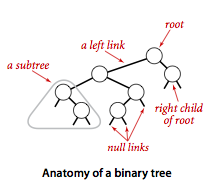
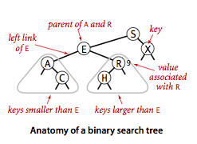
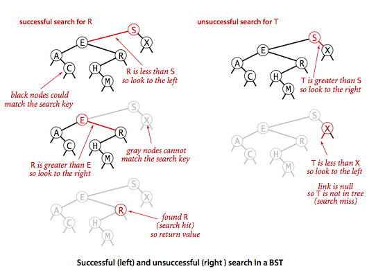
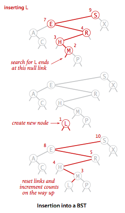
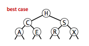
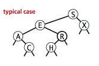
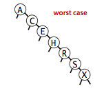
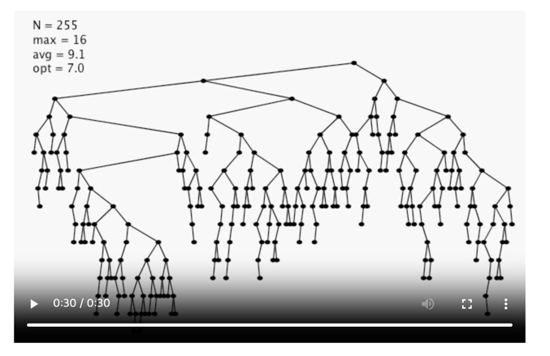

# 2. 이진 탐색 트리 (Binary Search Tree)

- 기본 구현
- 분석
- 순서 기반 메서드와 삭제

---



- 노드마다 2개의 링크를 사용하고, 이진 탐색 트리 데이터 구조를 기반으로 구현
- => 연결리스트의 우수한 삽입 작업 + 정렬된 배열의 효율적인 탐색
- 이러한 심볼 테이블 구현은 현대 컴퓨터 과학에서 가장 중요한 기초가 되는 알고리즘으로 인정받고 있음

#### BST, 용어 정의

- 링크 (link) : 노드를 연결하는 참조
    - 각 링크는 공백 겍체 (null link) 와 연결 or 다른 노드와 연결
    - 부모 링크 : 이진 트리에서 어떤 노드든 하나의 들어오는 링크를 가질 수 있도록 제한한 링크
    - 왼쪽 링크, 오른쪽 링크 : 나가는 링크는 정확히 2개 존재
- 노드 (node) : 키와 값으로 구성된 객체
    - 왼쪽 자식, 오른쪽 자식 : 왼쪽 링크, 오른쪽 링크로 연결된 각 노드
- 이진 탐색 트리 (BST)의 정의
    - 각 노드가 Comparable 키, 연관된 값을 가짐
    - 임의의 키는 왼쪽 부분 트리의 키들보다 크고, 오른쪽 부분 트리의 키들보다 작음

#### BST 표현



- 노드 안에는 키를 표시
- 연결 관계 표현 : "A는 E의 왼쪽 자식"
- 선은 노드의 연결을 의미
- 노드 옆에 노드의 키와 연관된 값 표시 (생략 가능)
- 공백 링크는 짧은 선분으로 표시

## 기본 구현

### 표현 방식

```java
public class BST<Key extends Comparable<Key>, Value> {

    // 중첩 클래스로 노드 정의
    private class Node {
        private Key key;           // sorted by key
        private Value val;         // associated data
        private Node left, right;  // left and right subtrees
        private int size;          // number of nodes in subtree
    }

    private int size(Node x) {
        if (x == null) return 0;
        else return x.size;
    }

    // ...

}
```

- 유연성 : 어떤 키 집합에 대한 BST 표현 방식은 여러개가 있음
    - 같은 키 집합이엉도 BST 가 여러개 존재할 수 있음
- 정렬 : 모든 키를 왼쪽 부분 트리의 노드들은 기준 키 왼쪽에, 오른쪽 부분 트리의 노드들은 기준 키 오른쪽에 위치
    - 항상 정렬된 키 목록을 얻어올 수 있음

### 탐색



- 키가 존재하면 연관되 값 리턴, 존재하지 않으면 null 리턴
- 재귀 탐색 가능 : BST는 재귀적인 구조
    - 트리가 공백이면 탐색 실패
    - 탐색 키가 뿌리 노드와 같으면 탐색 성공
    - 두경우 모두 아니면, 적합한 부분 트리로 재귀적으로 내려가며 탐색
        - 작으면 왼쪽, 크면 오른쪽

```java
public class BST<Key extends Comparable<Key>, Value> {

    // ...

    /**
     * Returns the value associated with the given key.
     *
     * @param key the key
     * @return the value associated with the given key if the key is in the symbol table
     * and {@code null} if the key is not in the symbol table
     * @throws IllegalArgumentException if {@code key} is {@code null}
     */
    public Value get(Key key) {
        return get(root, key);
    }

    private Value get(Node x, Key key) {
        if (key == null) throw new IllegalArgumentException("calls get() with a null key");
        if (x == null) return null;
        int cmp = key.compareTo(x.key);
        if (cmp < 0) return get(x.left, key);
        else if (cmp > 0) return get(x.right, key);
        else return x.val;
    }
    // ...

}
```

### 삽입



- 탐색 (`get()`) 작업에서 키를 찾지 못하면 새로운 노드로 바꿔주기

```java
public class BST<Key extends Comparable<Key>, Value> {

    // ...

    /**
     * Inserts the specified key-value pair into the symbol table, overwriting the old
     * value with the new value if the symbol table already contains the specified key.
     * Deletes the specified key (and its associated value) from this symbol table
     * if the specified value is {@code null}.
     *
     * @param key the key
     * @param val the value
     * @throws IllegalArgumentException if {@code key} is {@code null}
     */
    public void put(Key key, Value val) {
        if (key == null) throw new IllegalArgumentException("calls put() with a null key");
        if (val == null) {
            delete(key);
            return;
        }
        root = put(root, key, val);
        assert check();
    }

    private Node put(Node x, Key key, Value val) {
        if (x == null) return new Node(key, val, 1);
        int cmp = key.compareTo(x.key);
        if (cmp < 0) x.left = put(x.left, key, val);
        else if (cmp > 0) x.right = put(x.right, key, val);
        else x.val = val;
        x.size = 1 + size(x.left) + size(x.right);
        return x;
    }

    // ...

}
```

### 재귀

- 재귀 이전 : 주어진 키를 노드의 키와 비교해 왼쪽 (혹은 오른쪽)으로 내려감
- 재귀 이후 : 트리를 거슬로 올라감
    - `get()` 에서는 `return` 문으로 연이어 상위 호출로 되돌아감
    - `put()` 에서는 `return` 문으로 연이어 상위 호출로 되돌아가면서 `size` 필드를 갱신
- 기초적인 BST는 비재귀 방식으로 구현할 수 있기도 함

## 분석







- BST 알고리즘의 실행시간은 트리 모양에 종속적
- 완전한 균형의 BST는 N개의 노드가 있을 떄 뿌리와 null 링크 사이에 ~lgN개의 노드가 있음
- 최악의 경우 경로 N개의 노드를 모두 탐색해야함

### 명제 : N개의 무작위 키를 가진 BST 탐색 성공은 평균적으로 ~2lnN회의 비교연산 소요

- 탐색 성공시 소요된 비교연산 횟수는 노드 깊이 + 1
- 내부 경로 거리 : 모든 노드들에 대한 깊이를 더한 값

### 명제 : N개의 무작위 키로 형성된 BST에서 삽입, 탐색 실패 상황은 평균적으로 ~2lnN회의 비교연산 소요

- 평균적으로 삽입과 탐색 실패는 탐색 성공보다 한번 더 많은 비교연산 소요

### 실험



- 많은 응용 상황에서 BST 무작위 키 모델은 적합함
- 오차 요인
    - 테이블이 작을 떄 작업들을 완전히 랜덤하지 않을 수 있음
    - 키가 무작위이지 않음
    - 근사 수식 2lnN이 충분히 정확할만큼 테이블이 크지 않음

## 순서 기반 메서드와 삭제