# 3. 균형 탐색 트리

- 2-3 탐색 트리
- 레드-블랙 BST
- 구현
- 삭제
- 레드-블랙 BST의 속성

---

- BST는 최악의 조건에서 성능 문제가 있음 (노드가 무작위적이지 않을 때)
- 트리 생성 시 키 삽입 순서에 관계업이 로그 시간 성능을 보장하는 BST
    - 즉, N개의 노드가 있는 트리의 높이는 ~logN

## 2-3 탐색 트리

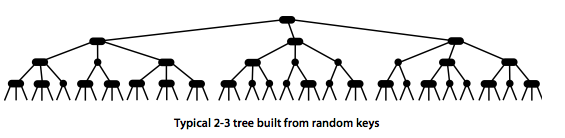

- 2-3트리는 최악의 조건에서도 좋은 성능을 보임 (최악의 조건 : 노드가 무작위적이지 않을 때)
- e.g. 10억개의 키를 가진 2-3트리의 높이는 19~30 사이 밖에 안됨

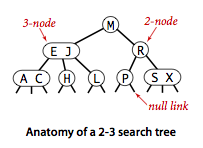

- 2-노드 : 표준 BST, 키 하나에 두개의 링크
- 3-노드 : 두개의 키와 세개의 링크

#### 정의

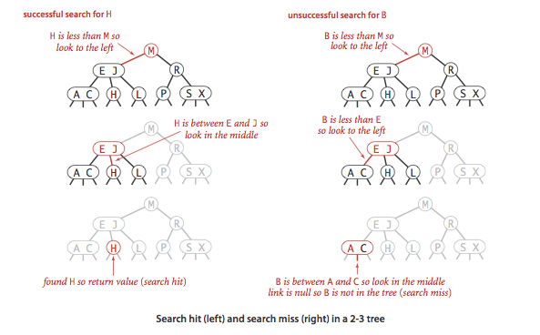

- 2-3 탐색 트리는 공백이거나 (2-노드 or 3-노드)로 구성
- 2-노드 : 하나의 키, 두개의 링크
    - 왼쪽 링크 : 더 작은 키를 담는 2-3 탐색 트리
    - 오른쪽 링크 : 더 큰 키를 담는 2-3 탐색 트리
- 3-노드 : 두개의 키, 세개의 링크
    - 왼쪽 링크 : 더 작은 키를 담는 2-3 탐색 트리
    - 중간 링크 : 두 개의 키 사이의 키를 담는 2-3 탐색 트리
    - 오른쪽 링크 : 더 큰 키를 담는 2-3 탐색 트리
- **완전히 균형 잡힌** 2-3 탐색 트리는 뿌리부터 null 링크까지의 거리가 모두 동일
    - 완전히 균형 잡히다 : 뿌리로부터 모든 리프까지의 거리가 동일
- **2-3 트리 : 완전히 규형잡힌 2-3 탐색 트리**

### 탐색

1. 트리에 키가 존재하는지 알기 위해 뿌리 노드의 키드로가 비교
2. 그 중 하나와 동일하면, 탐색 성공
3. 그렇지 않으면, 적합한 부분 트리 탐색
4. 링크가 null이면, 탐색 실패

### 2-노드로의 삽입

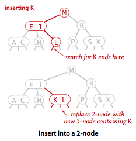

- 탐색 실패 후의 바닥에 새로운 노드 삽입해 연결하면 완전 균형 상태가 망가짐
- 탐색 실패 노드가 2-노드면, 3-노드로 변환하여 키를 삽입
- 탐색 실패 노드가 3-노드면, 추가 작업 필요 (하기 참조)

### 한개의 3-노드로 구성된 트리로의 삽입

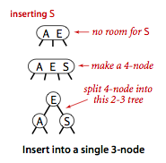

1. 임시로 4-노드를 만듦 (새로운 키 추가)
2. 4-노드를 3개의 2-노드로 분리
3. 결과 : 높이가 1 증가한 2-3 트리

### 2-노드를 부모로 가진 3-노드로의 삽입

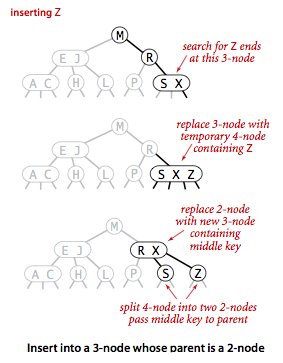

### 3-노드를 부모로 가진 3-노드로의 삽입


1. 임시로 4-노드를 만듦 (새로운 키 추가)
2. 중간 키를 부모 노드로 옮김 (부모 노드가 3-노드가 됨)
3. 결과 : 부모 노드가 3-노드가 되고, 자식노드는 2-노드로 분할됨
    - 중요 : 중간 키가 부모로 이동되어 완전 균형 상태가 유지됨

### 뿌리 노드의 분할

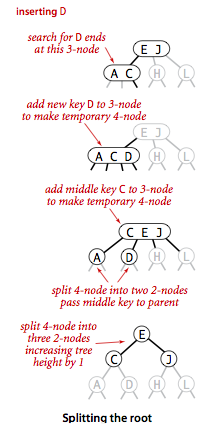

- 트리를 거슬러 뿌리까지 갔지만 모두 3-노드인 경우

1. 뿌리 노드를 임시로 4-노드로 만듦 (3-노드 한개로 이루어진 트리에 새로운 키를 삽입하는 경우와 동일하게 움직임)
2. 임시 4-노드를 3개의 2-노드로 분할
3. 결과 : 높이가 1 증가한 2-3 트리

### 지역 변환

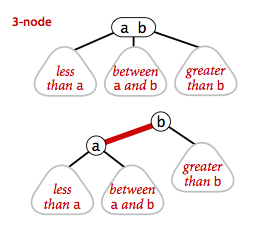

- 임시 4-노드를 분할하는 경우의 수 6가지
    - 4-노드가 루트 노드
    - 2-노드의 왼쪽
    - 2-노드의 오른쪽
    - 3-노드의 왼쪽
    - 3-노드의 중간
    - 3-노드의 오른쪽
- 2-3 트리의 삽입 알고리즘에서 변환 작업은 순수하게 지역적이다
    - 즉, 지정된 노드와 링크 외에 검사하거나 변경할 노드가 없음
- 각 변화마다 변경되는 링크의 수는 작은 상숫값 이하로 제한됨

### 전역 속성

- 지역 변환을 통해 전체 트리가 완전 균형을 이루게 함
- 뿌리 노드가 3개의 2-노드로 변환 시에만 예외적으로 뿌리에서 null까지의 모든 거리가 +1
- 즉, 모든 지역변환들은 전체 트리의 정렬 속성과 완전 균형 속성을 유지한다는 것이 알고리즘의 핵심

#### 명제 : 2-3트리에서 N개로의 키로 탐색, 삽입 작업시 방몬 노드 수가 최대 logN

- 표준 BST와 다른점 : 아래에서 위로 자람
    - 키를 표준 BST 기준 최악의 경우로 삽입해도 (오름차순으로 삽입) 높이가 logN을 넘지 않음
- 즉, 균형 트리는 표준 BST의 최악의 조건에서 성능을 보장할 수 있는 방법이 될 수 있음

## 레드-블랙 BST


- 기본 아이디어 : 표준 BST 기반에 3-노드로 표현할 수 있게 추가 정보를 첨가

### 3-노드의 표현 방식

- 링크는 두 종류 : 레드, 블랙 링크
- 레드 링크 : 3-노드를 두개의 2-노드를 묶어 표현
- 블랭 링크 : 2-3 트리들을 묶음
    - 왼쪽으로 기울어진 하나의 레드 링크로 두개의 2-노드를 연결하여 3-노드로 삼음
- 표준 BST의 `get()` 을 그대로 재활용 가능
- 어떤 2-3트리가 주어지든 각 노드를 이런식ㅇ로 변환하여 대응하는 BST를 형성해냄

### 다른 방식의 동등한 정의

다음 세가지 조건을 만족하면 레드-블랙 BST가 됨

- 조건 1. 레드 링크는 왼쪽으로 기운다 (큰 키에서 작은 키로 연결됨)
- 조건 2. 어떤 노드도 두개의 레드 링크로 연결되지 않는다
- 조건 3. 트리는 완전 블랙 균형 상태이다.
    - 즉, 모든 블랙 높이가 동일하다
    - 블랙 높이 : 뿌리로부터 모든 리프까지의 블랙 링크 수

### 1:1 대응 레드-블랙

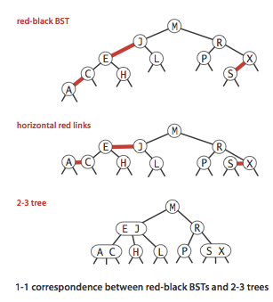

- 레드-블랙 트리는 BST이기도 하고, 2-3 트리이기도 함
- 레드-블랙 트리가 2-3 트리인 경우
    - BST에서 레드 링크를 가로로 그리면 뿌리부터 모든 리프까지의 거리가 동일
    - 레드 링크 노드를 병합하면 2-3 트리가 됨
- 레드-블랙 트리가 BST인 경우
    - 2-3 트리에서 3-노드를 레드 링크로 연결된 2-노드로 변환한 뒤
    - 레드 링크 노드의 자식이 존재하지 않으면 완전블랙 균형 상태가 됨
- 표준 BST와 2-3트리의 장점을 모두 취할 수 있음
    - BST의 장점 : 탐색 효율
    - 2-3트리의 장점 : 트리 균형을 유지하는 삽입 효율

### 색상 표현

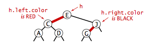

- 편의상 각 노드는 단 하나의 부모 링크를 가짐
- boolean 타입의 인스턴수 변수 `color` 를 `Node` 클래스에 추가
    - `true` : 레드 링크
    - `false` : 블랙 링크
    - `null` : 블랙 링크
- `isRed()` : 레드 링크인지 확인하는 메서드
- 노드의 색 = 노드를 가리키는 부모 링크의 색

````¬
private static final boolean RED = true;
private static final boolean BLACK = false;

private class Node {
    Key key;
    Value val;
    Node left, right;
    int N;
    boolean color;

    Node(Key key, Value val, int N, boolean color) {
        this.key = key;
        this.val = val;
        this.N = N;
        this.color = color;
    }
    
    boolean isRed(Node x) {
        if (x == null) return false;
        return x.color == RED;
    }
}
````

### 로테이션

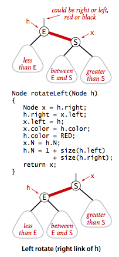

````
/**
  * 레드 링크를 오른쪽으로 기울이는 로테이션
  * @param h : 교정이 필요한 오른쪽 레드 링크를 가진 노드
  * @return : 레드 링크를 오른쪽으로 기울인 노드
*/
Node rotateLeft(Node h){
    Node x = h.right;
    h.right = x.left; // x의 왼쪽 자식을 h의 오른쪽 자식으로
    x.left = h;
    x.color = h.color;
    h.color = RED;
    x.N = h.N;
    h.N = 1 + size(h.left) + size(h.right);
    return x;
}
````

- 로테이션 : 레드 링크의 방향을 바꾸는 교정 작업
- **왼쪽 로테이션** : 오른족으로 기울어진 레드링크가 있을 때 왼쪽으로 기울어진 레드링크로 바꾸는 작업

### 로테이션 후 부모 링크의 재설정

````
h = rotateLeft(h); // h를 왼쪽으로 교정하고, 교정된 서브트리 뿌리를 h에 연결 (저장, 대입)
````

- 모든 로테이션 결과로 링크를 리턴
- 리턴한 결과를 사용해 부모 링크를 적절히 재설정

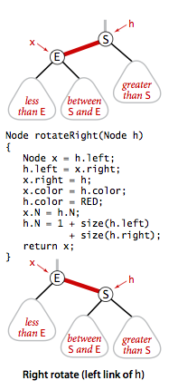

### 단일 2-노드로의 삽입

- 레드-블랙 BST에서 키 하나를 저장하는 2-노드는 하나만 존재함
- 해당 노드에 두번 쨰 키 삽입 시 로테이션 필요 가능성
- 삽입 키가 이미 존재하는 키보다 작으면, 새로운 키로 레드 노드 생성
    - 레드 노드 : 부모로부터 링크가 레드인 노드
- 삽입 키가 이미 존재하는 키보다 크면, 오른쪽에 레드 노드 생성
    - 로테이션 : `root = rotateLeft(root);`
- 결과 : 3-노드 하나짜리 레드-블랙 BST 생성됨

### 바닥에 있는 2-노드로의 삽입

- 일반 BST와 동일한 방법으로 삽입 (= 바닥에 새로운 노드 추가)
- 추가된 노드는 레드 링크로 부모와 연결
    - 오른쪽 레드링크로 연결되면 로테이션 필요

### 두 개의 키로 구성된(3-노드로 된) 트리로의 삽입

- 2개의 레드 링크로 새로운 노드 생성되고, 블랙으로 색을 반전시킴
- case 1. 삽입 키가 기존의 키들보다 작음
    1. 삽입 키가 왼쪽으로 연결됨
    2. 왼쪽으로 기울어진 두개의 레드링크 생성
    3. 가장 위쪽 링크를 `rotateRight()`
- case 2. 삽입 키가 기존 키 사이
    1. 왼쪽으로 기울어진 레드링크 생성됨
    2. 그 아래 오른쪽으로 기울어진 레드 존재
    3. 아래 링크를 `rotateLeft()`
- case 3. 삽입 키가 기존 키들보다 큼
    1. 기존 3-노드의 가장 왼쪽에 연결
    2. 중간 키가 뿌리가 되고, 두개의 키가 레드 링크로 연결됨
    3. 두개의 레드 링크를 블랙으로 변환

### 색 반전

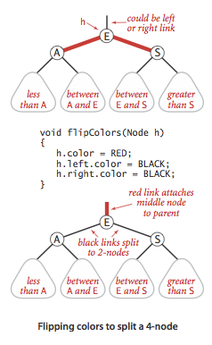

- `flipColors()` : 특정 노드의 두 자식 노드의 색 반전

```
/**
  * 색을 반전시켜 뿌리노드는 레드로, 자식노드는 블랙으로 변환
  * @param h : 색을 반전할 노드
*/
void flipColors(Node h) {
    h.color = RED;
    h.left.color = BLACK;
    h.right.color = BLACK;
}
```

### 뿌리를 블랙으로 유지하기

- 어떤 노드가 레드라는 것은, 그 노드가 부모 노드와 함께 3-노드의 구성요소임을 의미
- 삽입 후 뿌리 노드가 레드인 경우, 뿌리 노드를 블랙으로 변환
- 뿌리 노드의 색이 레드-> 블랙 반전될때마다 트리의 블랙 높이가 1씩 증가됨

### 바닥에 있는 3-노드로의 삽입

- 앞선 세가지 케이스 모두 가능
- 색 반전 시 중간 노드가 레드노드가 됨

### 트리를 거슬러 레드 링크 올려보내기

- 2-3트리의 삽입 알고리즘은 3-노드를 분할하여 중간 노드를 2-노드나 뿌리노드를 만날때까지 부모로 올려보냄
- 레드-블랙 BST에서는 `rotateLeft()`, `rotateRight()`, `flipColors()` 를 사용해 2-3트리와 레드-블랙 트리의 1:1 관곙 유지l
- `right` 가 `RED`이고, `left`가 `BLACK`인 경우 `rotateLeft()`
- `left`가 `RED`이고, `left.left`가 `RED`인 경우 `rotateRight()`
- `left`와 `right`가 `RED`인 경우 `flipColors()`

## 구현

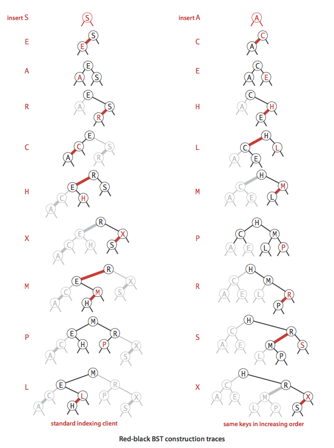

- 삽입 위치부터 트리를 거슬러 올라가며 재귀적으로 균현을 잡아감

```java
public class RedBlackBST<Key extends Comparable<Key>, Value> {
    private Node root;     // root of the BST

    private boolean isRed(Node h) {
    }

    private Node rotateLeft(Node h) {
    }

    private Node rotateRight(Node h) {
    }

    private void flipColors(Node h) {
    }

    private int size() {
    }

    /**
     * 키 탐색
     * 탐색 성공 -> 키 값 업데이트
     * 탐색 실패 -> 새로운 노드 생성 (테이블 크기 증가)
     */
    public void put(Key key, Value val) {
        if (key == null) throw new IllegalArgumentException("first argument to put() is null");
        if (val == null) {
            delete(key);
            return;
        }

        root = put(root, key, val);
        root.color = BLACK;
        // assert check();
    }

    // insert the key-value pair in the subtree rooted at h
    private Node put(Node h, Key key, Value val) {
        if (h == null) return new Node(key, val, RED, 1);

        int cmp = key.compareTo(h.key);
        if (cmp < 0) h.left = put(h.left, key, val);
        else if (cmp > 0) h.right = put(h.right, key, val);
        else h.val = val;

        // fix-up any right-leaning links
        if (isRed(h.right) && !isRed(h.left)) h = rotateLeft(h);
        if (isRed(h.left) && isRed(h.left.left)) h = rotateRight(h);
        if (isRed(h.left) && isRed(h.right)) flipColors(h);
        h.size = size(h.left) + size(h.right) + 1;

        return h;
    }
}

```

## 삭제

## 레드-블랙 BST의 속성
