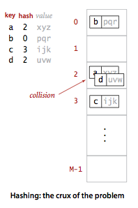
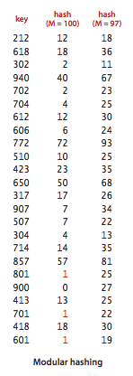
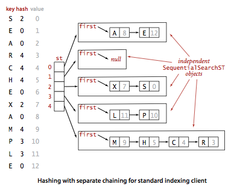
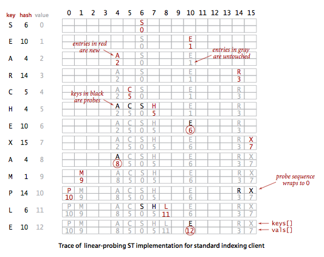

# 4. 해시 테이블

- 해시 함수
- 개별 체이닝 (chaining) 해싱
- 선형-탐지 (linear-probing)를 이용한 해싱
- 가변 크기 배열
- 메모리

---

- 키가 작은 정숫값이라면 배열의 인덱스를 키값으로 사용하여 테이블을 구성할 수 있음
- 하지만 키가 문자열이나 객체처럼 복잡한 데이터 타입이면 배열의 인덱스를 키로 사용하기 어려움
- 해싱 (hashing) : 키를 산술 연산해서 배열 인덱스로 변환하여 값에 접근
- 요소 1. 해시 함수 (hash function) : 탐색 키를 배열 인덱스로 변환하는 함수
    - 이상적이라면 서로 다른 키라면, 서로 다른 해시값 (인덱스)을 반환해야 함
    - 이상적이지 않은 경우를 대비하여 충돌 (collision)을 처리하는 방법이 필요



- 요소 2. 충돌 해소 단계 (collision resolution scheme) : 해시 함수가 서로 다른 키에 대해 같은 해시값을 반환할 때, 충돌을 해결하는 방법
    - 방법 1. 개별 체이닝 (chaining) : 해시 테이블의 각 슬롯에 연결 리스트를 저장
    - 방법 2. 선형-탐지 (linear-probing) : 충돌이 발생하면 다음 빈 슬롯을 찾아서 저장

### trade off : 공간 vs 시간

- 공간이 무한대라면, 모든 키에 대한 인덱스를 배열로 만들 수 있음
    - e.g. 대한민국 모든 주민번호가 키일 때,
        - 키 별로 1:1로 인덱스 값을 매핑한 배열을 만들 수 있음
- 시간이 무한대라면, 비순차 배열에서 순차 탐색
    - e.g. 대한민국 모든 주빈번호가 키일 때,
        - 모든 주민번호를 순차적으로 탐색해야 함
- 해싱은 두 가지 사이의 절충점을 찾는 기술

## 해시 함수

- M 개의 키-값 쌍을 가진 배열을 사용할 때
- 요구사항 1. 임의의 키를 [0, M-1] 범위의 정수로 변환
- 요구사항 2. [0, M-1] 사이에서 최대한 균등하게 분포
    - 특정 키에 대해 종속성이 없어야함
- 발상 1. 모든 키는 일련의 비트로 표현 가능 -> 비트 열의 범위에 해당하는 정숫값으로 매핑
    - 숫자 (e.g. 주민번호) -> 숫자 그대로 사용
    - 문자열 (e.g. 메일 주소) -> 문자열을 숫자로 변환 -> 숫자로 사용

### 전형적인 예제

- 미국 사회 보장번호 (SSN) : 9자리 숫자
    - 123-45-6789
    - 첫번쨰 필드 : 발행 지역
    - 나머지 필드 : 개인 식별
- 보장번호로 10억개까지 표현 가능
- 최악의 경우 : 10억개의 배열을 생성해두고, 각 배열에 값을 저장, 보장번호와 인덱스를 매핑
- 프로그램치 수백개 정도만 다룰수 있다면?
- M = 1000인 해시 테이블 사용
- 방법 1. 키에서 세자리 숫자를 따옴
    - 세번쨰 필드에서 세자리 숫자를 가져옴 e.g. 678
- 방법 2. 아홉자리 숫자 모두를 사용해 int를 만든 뒤 정수에 대한 해시 함수 적용

### 양의 정수



- modular hashing (모듈러 해싱) : 정수 해싱 시 가장 흔히 사용되는 방법
- 양의 정수 값 키 k를 M으로 나눈 나머지를 해시값으로 사용 `k % M`
- 배열의 크기 M은 소수 (prime number)
    - 소수가 아니면, 키의 모든 피트들이 변환에 기여하지 않아 해시값이 균등하게 분포되지 않을 수 있음
- e.g. 전화번호 지역코드가 사용되고, M=100이라면
    - 역사적으로 미국 전화번호 중간 필드는 0 or 1로 시작이 대부분
    - 0 or 1로 시작하는 전화번호가 많아지면, 해시값이 몰릴 수 있음 (20으로 몰림)
    - M=97로 해야 적당

### 부동소수점 숫자

- 키가 [0, 1] 사이의 실수라면 M을 곱해 정수로 바꾸어 [0, M-1] 사이의 정수로 해시
- 단점 : 직관적이지만 키의 최상위 비트가 더 많이 영향을 주고, 최하위 비트는 역할이 거의 없음
- 자바가 해결한 방법 : 부동소숫점 숫자의 이진수 표현에 무듈러 해싱

### 문자열

```
Stirng s = "임의의 키 값";
int hash = 0;
for (int i = 0; i < key.length(); i++) {
    hash = (R * hash + key.charAt(i)) % M;
}
```

- `charAt(i)` : 문자열의 i번째 문자의 16비트 양의 정수 값
- `R` : 기수 (radix) : 문자열의 문자 수

### 복합키

- 여러개의 정수 필드로 구성된 데이터 타입일 때
- String과 마찬가지로 모드 낙ㅂㅅ을 이어붙여 처리

````
int hash = (((day * R + month) % M) * R + year) % M;
````

### 자바의 해시 함수 관례

- 자바는 모든 데이터 타입이 32비트 정수 해시값을 리턴하는 `hashCode()` 메서드를 상속하게 함
- `hashCode()` 반드시 동일성 (equality)과 일관성 (consistency)을 만족해야 함
    - `a.equals(b)`가 참이면, `a.hashCode() == b.hashCode()`도 참
    - `a.equals(b)`가 거짓이면, `a.hashCode() == b.hashCode()`도 거짓
    - `a.hashCode() == b.hashCode()`가 참이면, `a.equals(b)`가 참일 수도 있고 거짓일 수도 있음
- TODO. 두 객체의 동일성은 해시 값이 아니라 `equals()` 메서드로 판단해야 한다고...? 왜..?

### hashCode() 값을 배열 인덱스로 변환하기

- 32비트 해시값을 M 크기의 배열 인덱스로 변환

````
private int hash(Key x) {
    return (x.hashCode() & 0x7fffffff) % M;
}
````

1. 부호 비트의 마스킹을 제거 : 32 비트 숫자를 31비트 양의 정수로 변환
2. 나머지 연산을 통해 M 크기의 배열 인덱스로 변환 (모듈러 해싱)

### 사용자 정의

- 클라이언트는 `hashCode()` 겨로가가 32 비트 숫자 범위 내에서 균일하게 분포하길 원함
- 즉, `x.hashCode()` 값은 가능한 값들 중에 동일한 확률로 나타아야함

````java
public class Transaction {
    private final String who;
    private final Date when;
    private final double amount;

    @Override
    public int hashCode() {
        int hash = 17;
        hash = 31 * hash + who.hashCode();
        hash = 31 * hash + when.hashCode();
        hash = 31 * hash + ((Double) amount).hashCode();
        return hash;
    }
}
````

### 소프트웨어 캐싱

- 해시가 오래걸리면 해시결과를 캐싱하는 것이 바람직
- 데이터 타입에 변수 `hash`를 추가하여 해시값을 저장
    - Java String 클래스 방법
- 좋은 해시 함수는 다음 특정을 만족
    - 특성 1. 일관성 : 같은 키는 같은 해시값
    - 특성 2. 효율성 : 해시가 효율적으로 빠르게 계산
    - 특성 3. 균등성 : 해시 값은 가능한 값들 중에 균일하게 분포

#### 균일 해싱 가정 : 우리가 사용하는 해시 함수 (`hashCode()`)는 서로 독립적인 값으로 정수 [0, M-1] 사이에 균등하게 분포시킨다

- 자바의 해시함수가 모든 임의 상황에서 만족할 수 없음
- 컴퓨터 과학 이론에서도 균일하고 독립적인 해시 값을 분포시키는 것은 연구 주제
- 1977년 카터 (L. Carter)와 와이스 (M. N. Wegman)는 해시 함수의 균등성을 측정하는 방법을 제안
    - 만약 어떤 해시 함수가 범용적이라면, 해시 함수는 키를 균일하게 분포시킨다.
        - 단, 독립성은 부분적으로만 확보된다 (즉, 키가 서로 독립적이지 않을 수 있다)
- 가이드
    - 충돌이 많이 일어날 가능성이 있는 함수 선택 X
    - 균일 해싱 가정을 만족하지 못하더라도 성능을 크게 저하시키지 않는다면, 충돌을 최소화하는 함수 선택

## 개별 체이닝 (chaining) 해싱



- 해싱 알고리즘의 두번째 요소는 충돌 처리 (collision resolution)
    - 서로다른 두 키를 같은 해시값으로 반환해버려 동일한 인덱스에 여러 키를 삽입 해야하는 상황을 해소하는 절차
- 단순한 해결책 : 같은 인덱스에 연결리스트를 두어 복수의 키를 저장
    - 개별 체이닝 (separate chaining)
- 개별-체이닝 해싱은 키의 순서가 중요치 않은 응용환경에서 가장 빠른 심볼 테이블
- 구현이 쉬움
- 개별 연길리스트 크기 M의 크기를 충분히 크게 만들어 두번만에 탐색이 끝나도록 함
- 구현 방법 : M개의 인덱스에 대해 인덱스에 저장되는 키만을 위한 심볼테이블 생성
    - 비효율적이지만 범용적이고 단순한 방법
    - M개의 리스트(인덱스)가 각각 N개의 키를 저장
    - 리스트 분포에 관계없이 리스트 평균길이는 N/M
- 상세 구현
    - `SequentialSearchST` 클래스 : 순차 탐색을 이용한 심볼 테이블
    - `SeparateChainingHashST` 클래스 : 개별 체이닝 해싱을 이용한 심볼 테이블
    - `SequentialSearchST`를 M개의 배열로 만들어 `SeparateChainingHashST` 심볼 테이블 구현
- 알고리즘 예시 (탐색)
    1. `SeparateChainingHashST.get(탐색키)` -> 탐색키의 해시값을 계산하여 `SequentialSearchST` 배열의 인덱스 반환
    2. `SequentialSearchST.get(탐색키)` -> 해당 인덱스의 `SequentialSearchST` 객체에서 탐색키를 찾아 반환 (이떄 순차 탐색)

```java
public class SeparateChainingHashST<Key, Value> {
    private int M; // 해시 테이블 크기
    private SequentialSearchST<Key, Value>[] st; // M개의 SequentialSearchST 객체

    public SeparateChainingHashST() {
        this(997); // 기본 크기
    }

    // M개의 연결 리스트 생성
    public SeparateChainingHashST(int m) {
        this.m = m;
        st = (SequentialSearchST<Key, Value>[]) new SequentialSearchST[m];
        for (int i = 0; i < m; i++)
            st[i] = new SequentialSearchST<Key, Value>();
    }

    private int hash(Key key) {
        return (key.hashCode() & 0x7fffffff) % M;
    }

    public Value get(Key key) {
        return (Value) st[hash(key)].get(key);
    }

    public void put(Key key, Value val) {
        st[hash(key)].put(key, val);
    }

    public Iterable<Key> keys() {
        // 모든 키를 순회하며 반환
    }
}

```

### 명제 : M개의 리스트와 N개의 키가 사용되는 개별 체이닝 해시 테이블에서, 각 리스트의 길이가 N/M에서 작은 상숫값 만큼 차이날 확률은 1에 극히 가깝다. (가정 J에 한해)

- **가정 J** : 균일 해싱 가정
    - 우리가 사용하는 해시 함수는 키의 해시값을 서로 독립적으로 정수 [0, M-1] 사이에 균등하게 분포시킨다
- 고전적인 확률 이론으로 증명 가능
- 주의점 : 가정 J에 전형적으로 의존한다.
    - 만약 해시 함수가 균일하지도 않고, 독립적이지도 않다면 순차 탐색보다 나을게 없어짐

### 속성 L : 개별-체이닝 해시 테이블에서 M개의 리스트와 N개의 키가 사용될 때, 탐색 실패와 삽입 시 소요되는 비교 연산 (동일성 테스트) 의 횟수는 ~N/M에 비례한다

- 1950년대부터 수많은 프로그래머들에 의해 개별-체이닝이 명제 K에서 예측만큼 좋은 성능을 보임을 확인함
- 예를 들어 아주 큰 문자열 (책 정도의)을 가지고 개별-체이닝 방법으로 해싱한 결과 M개의 리스트 길이 분포가 이론적 모델과 정확하게 합치됨
- 즉, M개의 배열을 사용하는 개별-체이닝은 심볼테이블 탐색/삽입 작업에서 M배 성능 향상을 가져온다고 말 할 수 있음

### 테이블 크기

- 개별-체이닝 시 테이블 크기 M은 너무 크지도, 작지도 않게 적절히 사용하는 것이 좋음
- M이 너무 크면 -> 비어있는 체인이 많아져 메모리 낭비
- M이 너무 작으면 -> 체인이 길어져 탐색 시간이 길어짐
- 기대보다 키가 많으면 -> M을 늘리고 -> 탐색 성능이 떨어지게 됨
- 공간 절약이 중요치 않으면 M을 여유있게 두어 탐색 성능을 높이는 것이 좋음

### 삭제

- 단순히 키를 가진 `SequentialSearchST` 객체를 찾고 `delete()` 메서드를 호출

### 순차 작업

- 키들 간의 순서는 해싱 작업에 읭해 사라짐
- 따라서 최대/최소 항목 또는 특정 범위 탐색을해야하면 해싱은 적합하지 않음 (선형 성능)

## 선형-탐지 (linear-probing)를 이용한 해싱



- M > N인 경우 (M = 테이블 크기, N = 키-값 쌍 개수)
- 개방형 주소 지정 (open-addressing) 해싱 : 즉, 해시 테이블의 크기가 저장할 key-value 쌍 개수보다 큰 경우, 해시 값 충돌이 나면 이미 존재하는 빈 공간에 의존하여 충돌 해소
- 해시값 충돌이 일어나면 단순히, 테이블의 다음 항목 위치 (인덱스를 증가한 위치)를 검사하면서 빈 공간을 찾음
    - 탐색 성공 :탐색 키와 탐지 중인 키가 동일한 경우
    - 탐색 실패 : 빈 공간 (인덱스 위치에 null 키 존재) 탐지
    - 다음 인덱스 시도 : 탐색 키와 탐지 중인 키가 다름
- 키를 테이블 인ㄷ게스로 해싱하고, 탐ㄴ색 키와 매칭되는 키가 그 위치에 있는지 검사하는 작업을 반복 (같은 키가 발겨노디거나, 빈 공간을 찾을 떄까지)
    - 인덱스를 증가하면서, 마지막 부븐에 도착하면 테이블의 앞으로 되돌아감
- 이탐침 (probe) : 테이블에 이미 있는지 없는지 검사하는 탐색 키
- 핵심 아이디어 : 메모리를 연결 리스트의 링크 참조 변수로 허비하는 대신, 해시 테이블의 키 저장 곤안을 늘이는데 쓰자
    - 키 탐지 위치의 끝 (저장된 키 나열의 끝) 을 표시하는데 `null` 값 사용

```java
public class LinearProbingHashST<Key, Value> {
    private int N;  // 테이블에 저장된 키-값 쌍 개수
    private int M = 16; // 테이블 크기
    private Key[] keys; // 키 배열
    private Value[] vals; // 값 배열

    public LinearProbingHashST() {
        keys = (Key[]) new Object[M];
        vals = (Value[]) new Object[M];
    }

    private int hash(Key key) {
        return (key.hashCode() & 0x7fffffff) % M;
    }

    private void resize(int cap) {
        // 크기 조정
    }

    public void put(Key key, Value val) {
        if (N >= M / 2) resize(2 * M); // 테이블 크기가 1/2 이상 차면 크기 조정
        int i;
        for (i = hash(key); keys[i] != null; i = (i + 1) % M) {
            if (keys[i].equals(key)) {
                vals[i] = val;
                return;
            }
        }
        keys[i] = key;
        vals[i] = val;
        N++;
    }

    public Value get(Key key) {
        for (int i = hash(key); keys[i] != null; i = (i + 1) % M) {
            if (keys[i].equals(key)) {
                return vals[i];
            }
        }
        return null;
    }
}
```

### 삭제

- 키 위치를 null로 세팅하면, 저장된 키들의 마지막 위치는 null이라는 원칙이 깨져, null로 지워진 키의 뒷부분에 저장된 항목을 무시하게 됨

````
public void delete(Key key){
  if(!contains(key)) return;
  
  int i = hash(key);
  while(!key.equals(keys[i]))
      i = (i + 1) % M;
      
  keys[i] = null;
  vals[i] = null;
    while(keys[i] != null){
      Key keyToRedo = keys[i];
      Value valToRedo = vals[i];
      keys[i] = null;
      vals[i] = null;
      N--;
      put(keyToRedo, valToRedo);
      i = (i + 1) % M;
    }
    
    N--;
    if(N > 0 && N == M / 8) resize(M / 2);
}
````

### 무리 짓기

- 선형-탐지의 평균 비용은 키들이 어떤시긍로 뭉쳐저 테이블 공간을 차지하느냐에 조속적임
- 키 무리 (cluster) : 키가 삽입되는 와중에 연소괻게 모여있는 키의 집합
- e.g. 키 C가 삽이보딜 때 (A C S) 와 같은 길이 3인 키 무리가 나타남
    - 이 떄 H를 ㅏㅂ입하면, 키 무리의 첫번쨰 인덱스와 같아 네번의 탐지가 소요됨

### 선형 탐지의 분석

// TODO. 선형 탐지의 분석

## 가변 크기 배열

## 메모리
