## 1. 무방향 그래프

- 용어
- 무방향 그래프 데이터 타입
- 깊이 우선 탐색 (Depth-First Search, DFS)
- 경로 찾기
- 너비 우선 탐색 (Breadth-First Search, BFS)
- 연결 컴포넌트
- 심볼 그래프
- 요약

---

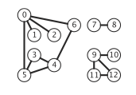

### 정의 : 그래프는 정점의 집합과 그 집합의 정점 쌍을 연결하는 간선의 모음이다.

- 그래프 모델 : 정점을 간선으로 연결한 것
- 무방향 그래프 : 가장 단순한 모델
- 각 정점을 구분하는 관례
    - V개 정점 그래프에서 각 정점의 이름을 0부터 V-1까지의 정수로 지정
    - 정점 이름을 배열의 인덱스로 사용 가능
- v-w or w-v : 정점 v와 w를 연결하는 간선
- 그림으로 표현시
    - 원 : 정점
    - 원과 원의 연결 선분 : 간선

### 특이 조건

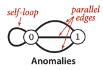

- 자기 순환 (self-loop) : 정점이 자기 자신과 연결된 순환 간선
- 다중 간선 (parallel edges) : 두 정점을 연결하는 두 개 이상의 간선
    - 다중 그래프 : 다중 간선이 있는 그래프
- 단순 그래프 : 자기 순환과 다중 간선이 없는 그래프

## 용어

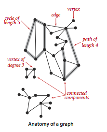

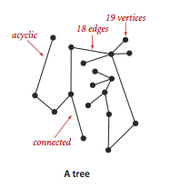

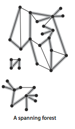

- 인접한다 (adjacent to) : 두 정점이 간선으로 연결되어 있는 경우
- 부속한다 (incident to) : 정점이 간선에 연결되어 있는 경우
- 차수 (degree) : 정점에 부속된 간선의 수
- 서브그래프 (subgraph) : 그래프를 이루는 간선들의 부분집합

> ### 정의
> - 경로 : 간선으로 연결된 정점들의 나열
> - 단순경로 : 반복되는 정점이 없는 경로
> - 순환 : 출발 정점과 도착 정점이 같은 같은 간선이 하나라도 존재하는 경로
> - 단순 순환 : 반복되는 간선이나 정점이 없는 순환 경로 (출발/도착 정점 예외)
> - 경로 (순환)의 길이 : 간선의 개수

- 일반 경로 (일반 순환) : 반복되는 정점이 있을수 있는 경우
- 연결되었다 : 어떤 두 정점을 모두 포함하는 경로가 존재하는 경우
- u-v-w-x : u에서 x로 가는 경로의 표현
- u-v-w-x-u : u로 다시 돌아가는 경로

> ### 정의
>
> - 그래프가 연결되었다 : 그래프 임의의 정점에서 다른 정점으로 가는 경로가 항상 존재하는 경우
> - 연결 컴포넌트 : 서로 연결된 정점들이 모두 모인 서브 그래프
> - 전체 그래프는 연결 컴포넌트들의 집합

| 그래프     | 비유                     |
|---------|------------------------|
| 정점      | 매듭, 구슬                 |
| 간선      | 밧줄, 실                  |
| 연결 컴포넌트 | 어떤 밧줄을 잡아당겼을 때 끌려오는 그룹 |
| 전체 그래프  | 그룹들의 집합                |

- 비순환 그래프 (acyclic graph) : 순환 경로가 없는 그래프

> ### 정의
>
> - 트리 : 연결된 비순환 그래프
> - 숲 : 서로 중첩되는 부분이 없는 트리들의 집합
> - 신장 트리 (spanning tree) : 어떤 연결된 그래프에 대해 속한 모든 정점들을 포함하는 트리
> - 신장 숲 (spanning forest) : 연결 컴포넌트들 각각에 대한 신장 트리들의 집합

- V개의 정점을 가지는 그래프 G가 트리가 되기 위한 조건
    - G는 V-1개의 간선을 가지고, 순환 경로는 없다
    - G는 V-1개의 간선을 가지고, 연결되어 있다.
    - G는 연결되어 있지만, 어떤 간선이든 하나를 제거하면 연결이 끊어진다.
    - G는 비순환 그래프지만, 어떤 두 정점이든 가선을 하나 추가하면 순환 경로가 생긴다.
    - G의 임의의 두 정점을 연결하는 경로는 모든 경우에 있어 정확히 하나만 존재한다.
- 그래프의 밀도 (density) : 간선으로 연결된 정점 쌍의 개수와 가능한 정점 쌍의 개수의 비율
- 희소 (sparse) 그래프 : 밀도가 낮은 그래프
    - 희소하다 : 간선의 개수가 V에 작은 상수 비율정도의 값
- 밀집 (dense) 그래프 : 밀도가 높은 그래프
    - 밀집하다 : 희소하지 않은 그래프
- 이분 그래프 (bipartite graph) : 모든 간선들이 두 그룹으로 완전히 나뉘어진 정점의 양쪽을 연결하는 그래프

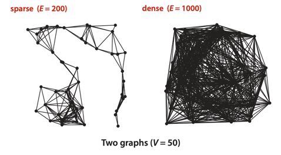

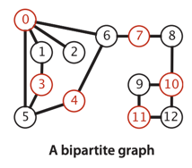

## 무방향 그래프 데이터 타입

<table>
    <tr>
        <td colspan="2">
          public class Graph
        </td>
    </tr>
    <tr>
        <td>
            Graph (int V)
        </td>
        <td>
            간선 없이 V개의 정점을 가진 그래프 생성
        </td>
    </tr>
    <tr>
        <td>
            Graph(In in)
        </td>
        <td>
            입력 스트림으로부터 그래프 생성 (in은 2E+2개의 정수, V와 E는 정수, 간선은 정점 쌍의 리스트 E개)
        </td>
    </tr>
    <tr>
        <td>
            int V()
        </td>
        <td>
            정점의 개수 반환
        </td>
    </tr>
    <tr>
        <td>
            int E()
        </td>
        <td>
            간선의 개수 반환
        </td>
    </tr>
    <tr>
        <td>
            void addEdge(int v, int w)
        </td>
        <td>
            간선 v-w 추가
        </td>
    </tr>
    <tr>
        <td>
            Iterable&lt;Integer&gt; adj(int v)
        </td>
        <td>
            정점 v에 인접한 정점 리스트 반환
        </td>
    </tr>
    <tr>
        <td>
            String toString()
        </td>
        <td>
            그래프의 문자열 표현 반환
        </td>
    </tr>
</table>


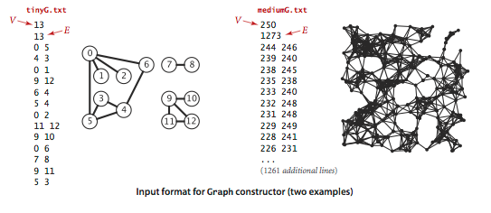

```
// 주어진 정점의 차수 구하기
public static int degree(Graph G, int v) {
    int degree = 0;
    for (int w : G.adj(v)) degree++;
    return degree;
}

// 최대 차수 구하기
public static int maxDegree(Graph G) {
    int max = 0;
    for (int v = 0; v < G.V(); v++)
        if (degree(G, v) > max)
            max = degree(G, v);
    return max;
}

// 평균 차수 구하기
public static double avgDegree(Graph G) {
    return 2.0 * G.E() / G.V();
}

// 자기 순환의 개수 구하기
public static int numberOfSelfLoops(Graph G) {
    int count = 0;
    for (int v = 0; v < G.V(); v++)
        for (int w : G.adj(v))
            if (v == w) count++;
    return count / 2;
}

// 그래프의 인접 리스트 구조에 대한 문자열 표현
public String toString() {
    String s = V + " vertices, " + E + " edges\n";
    for (int v = 0; v < V; v++) {
        s += v + ": ";
        for (int w : this.adj(v))
            s += w + " ";
        s += "\n";
    }
    return s;
}
```

### 다른 표현 방법

| 기반 데이터 구조 | 공간 성능 | 간선 v-w 추가 성능 | w의 v인접 여부 검사 | v에 인접한 정점 순회 |
|-----------|-------|--------------|--------------|--------------|
| 간선 리스트    | E     | 1            | E            | E            |
| 인접 행렬     | V^2   | 1            | 1            | V            |
| 인접 리스트    | E+V   | 1            | degree(v)    | degree(v)    |
| 인접 집합     | E+V   | log(V)       | log(V)       | degree(v)    |

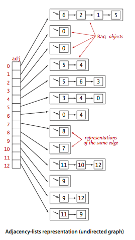

- 요구사항 1. 실제 응용에서 만날 수 있는 여러가지 그래프 형태를 감당할 수 있도록 높은 수준의 공간 효율성을 만족해야한다.
- 요구사항 2. 클라이언트에서 이용할 Graph 인스턴스 메서드들이 빠른속도로 동작할 수 있도록 높은 수준의 시간 효율성으로 구현될 수 있어야 한다.
- 후보 데이터 구조
    - 후보 1. 인접 행렬 데이터 구조
        - V * V 크기의 boolean 타입 배열에 간선 v-w가 존재하면 v행 w열의 값을 true로 설정
        - v^2개의 boolean 값 저장 공간 필요
        - 단점 : 정점의 수가 많을수록 공간 낭비
    - 후보 2. 간선 배열 데이터 구조
        - `Edge` 클래스 생성, 정점 두개의 연결을 의미하는 int 타입 인스턴스 변수 2개를 가짐
        - 단점 : 간선이 많을수록 시간 낭비
            - `adj()` 구현 시 모든 간선을 검사해야 함
    - 후보 3. 인접 리스트의 배열 데이터 구조
        - 각 정점마다 그에 인접한 정점 목록을 배열로 저장
        - 배열들을 리스트로 관리
        - 대부분의 응용 상황에서 공간/시간 효율성 만족

### 인접-리스트 데이터 구조

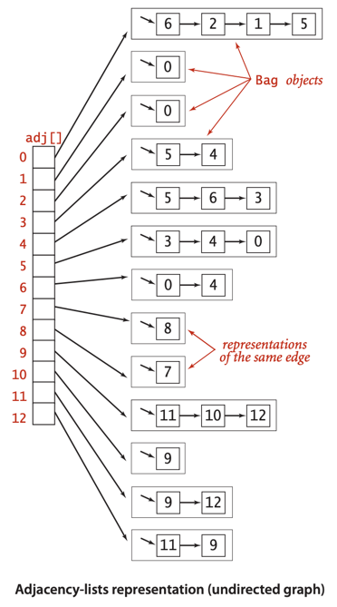

- 밀집하지 않은 그래프에서는 인접-리스트 데이터 구조가 표준으로 사용됨
- 어떤 정점이 주어지면 배열을 통해 즉각적으로 인접한 정점을 담은 리스트에 접근 가능
- `Bag` 데이터 타입 사용
    - `Bag`으로 간선 추가, 인접 정점 목록 순회 작업을 상수 시간에 완료
- 공간 사용량이 V+E에 비례
- 간선 추가 작업은 상수 시간 소요
- 정점 v에 인접한 정점 목록 순회 작업 시간은 정점 v 차수에 비례
- 동일한 그래프가 서로 다른 인접 리스트 배열로 표현될 수 있음
    - 인접 리스트 배열의 정점 순서는 그래프 생성 시 간선이 그래프에 추가된 순서를 따름

```java
public class Graph {
    private final int V; // 정점 개수
    private int E; // 간선 개수
    private Bag<Integer>[] adj; // 인접 리스트

    public Graph(int V) {
        this.V = V;
        this.E = 0;
        adj = (Bag<Integer>[]) new Bag[V]; // 각 정점에 대한 인접 리스트 생성
        for (int v = 0; v < V; v++)
            adj[v] = new Bag<Integer>();
    }

    public Graph(In in) {
        this(in.readInt()); // 정점 개수를 읽기
        int E = in.readInt(); // 간선 개수 읽기

        for (int i = 0; i < E; i++) {
            // 간선 추가
            int v = in.readInt(); // 정점 읽기
            int w = in.readInt(); // 다른 정점 읽기
            addEdge(v, w); // 간선 추가
        }
    }

    public int V() {
        return V;
    }

    public int E() {
        return E;
    }

    public void addEdge(int v, int w) {
        adj[v].add(w); // v의 인접 리스트에 w 추가
        adj[w].add(v); // w의 인접 리스트에 v 추가
        E++;
    }

    public Iterable<Integer> adj(int v) {
        return adj[v];
    }
}
```

#### 추가 고려 대상 API

- 정점의 추가 / 삭제
    - 배열 (정점을 인덱스로 하는)대신 심볼 테이블을 이용해볼 수 있음
    - 심볼 테이블을 사용하면 정점의 타입이 정수일 필요도 없어짐
- 간선의 삭제, 간선 v-w 존재 여부 검사
    - 인접 리스트 `Bag` 대신 `SET` 사용
    - 인접 집합 가능 (`SET`으로 다중 간선을 금지 가능)

### 그래프 처리 디자인 패턴

- 그래프 표현 방법과 알고리즘 구현을 분리
- 각 작업 마다 적합한 구현 클래스를 작성
- 클라이언트는 필요 작업에 맞는 클래스를 사용
- 생성자에서는 클라이언트의 요청을 효율적으로 처리하기 위한 전처리 과정 수행

```java
public class TestSearch {
    // 원점 s에서 시작하는 그래프 G의 연결 컴포넌트 찾기
    public static void main(String[] args) {
        Graph G = new Graph(new In(args[0])); // 그래프
        int s = Integer.parseInt(args[1]); // 원점
        Search search = new Search(G, s);

        for (int v = 0; v < G.V(); v++)
            if (search.marked(v))
                StdOut.print(v + " ");
        StdOut.println();

        if (search.count() != G.V())
            StdOut.print("NOT ");
        StdOut.println("connected");
    }
}
```

<table>
    <tr>
        <td colspan="2">
            public class Search
        </td>
    </tr>
    <tr>
        <td>
            Search(Graph G, int s)
        </td>
        <td>
            원점 s에 연결된 정점들 찾기
        </td>
    </tr>
    <tr>
        <td>
            boolean marked(int v)
        </td>
        <td>
            정점 v가 원점 s에 연결되어 있는지 여부 반환
        </td>
    </tr>
    <tr>
        <td>
            int count()
        </td>
        <td>
            원점 s에 연결된 정점의 개수 반환
        </td>
</table>

- 원점 : 생성자에 인수로 전달되는 정점
- 생성자의 역할 : 그래프에서 원점에 연결된 다른 정점들을 찾는 것

#### BFS와 DFS는 범용적인 그래프 탐색 접근 방법

- 공통점 1. 데이터 구조에서 방문 표시되지 않은 정점 v를 꺼내고 방문 표시
- 공통점 2. 정점 v에 인접한 정점 중 방문 표시되지 않은 것들을 데이터 구조에 넣음
- BFS는 LIFO 데이터 구조 사용
- DFS는 FIFO 데이터 구조 사용
- 이러한 동작 차이는 서로 다른 관점에서 그래프를 바라보게 만듦

| BFS             | DFS             |
|-----------------|-----------------|
| LIFO 데이터 구조 사용  | FIFO 데이터 구조 사용  |
| 성급하게 데이터 구조에 추가 | 느긋하게 데이터 구조에 추가 |

## 깊이 우선 탐색 (Depth-First Search, DFS)

- 정점의 순회를 위해 서로 다른 순회 전략들이 있음
- 그 중에서 가장 단순하고 전통적인 방법이 깊이 우선 탐색

### 미로 찾기

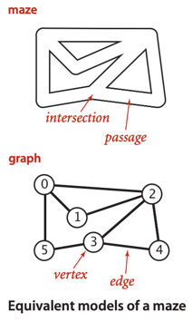

| 미로  | 그래프 |
|-----|-----|
| 길   | 간선  |
| 갈림길 | 정점  |

- 미로 : 갈림길과 그 갈림길에 연결된 길로 이루어짐
- 트라모스의 탐험 (Trémaux's exploration) : 미로를 탐색하는 방법
    - 가보지 않은 아무 길이나 선택하고, 실을 풀어서 남기져 진행
    - 한번이라도 지나간 길이나 갈림길은 표시를 남김
    - 표시된 갈림길을 만나면 풀어둔 실을 따라 뒤로 되돌아감
    - 되돌아가다가 지나지 않은 길에 남아있는 갈림길이 있다면 위 작업 반복


### 준비 운동

- 연결 그래프를 저통적인 재귀적 방식으로 탐색하는 것이 트라모스의 탐험과 유사
- 깊이 우선 탐색 : 그래파 탐색마다 다음 동작을 하면서 정점을 방문하는 메서드를 재귀적으로 호출
    - 방문 했다는 표시
    - 인접한 정점 중 방문하지 않은 정점을 재귀적으로 방문

```java
// 깊이 우선 탐색
public class DepthFirstSearch {
    private boolean[] marked; // 정점 별 방문 여부
    private int count; // 방문한 정점 개수

    public DepthFirstSearch(Graph G, int s) {
        marked = new boolean[G.V()];
        dfs(G, s);
    }

    private void dfs(Graph G, int v) {
        marked[v] = true;
        count++;
        for (int w : G.adj(v))
            if (!marked[w]) // 방문하지 않은 정점이면
                dfs(G, w); // 재귀 호출
    }

    public boolean marked(int w) {
        return marked[w];
    }

    public int count() {
        return count;
    }

}
```

#### 명제 : DFS는 주어진 원점에 연결된 모든 정점들을 방문 표시하는데 그 정점들의 차수에 비례하는 시간 소요

### 단방향 통로

- 메서드 호출 후 리턴하는 과정 : 미로에서 길에 실을 풀어놓았다가 되짚어 가는 과정
    - 어떤 정점에 부속한 간선들을 모두 처리(탐색) 한 다음에 되돌아옴
- 어떤 통로(간선)을 처음 지나가거나, 표시된 정점에서 되돌아오면서 두번쨰로 지나가게됨
    - 표시되지 않은 정점 w에 대한 간선 v-w를 만나면, 재귀 호출
    - 이미 방문한 v-w를 건너 뛸때도 재귀 호출 (반대 방향 w-v를 만났을 때)
        - 이 떄는 v가 이미 방문된 상태라서 건너뛰게됨

### DFS의 동작 과정

- DFS는 그래프의 모든 정점을 방문하는데 사용됨
- 간선이 검사되고, 정점이 방문되는 순서는 그래프의 표현 상태에도 의존적임
- 그래프 첫번째 정점의 인접리스트 가장 앞에 있는 정점이 가장 먼저 방문됨
- DFS는 기대한것 보다 두배 오래 걸림
    - DFS는 각 간선을 두번씩 순회하고, 표시되는 정점도 두번씩 방문함

### 깊이 우선 탐색의 상세 동작 과정

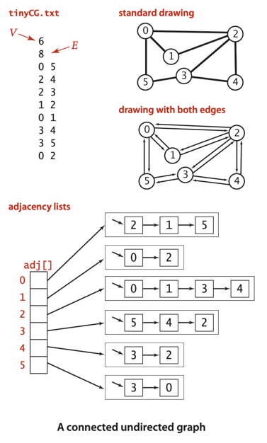

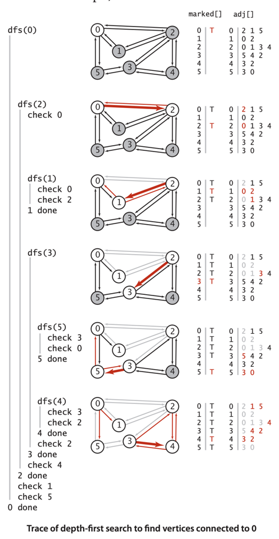

````
6
8
0 5
2 4
2 3
1 2
0 1
3 4
3 5
0 2
````

````
// graph 데이터 의사 코드
val graph = Graph(
    0 = [2, 1, 5],
    1 = [0, 2],
    2 = [0, 1, 3, 4],
    3 = [2, 4, 5],
    4 = [2, 3],
    5 = [0, 3]
)
````

1. 0의 인접리스트에서 2를 방문
    1. dfs()에서 0을 방문 표시
    2. 2를 방문 (재귀호출)
        1. 2를 방문 표시
        2. 0을 방문 (실패, 이미 방문)
        3. 1을 방문 (재귀호출)
            1. 1을 방문 표시
            2. 0, 2 방문 (실패, 이미 방문)
        4. 3을 방문 (재귀호출)
            1. 3을 방문 표시
            2. 2, 4를 방문 (실패, 이미 방문)
            3. 5를 방문 (재귀호출)
                1. 5를 방문 표시
                2. 0, 3 방문 (실패, 이미 방문)
        5. 4를 방문 (재귀호출)
            1. 4를 방문 표시
            2. 2, 3 방문 (실패, 이미 방문)

## 경로 찾기

- **연결성 검사** : 주어진 그래프에서 특정 두 정점이 연결되어 있는가? 그 그래프에서 연결 컴포넌트 개수는 몇개인가?
    - = 두 정점을 연결하는 경로가 존재하는가?
    - **단일 원점에서 시작하는 경로** : 그래프와 원점 s가 주어졌을때 s로부터 어떤 다른 정점 v로의 경로가 존재하는가?

<table>
    <tr>
        <td colspan="2">
            public class Paths
        </td>
    </tr>
    <tr>
        <td>
            Paths(Graph G, int s)
        </td>
        <td>
            원점 s에서 시작하는 모든 경로
        </td>
    </tr>
    <tr>
        <td>
            boolean hasPathTo(int v)
        </td>
        <td>
            원점 s에서 정점 v로의 경로가 존재하는가?
        </td>
    </tr>
    <tr>
        <td>
            Iterable&lt;Integer&gt; pathTo(int v)
        </td>
        <td>
            원점 s에서 정점 v로의 경로
        </td>
    </tr>
</table>

### 구현

```java
// PathClient
public class PathClient {
    public static void main(String[] args) {
        Graph G = new Graph(new In(args[0])); // 그래프
        int s = Integer.parseInt(args[1]); // 원점
        Paths search = new Paths(G, s); // 경로 탐색

        for (int v = 0; v < G.V(); v++) {
            StdOut.print(s + " to " + v + ": ");
            if (search.hasPathTo(v)) {
                for (int x : search.pathTo(v))
                    if (x == s) StdOut.print(x);
                    else StdOut.print("-" + x);
            }
            StdOut.println();
        }
    }
}
```

````
% java Paths tinyCG.txt 0
0 to 0: 0
0 to 1: 0-2-1
0 to 2: 0-2
0 to 3: 0-2-3
0 to 4: 0-2-3-4
0 to 5: 0-2-3-5
````

```java
// 그래프의 경로를 찾기 위한 깊이 우선 탐색
public class DepthFirstPaths {
    private boolean[] marked; // dfs()에서 해당 정점에 방문했는지 여부
    private int[] edgeTo; // 해당 정점으로 가는 경로의 마지막 정점 (실뭉치 역할)
    private final int s; // 원점

    public DepthFirstPaths(Graph G, int s) {
        this.s = s;
        edgeTo = new int[G.V()];
        marked = new boolean[G.V()];
        dfs(G, s);
    }

    private void dfs(Graph G, int v) {
        marked[v] = true;
        for (int w : G.adj(v))
            if (!marked[w]) {
                edgeTo[w] = v;
                dfs(G, w);
            }
    }

    public boolean hasPathTo(int v) {
        return marked[v];
    }

    public Iterable<Integer> pathTo(int v) {
        if (!hasPathTo(v)) return null;
        Stack<Integer> path = new Stack<Integer>();
        for (int x = v; x != s; x = edgeTo[x])
            path.push(x);
        path.push(s);
        return path;
    }
}
```

- `edgeTo[]` 배열 : 원점을 뿌리로하는 트리
    - 경로를 저장하는데 사용
    - `edgeTo[v]` : 원점에서 v로 가는 경로의 마지막 정점
    - `edgeTo[v] = w` : 원점에서 v로 가는 경로 중에서 간선 w-v가 처음으로 발견되었음을 의미
    - 단순하게 현재 정점에서 원점으로의 경로를 기록하는 대신 각 정점에서의 원점으로의 경로를 기록
    - 어떤 간선 v-w를 처음 만났을 때 `edgeTo[w] = v`로 설정
        - 즉 v-w는 s에서 w로 가는 마지막 간선이라는 뜻
- `pathTo()` : s에서 임의의 정점 v로의 경로를 구함
    - 변수 x를 두고 `edgeTo[x]`를 따라가면서 경로를 구함
    - 트리를 거슬러 올라가면서 만나는 정점들을 s를 만날 때까지 스택에 넣음

### 상세 동작 과정

````
// 그래프 의사 코드
val graph = Graph(
    0 = [2, 1, 5],
    1 = [0, 2],
    2 = [0, 1, 3, 4],
    3 = [2, 4, 5],
    4 = [2, 3],
    5 = [0, 3]
)

val edgeTo = [0, 2, 0, 2, 3, 3]
````

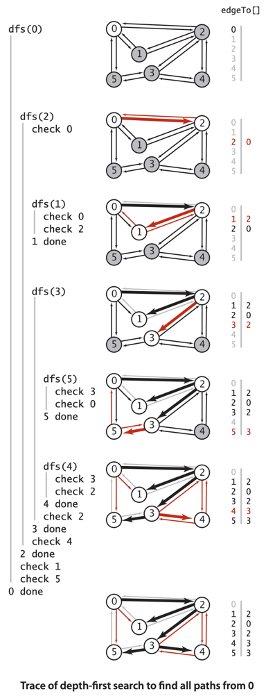

1. dfs(0)
    1. 0 방문
    2. dfs(2)
        1. 2 방문
        2. `edgeTo[2] = 0`
        3. dfs(1)
            1. 1 방문
            2. `edgeTo[1] = 2`
            3. dfs(0), dfs(2) 방문 (실패, 이미 방문)
        4. dfs(3)
            1. 3 방문
            2. `edgeTo[3] = 2`
            3. dfs(4)
                1. 4 방문
                2. `edgeTo[4] = 3`
                3. dfs(2) 방문 (실패, 이미 방문)
            4. dfs(5)
                1. 5 방문
                2. `edgeTo[5] = 3`
                3. dfs(0), dfs(3) 방문 (실패, 이미 방문)
        5. 4 방문 (실패, 이미 방문)
    3. 1 방문 (실패, 이미 방문)
    4. 5 방문 (실패, 이미 방문)

#### 명제 : DFS는 주어진 원점에 연결된 임의의 정점으로의 경로를 클라이언트에게 알려주는데, 그 경로의 길이에 비례하는 실행 시간 소요

- 귀납적으로 방문한 정점의 수는 `DepthFirstPaths`의 `edgeTo[]` 배열을 따른다.
- `pathTo()`는 이 트리의 길이에 비례하는 경로를 만듦

## 너비 우선 탐색 (Breadth-First Search, BFS)


- **단일 원점 최단 경로** 문제 : 어떤 그래프와 원점 s가 주어졌을 때, s와 다른 정점 v 사이의 최단 경로를 찾는 문제
    - 최단 경로 : 간선의 개수가 최소인 경로
- 전통적인 해결방법은 너비 우선 탐색 (Breath-First Search, BFS)
    - 여러 그래프 처리 알고리즘의 근간
    - DFS는 최단 경로를 찾는 것이 목적이 아님
    - BFS의 목적은 최단 경로를 찾는 것
- S에서 시작해 간선 하나만 이동해서 갈 수 있는 범위 안에 v가 있는지 검사
    - 2개를 이동해서 갈 수 있는 범위 안에 v가 있는지 검사
    - 3개를 이동해서 갈 수 있는 범위 안에 v가 있는지 검사
    - ...
- 마치 미로에서 여러 사람이 각기 서로 다른 갈림길로 흩어져서 길을 찾는 것과 비슷
    - 실뭉치를 가지고 풀어놓았다가 되감으면서 새로운 길 탐색
    - 갈림길이 나오면 사람을 쪼개어 다시 각자 새로운길 탐색
    - 갈림길을 가다가 모이게 되면 사람을 합쳐서 함께 탐색
- BFS는 원점에서 떨어진 정점 순서대로 탐색
    - FIFO 큐를 사용
    - 탐험할 새로운 간선으로 가장 오래전에 발견된 간선을 사용

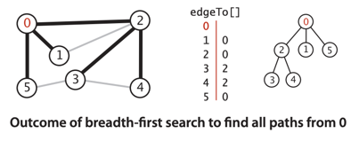

### 구현

- 큐를 사용 (재귀호출 아님)
- 큐를 이용해 해당 정점의 검사되지 않은 정점들을 관리
- 원점을 큐에 넣은 후 큐가 빌 때까지 다음 작업 수행
    - 큐에서 다음 정점 v를 꺼낸다
    - v의 인접한 정점들 중 방문 표시되지 않은 정점을 모두 큐에 삽입

```java
public class BreadthFirstPaths {
    private boolean[] marked; // 이 정점으로의 최단 경로가 찾아졌는지 여부
    private int[] edgeTo; // 해당 정점으로 가는 경로의 마지막 정점
    private final int s; // 원점

    public BreadthFirstPaths(Graph G, int s) {
        marked = new boolean[G.V()];
        edgeTo = new int[G.V()];
        this.s = s;
        bfs(G, s);
    }

    private void bfs(Graph G, int s) {
        Queue<Integer> queue = new Queue<Integer>();
        marked[s] = true; // 원점 방문
        queue.enqueue(s); // 원점을 큐에 추가
        while (!queue.isEmpty()) {
            int v = queue.dequeue(); // 큐에서 정점 꺼내기
            for (int w : G.adj(v))
                if (!marked[w]) { // 방문하지 않은 정점이면
                    edgeTo[w] = v; // 최단 경로의 마지막 간선 저장
                    marked[w] = true; // 방문 표시
                    queue.enqueue(w); // 큐에 추가
                }
        }
    }

    public boolean hasPathTo(int v) {
        return marked[v];
    }

    public Iterable<Integer> pathTo(int v) {
        validateVertex(v);
        if (!hasPathTo(v)) return null;
        Stack<Integer> path = new Stack<Integer>();
        int x;
        for (x = v; distTo[x] != 0; x = edgeTo[x])
            path.push(x);
        path.push(x);
        return path;
    }
}
```

- `Grpah` 클라이언트는 `BreadthFirstPaths`를 사용해 최단 경로를 찾음
    - `BreathFirstPaths` 객체를 생성하고 `hasPathTo()`와 `pathTo()`를 사용해 최단 경로를 찾음
    - e.g. `new BreadthFirstPaths(G, s).hasPathTo(v)` : s에서 v로의 경로가 존재하는가?
    - e.g. `new BreadthFirstPaths(G, s).pathTo(v)` : s에서 v로의 최단 경로

````
// 그래프 의사 코드
val graph = Graph(
    0 = [2, 1, 5],
    1 = [0, 2],
    2 = [0, 1, 3, 4],
    3 = [5, 4, 2],
    4 = [3, 2],
    5 = [3, 0]
)
````

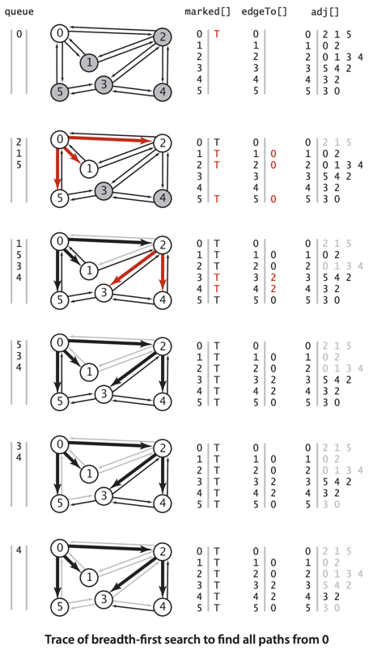

1. 큐에 0
    1. dequeue(0)
    2. 0의 인접 정점 0, 2, 1, 5 방문, marked[0, 2, 1, 5] = true
    3. 방문한 정점으로의 마지막 정점을 0으로 설정, edgeTo[2, 1, 5] = 0
    4. enqueue(2, 1, 5)
2. 큐에 2, 1, 5
    1. dequeue(2)
        1. 2의 인접 정점 중 미방문한 3, 4 방문, marked[3, 4] = true
        2. 방문한 정점으로의 마지막 정점을 2로 설정, edgeTo[3, 4] = 2
3. 큐에 1, 5, 3, 4
    1. dequeue(1)
        1. 1의 인접 정점 모두 방문
4. 큐에 5, 3, 4
    1. dequeue(5)
        1. 5의 인접 정점 모두 방문
5. 큐에 3, 4
    1. dequeue(3)
        1. 3의 인접 정점 모두 방문
6. 큐에 4
    1. dequeue(4)
        1. 4의 인접 정점 모두 방문

- 2단계에서 `edgeTo[]` 완성
- 2단계 이후에는 표시된 정점에 연결되어있는 간선을 검사하는 것 외에는 아무것도 하지 않음 (`adj()`-> `marked[]`)
- DFS를 BFS로 대체 가능

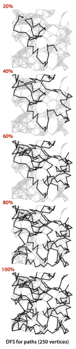
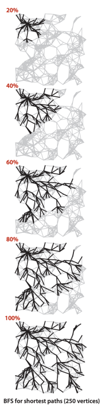

## 연결 컴포넌트

- 너비 우선 탐색을 직접 응요하여 연결 컴포넌트 찾기

<table>
    <tr>
        <td colspan="2">
            public class CC
        </td>
    </tr>
    <tr>
        <td>
            CC(Graph G)
        </td>
        <td>
            전처리 생성자
        </td>
    </tr>
    <tr>
        <td>
            boolean connected(int v, int w)
        </td>
        <td>
            정점 v와 w가 같은 연결 컴포넌트에 있는가? (= 연결되어 있는가?)
        </td>
    </tr>
    <tr>
        <td>
            int count()
        </td>
        <td>
            연결 컴포넌트의 개수
        </td>
    </tr>
    <tr>
        <td>
            int id(int v)
        </td>
        <td>
            정점 v가 속한 연결 컴포넌트의 식별자
        </td>
    </tr>
</table>

- 클라이언트는 `Queue` 타입 배열를 만들어 정점별 컴포넌트 식별자를 배열의 인덱스로하여 삽입
    - e.g. `Queue[0]` : 컴포넌트 식별자 0에 속한 정점들

````
// 클라이언트
public static void main(String[] args) {
    Graph G = new Graph(new In(args[0]); // 그래프
    CC cc = new CC(G); // 연결 컴포넌트
    int M = cc.count(); // 연결 컴포넌트 개수
    StdOut.println(M + " components");

    Queue<Integer>[] components = (Queue<Integer>[]) new Queue[M];
    for (int i = 0; i < M; i++)
        components[i] = new Queue<Integer>();
    for (int v = 0; v < G.V(); v++)
        components[cc.id(v)].enqueue(v);

    for (int i = 0; i < M; i++) {
        for (int v : components[i])
            StdOut.print(v + " ");
        StdOut.println();
    }
}
````

### 구현

```java
// 그래프의 연결 컴포넌트 찾기를 위한 깊이 우선 탐색
public class CC {
    private boolean[] marked; // 정점 별 방문 여부
    private int[] id; // 정점 별 연결 컴포넌트 식별자
    private int count; // 연결 컴포넌트 개수

    public CC(Graph G) {
        marked = new boolean[G.V()];
        id = new int[G.V()];
        for (int s = 0; s < G.V(); s++)
            if (!marked[s]) {
                dfs(G, s);
                count++;
            }
    }

    private void dfs(Graph G, int v) {
        marked[v] = true;
        id[v] = count;
        for (int w : G.adj(v))
            if (!marked[w])
                dfs(G, w);
    }

    public boolean connected(int v, int w) {
        return id[v] == id[w];
    }

    public int id(int v) {
        return id[v];
    }

    public int count() {
        return count;
    }
}

````

- `id[v] = i`
    - 정점 인덱스 기반 배열 `id[]`가 있고, 정점 `v`가 컴포넌트 `i` 에 속한다
- 첫번째 재귀 호출의 시작은 정점 0부터 시작
    - 0에 연결된 모든 정점들이 방문표시됨
- 생성자의 for 루프로 미방문 정점을 재귀적으로 찾아 방문 표시
    - `id[]` 에 각 정점이 속한 컴포넌트 식별 번호를 저장
    - 같은 컴포넌트에 속한 정점들이라면 모두 같은 값 (컴포넌트 식별 번호)을 가짐

````
// 그래프 의사 코드
val graph = Graph(
    0 = [6, 2, 1, 5],
    1 = [0],
    2 = [0],
    3 = [5, 4],
    4 = [5, 6, 3],
    5 = [3, 4, 0],
    6 = [0, 4]
    7 = [8],
    8 = [7],
    9 = [11, 10, 12],
    10 = [9],
    11 = [9, 12],
    12 = [11, 9]   
)

````

1. dfs(0)
    1. 0 방문, `marked[0] = true`, `id[0] = 0`
    2. dfs(6)
        1. 6 방문, `marked[6] = true`, `id[6] = 0`
        2. dfs(4)
            1. 4 방문, `marked[4] = true`, `id[4] = 0`
            2. dfs(5)
                1. 5 방문, `marked[5] = true`, `id[5] = 0`
                2. dfs(3)
                    1. 3 방문, `marked[3] = true`, `id[3] = 0`
                    2. `5, 4` 방문 (실패, 이미 방문)
                3. `0, 4, 3` 방문 (실패, 이미 방문)
            3. `5, 6, 3` 방문 (실패, 이미 방문)
    3. dfs(2)
        1. 2 방문, `marked[2] = true`, `id[2] = 0`
        2. `0` 방문 (실패, 이미 방문)
    4. dfs(1)
        1. 1 방문, `marked[1] = true`, `id[1] = 0`
        2. `0` 방문 (실패, 이미 방문)
2. dfs(7)
    1. 7 방문, `marked[7] = true`, `id[7] = 1`
    2. dfs(8)
        1. 8 방문, `marked[8] = true`, `id[8] = 1`
        2. `7` 방문 (실패, 이미 방문)
    3. `8` 방문 (실패, 이미 방문)
3. dfs(9)
    1. 9 방문, `marked[9] = true`, `id[9] = 2`
    2. dfs(11)
        1. 11 방문, `marked[11] = true`, `id[11] = 2`
        2. dfs(12)
            1. 12 방문, `marked[12] = true`, `id[12] = 2`
            2. `11, 9` 방문 (실패, 이미 방문)
        3. `12` 방문 (실패, 이미 방문)
    3. dfs(10)
        1. 10 방문, `marked[10] = true`, `id[10] = 2`
        2. `9` 방문 (실패, 이미 방문)
    4. `11, 12, 10` 방문 (실패, 이미 방문)

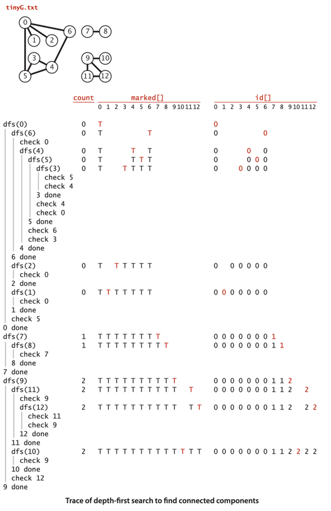

#### 명제 : DFS는 `V+E`에 비례하는 별도의 전처리 시간, 공간을 소요하여 그래프의 연결 상태 조회에 상수 시간 성능 제공

- 코드로부터 유도 가능
- 인접 리스트의 각 항목은 정화히 한번씩만 검사되고, 그러한 항목이 2E개 있음 (각 간선당 두개)
- `marked[]`, `id[]` 배열의 초기화에는 V에 비례하는 시간 소요
- 조회를 위한 인스턴스 메서드들은 단순 비교를 하거나, 인스턴스 변수하나 또는 두개 리턴 (상수 시간)

### 유니온-파인드

- 이론적으로 DFS가 유니온-파인드보다 빠름
- DFS는 상수 시간을 보증하지만, 유니온-파인드는 그렇지 않음
- 실제로는 유니온-파인드가 더 빠름
    - 유니온-파인드는 전체 그래프에 대한 표현 (전처리 시간) 과정 필요가 없음
- 유니온-파인드는 온라인 알고리즘이다
    - 온라인 알고리즘 : 입력 정보과 완료되지 않아도, 동작할 수 있는 알고리즘
    - 즉 새로운 간선을 추가하는 와중에도 두 전점의 연결여부 조회 가능
- 따라서 그래프의 크기가 크다면 전처리 과정이 생략 가능한 유니온-파인드를 사용하는 것이 좋음

#### DFS를 응용

- **순환 탐지** : 주어진 그래프가 비순환 그래프 (순환 경로가 없는 그래프) 인가?
- **2색 칠하기** :  주어진 그래프의 정점들을 2개의 색으로 서로 분리되게 칠할 수 있는가?
    - = 어느 간선도 양쪽의 색이 다른 두 정점을 연결하지 않는가?
    - = 이분 그래프인가? (binary graph)

```java
// 순환 탐지
public class Cycle {
    private boolean[] marked;
    private boolean hasCycle;

    public Cycle(Graph G) {
        marked = new boolean[G.V()];
        for (int s = 0; s < G.V(); s++)
            if (!marked[s])
                dfs(G, s, s);
    }

    private void dfs(Graph G, int v, int u) {
        marked[v] = true;
        for (int w : G.adj(v))
            if (!marked[w])
                dfs(G, w, v);
            else if (w != u) hasCycle = true;
    }

    public boolean hasCycle() {
        return hasCycle;
    }
}
```

```java
// 2색 칠하기
public class TwoColor {
    private boolean[] marked;
    private boolean[] color;
    private boolean isTwoColorable = true;

    public TwoColor(Graph G) {
        marked = new boolean[G.V()];
        color = new boolean[G.V()];
        for (int s = 0; s < G.V(); s++)
            if (!marked[s])
                dfs(G, s);
    }

    private void dfs(Graph G, int v) {
        marked[v] = true;
        for (int w : G.adj(v))
            if (!marked[w]) {
                color[w] = !color[v];
                dfs(G, w);
            } else if (color[w] == color[v])
                isTwoColorable = false;
    }

    public boolean isBipartite() {
        return isTwoColorable;
    }
}
```

## 심볼 그래프

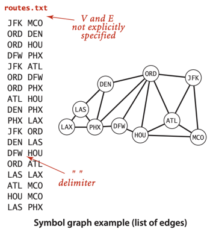

- 전형적인 그래프 응용사례는 정점을 정의할 때 숫자가 아닌 문자열을 사용
- 입력 포맷 정의
    - 정점의 이름은 문자열
    - 구분자를 지정하여 정점 분리 (이름에 공백 포함 가능)
    - 각 줄은 간선의 집합을 의미, 첫번쨰 정점 이름 다음에 그 정점에 연결된 다른 정점 이름들이 나열
    - 정점의 개수 V, 간선의 개수 E는 암묵적으로 정해짐
- 위 그림은 북미 공항 연결 모델 그래프
    - 정점의 이름 : 공항 식별 코드
    - 간선 : 운행되는 항공 라인
    - 파일 내용은 단순한 간선의 나열

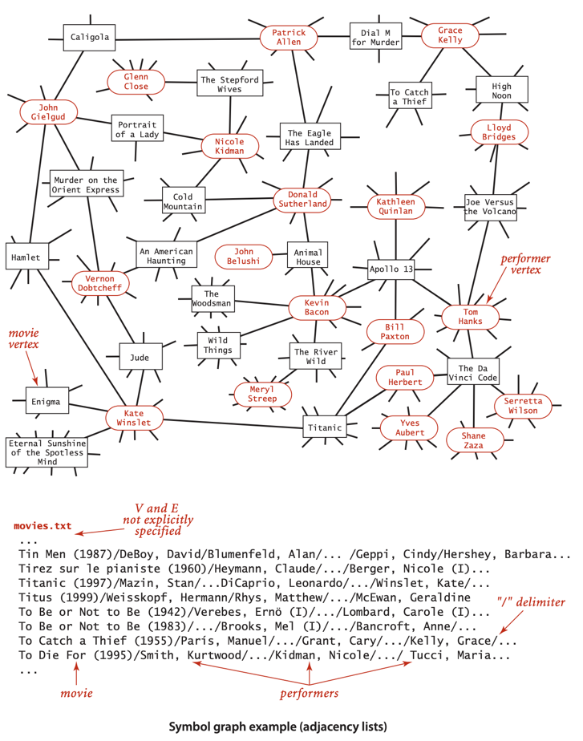

- 위 그림은 IMDB 웹사이트에서 얻은 영화 정보 그래프
    - 정점의 이름 : 배우, 영화 이름
    - 간선 : 배우가 영화에 출연 여부
    - 이분 그래프 : 배우 간, 영화 간에 간선은 없음
        - 오직 배우와 영화 사이에만 간선이 존재

### API

<table>
    <tr>
        <td colspan="2">
            public class SymbolGraph
        </td>
    </tr>
    <tr>
        <td>
            SymbolGraph(String fileName, String delim)
        </td>
        <td>
            입력 스트림에서 그래프 생성, delim은 구분자
        </td>
    </tr>
    <tr>
        <td>
            boolean contains(String key)
        </td>
        <td>
           정점 이름 중에 key가 있는가?
        </td>
    </tr>
    <tr>
        <td>
            int index(String key)
        </td>
        <td>
            key에 연관된 인덱스
        </td>
    </tr>
    <tr>
        <td>
            String name(int v)
        </td>
        <td>
            인덱스 v와 연관된 정점 이름(key)
        </td>
    </tr>
    <tr>
        <td>
            Graph G()
        </td>
        <td>
            그래프 객체
        </td>
    </tr>
</table>

- 그래프 데이터 파일로부터 그래프 객체 생성
- `name()`, `index()` 메서드를 통해 정점 이름과 인덱스 변환

### 테스트 클라이언트

````
public static void main(String[] args) {
    String filename = args[0];
    String delim = args[1];
    SymbolGraph sg = new SymbolGraph(filename, delim);
    Graph G = sg.G();

    while (StdIn.hasNextLine()) {
        String source = StdIn.readLine();
        for (int v: G.adj(sg.index(source)))
            StdOut.println("   " + sg.name(v));
    }
}
````

- 그래프 데이터 파일명과, 구분자를 입력받은 후 표준 입력으로부터 사용자의 조회 명령을 기다림
- 사용자가 정점의 이름을 입력하면 해당 정점과 연결된 모든 정점을 출력

### 구현

- `st <String, Integer>` : 정점 이름과 인덱스를 연결 짓는 심볼 테이블
- `keys[]` : 인덱스와 이름을 연결 짓는 배열
- `G` : 그래프 객체
    - 정점에 대한 인덱스로 생성됨
- 두단계 처리과정 필요
    - Graph 객체를 만들기 위해 정점의 개수 V 를 알아야 함

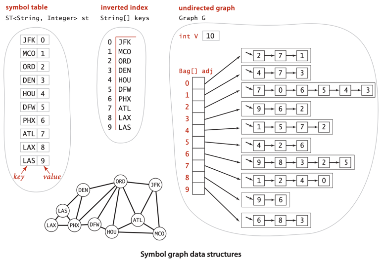

```java
public class SymbolGraph {
    private ST<String, Integer> st; // 정점 이름 (문자열) -> 인덱스
    private String[] keys; // 인덱스 -> 정점 이름 (문자열)
    private Graph G; // 그래프

    public SymbolGraph(String stream, String delim) {
        st = new ST<String, Integer>();
        In in = new In(stream);
        // 첫번째 처리 : 정점 이름을 인덱스와 연관
        while (in.hasNextLine()) {
            String[] a = in.readLine().split(delim); // 문자열 읽기
            for (int i = 0; i < a.length; i++) // 서로 다른 문자열을 인덱스와 연관
                if (!st.contains(a[i]))
                    st.put(a[i], st.size());
        }
        keys = new String[st.size()]; // 반전된 인덱스 배열
        for (String name : st.keys())
            keys[st.get(name)] = name;
        G = new Graph(st.size());
        // 두번째 처리 : 간선을 추가
        in = new In(stream);
        while (in.hasNextLine()) {
            String[] a = in.readLine().split(delim);
            int v = st.get(a[0]);
            for (int i = 1; i < a.length; i++)
                G.addEdge(v, st.get(a[i]));
        }
    }

    public boolean contains(String s) {
        return st.contains(s);
    }

    public int index(String s) {
        return st.get(s);
    }

    public String name(int v) {
        return keys[v];
    }

    public Graph G() {
        return G;
    }
}

```

- `st` : 이름과 인덱스를 연결 짓는 심볼 테이블
- `keys` : 인덱스와 이름을 연결 짓는 배열
- `G` : 그래프 객체
- 그래프 생성시 두번에 걸쳐 읽어서 처리
    - 첫번째 처리 : 정점 이름을 인덱스와 연관
        - 각 줄을 읽어 공백으로 분리
        - 각 문자열을 인덱스와 연관
    - 두번째 처리 : 간선을 추가

### 분리 차수 (Degree of Separation)

- SNS에서 개인간의 관계의 분리차수는 몇인가?
    - = 몇사람을 건너야 서로 아는사이인가?
- 그래프에서 최단경로를 알아내 경로 상의 정점의 개수를 세는 것

```java
public class DegreesOfSeparation {
    public static void main(String[] args) {
        String filename = args[0];
        String delim = args[1];
        String source = args[2];
        SymbolGraph sg = new SymbolGraph(filename, delim);
        Graph G = sg.G();
        if (!sg.contains(source)) {
            StdOut.println(source + " not in database.");
            return;
        }
        int s = sg.index(source);
        BreadthFirstPaths bfs = new BreadthFirstPaths(G, s);
        while (!StdIn.isEmpty()) {
            String sink = StdIn.readLine();
            if (sg.contains(sink)) {
                int t = sg.index(sink);
                if (bfs.hasPathTo(t))
                    for (int v : bfs.pathTo(t))
                        StdOut.println("   " + sg.name(v));
                else
                    StdOut.println("Not connected");
            } else
                StdOut.println("Not in database");
        }
    }
}
```


## 요약