# 2. 방향 그래프 (Directed Graph)

- 용어
- 방향 그래프 (Digraph) 데이터 타입
- 방향 그래프에서의 도달성
- 순환과 비순환 방향 그래프 (Directed Acyclic Graph, DAG)
- 방향 그래프와 강한 연결성
- 요약

---

- 방향 그래프에서의 간선은 한쪽 방향으로의 경로만 가짐
- 간선
    - 두 정점에 순서가 존재
    - 단방향으로 인접하는 정점 쌍으로 정의
- e.g. 웹 페이지 링크, 작업 순서 제약 조건, 전화 발신 등

| 응용 분야 | 정점  | 간선     |
|-------|-----|--------|
| 먹이사슬  | 종   | 먹이-포식자 |
| 웹 컨텐츠 | 페이지 | 하이퍼링크  |
| 프로그램  | 모듈  | 외부 참조  |
| 전화    | 전화기 | 호출     |
| 학술    | 논문  | 인용     |
| 재무    | 주식  | 거래     |
| 인터넷   | 기계  | 연결     |

## 용어

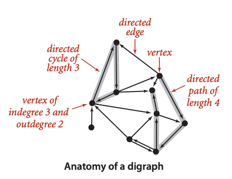

> ### 정의
>
> - 방향 그래프 (digraph) 는 정점과 방향을 가진 간선의 집합
> - 각각의 방향 간선은 순서를 가진 두 정점 쌍을 연결

- 방향 간선 : 해당 정점 쌍의 첫번째 정점에서 두번째 정점으로 향하는 방향을 가리킨다
- 출력 차수 (outdegree) : 어떤 정점에서 나가는 방향으로 연결된 간선의 수
- 입력 차수 (indegree) : 어떤 정점에서 들어오는 방향으로 연결된 간선의 수
- 꼬리 (tail) : 간선의 첫번쨰 정점
- 머리 (head) : 간선의 두번째 정점
- 간선의 표현 : 꼬리에서 머리를 향하는 화살표로 표현
- `v -> w` : 정점 `v`에서 정점 `w`로 가는 간선
- 두 정점의 관계는 4가지 케이스
    - `v -> w` : `v`는 `w`에 인접
    - `w -> v` : `w`는 `v`에 인접
    - `v->w`와 `w->v` 즉 양방향 연결
    - `v`와 `w`는 서로 인접하지 않음

> ### 정의
>
> - 방향 경로 :  연결되는 간선의 방향을 따라 순서대로 이어지는 정점들의 나열
> - 방향 순환 : 경로의 시작 정점, 끝 정점이 같은 정점 쌍을 가진 간선이 한개 이상 존재하는 방향 경로
> - 단순 경로 : 중복되는 정점이 없는 경로
> - 단순 순환 : 중복되는 간선이나 정점이 없는 순환 경로  (시작, 끝 정점 제외)
> - 경로나 순환의 길이 = 간선의 수

- "w가 v에 도달 가능하다" : `w`에서 `v`로 가는 방향 경로가 존재
    - `v`에서 `w` 로의 도달 여부는 알 수 없음
- 각 정점은 자기 자신에 도달 가능한 것을 관례로 삼음
- 방향 그래프의 도달성
    - 어떤 두 정점 간의 방향 경로 존재여부는 쉽게 알 수 없음
- 무방향 그래프의 연결성
    - 작은 무방향 그래프에서 두 정점의 연결여부는 쉽게 알 수 있음

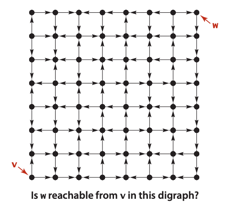

- 위 방향 그래프에서 v가 w에 도달 가능한지 여부는 쉽게 알 수 없다

## 방향 그래프 (Digraph) 데이터 타입

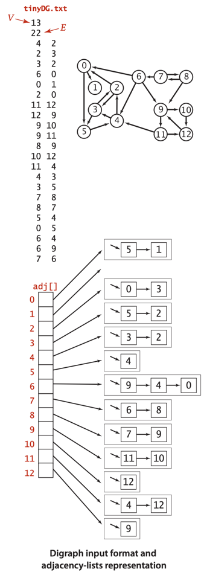

<table>
    <tr>
        <th colspan="2">public class Digraph</th>
    </tr>
    <tr>
        <td> Digraph(int V)</td>
        <td> 간선이 없는 V개의 정점을 가진 방향 그래프를 생성</td>
    </tr>
    <tr>
        <td> Digraph(In in)</td>
        <td> 입력 스트림에서 방향 그래프를 읽어들임</td>
    </tr>
    <tr>
        <td>int V()</td>
        <td>정점의 수</td>
    </tr>
    <tr>
        <td>int E()</td>
        <td>간선의 수</td>
    </tr>
    <tr>
        <td>void addEdge(int v, int w)</td>
        <td>v -> w 간선 추가</td>
    </tr>
    <tr>
        <td>Iterable&lt;Integer&gt; adj(int v)</td>
        </td>
        <td>v를 출발 정점으로 하는 간선들로 연결된 정점 목록</td>
    </tr>
    <tr>
        <td>Digraph reverse()</td>
        <td>그래프의 반전</td>
    </tr>
    <tr>
        <td>String toString()</td>
        <td>그래프의 문자열 표현</td>
    </tr>
</table>

```java
public class Digraph {
    private final int V;
    private int E;
    private Bag<Integer>[] adj;

    public Digraph(int V) {
        this.V = V;
        this.E = 0;
        adj = (Bag<Integer>[]) new Bag[V];
        for (int v = 0; v < V; v++) {
            adj[v] = new Bag<Integer>();
        }
    }

    public Digraph(In in) {
        this(in.readInt());
        int E = in.readInt();
        for (int i = 0; i < E; i++) {
            int v = in.readInt();
            int w = in.readInt();
            addEdge(v, w);
        }
    }

    public int V() {
        return V;
    }

    public int E() {
        return E;
    }

    public void addEdge(int v, int w) {
        adj[v].add(w);
        E++;
    }

    public Iterable<Integer> adj(int v) {
        return adj[v];
    }

    public Digraph reverse() {
        Digraph R = new Digraph(V);
        for (int v = 0; v < V; v++) {
            for (int w : adj(v)) {
                R.addEdge(w, v);
            }
        }
        return R;
    }

    public String toString() {
        String s = V + " vertices, " + E + " edges\n";
        for (int v = 0; v < V; v++) {
            s += v + ": ";
            for (int w : this.adj(v)) {
                s += w + " ";
            }
            s += "\n";
        }
        return s;
    }

}
```

### 표현

- 인접 리스트 표현을 사용
- v -> w : v에 대응하는 연결리스트에서 w를 항목으로 가짐
    - 중복 간선이 없음
    - 무방향 그래프는 v->w, w->v 가 인접리스트 각 항목에 중복으로 있음

### 입력 포맷

- 생성자를 통해 입력 스트림으로부터 방향 그래프를 읽어들임
- 간선이 방향 간선으로 해석됨 (간주)
- 간선 리스트에서 정점 쌍 v, w는 v -> w 간선으로 해석

### 방향 그래프의 반전

- `reverse()`
- 해당 방향 그래프의 모든 간선들의 방향을 반대로 바꾼 그래프를 반환
- 들어오는 방향으로 연결된 인접 정점 목록을 얻어야할 때 유용

### 심볼 이름

- 정점에 숫자가 아닌 심볼을 사용하게 가능
- `SymbolGraph`에서 `Graph` 대신 `Digraph` 사용

## 방향 그래프에서의 도달성

- **단일 원점 도달성** : 주어진 방향그래프와 원점 s에 대해 s로부터 어떤 정점 v로의 방향 경로가 존재하는가
- **복수 원점 도달성** : 주어진 방향 그래프와 원점 집합에 대해 어떤 정점 v로의 방향 경로가 존재하는가

<table>
    <tr>
        <th>public class DirectedDFS</th>
    </tr>
    <tr>
        <td>DirectedDFS(Digraph G, int s)</td>
        <td>G에서 s로부터 도달 가능한 모든 정점을 찾음</td>
    </tr>
    <tr>
        <td>DirectedDFS(Digraph G, Iterable&lt;Integer&gt; sources)</td>
        <td>G에서 원점집합 sources로부터 도달 가능한 정점 찾기</td>
    </tr>
    <tr>
        <td>boolean marked(int v)</td>
        <td>v로 도달 가능한가?</td>
    </tr>
</table>

- 표준적인 재귀방식의 깊이 우선 탐색 사용
- `dfs()`를 원점마다 호출하여 만나는 모든 정점들에 방문 표시

````
// graph 데이터 의사 코드
val graph = Graph(
    0 = [5, 1],
    1 = [],
    2 = [3, 0],
    3 = [2, 5],
    4 = [3. 2],
    5 = [4],
    6 = [0, 4, 9],
    7 = [6, 8],
    8 = [7, 9],
    9 = [10, 11],
    10 = [12],
    11 = [4, 12],
    12 = [9]
)
````

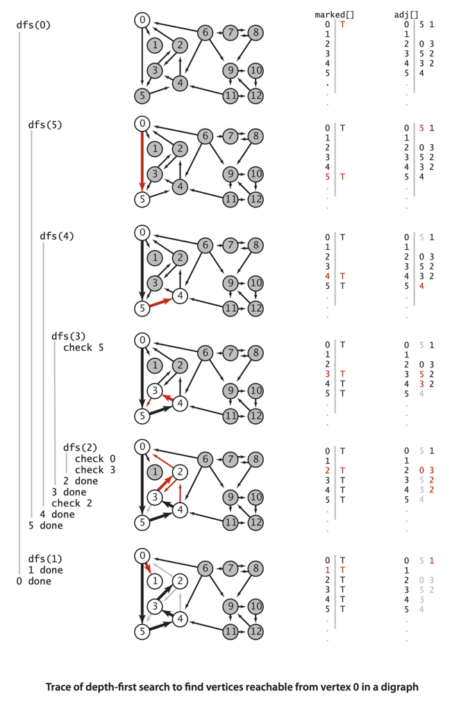

1. `dfs(0)`
    1. `dfs(5)`
        1. `dfs(4)`
            1. `dfs(3)`
                1. `dfs(5)` 미실행, 이미 방문
                2. `dfs(2)`
                    1. `dfs(3)` 미실행, 이미 방문
                    2. `dfs(0)` 미실행, 이미 방문
            2. `dfs(2)` 미실행, 이미 방문
    2. `dfs(1)`

### "표시하고 훑기 (Mark-and-sweep)" 가비지 컬렉션 (Garbage Collection)

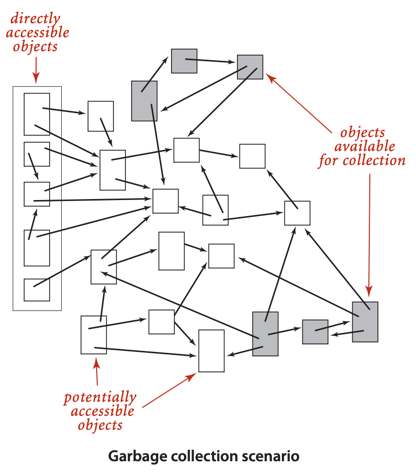

- 전형적인 메모리 관리 시스템에서 사용하는 복수 원점 도달성 문제의 응용
- 자바 시스템을 구현하는 중요 요소
- 정점 : 객체 / 간선 : 객체에 대한 참조
- 자바 프로그램의 런타임 메모리 사용상태
- 어느것으로부터도 참조되지 않은 객체 (사용되지 않는 가비지) 를 찾아내서 가용메모리로 반환
- 비트 하나를 표시용으로 남겨두고, 주기적으로 `DirectedDFS`를 사용하여 도달 가능한 객체를 표시하고, 표시되지 않은 객체를 가비지로 처리

### 방향 그래프에서 경로 찾기

- `DepthFirstDirectedPaths`, `BreadthFirstDirectedPaths` 에서 `Graph` 대신 `Digraph` 사용
- **단일 원점 방향 경로** : 주어진 그래프와 원점 s에 대해 s로부터 어떤 정점 v로의 방향 경로를 찾아라
- **단일 원점 최단 방향 경로** : 주어진 그래프와 원점 s에 대해 s로부터 어떤 정점 v로의 최단 방향 경로를 찾아라
    - 최단 방향 경로 : 간선의 수가 최소인 방향 경로

## 순환과 비순환 방향 그래프 (Directed Acyclic Graph, DAG)

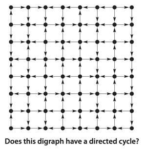

- 방향 그래프에서 방향 순환을 찾는 것은 어려운 문제
- 방향 순환 : 시작 정점과 끝 정점이 같은 방향 경로

### 스케줄링 문제

| 응용 분야   | 정점     | 간선      |
|---------|--------|---------|
| 작업 스케줄링 | 작업     | 선행 조건   |
| 수강 스케줄링 | 과목     | 선수 과목   |
| 상속      | 자바 클래스 | extends |
| 스프레드시트  | 셀      | 수식      |
| 심볼적 링크  | 파일 이름  | 심볼릭 링크  |

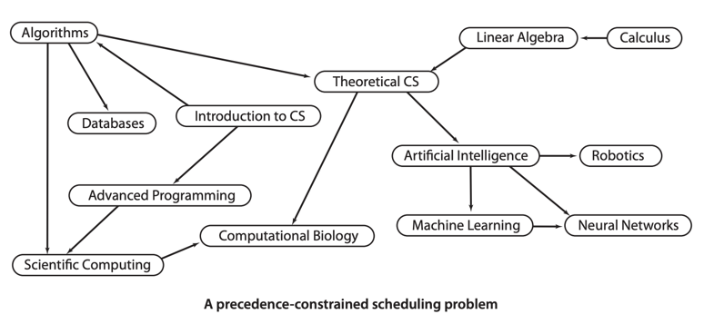

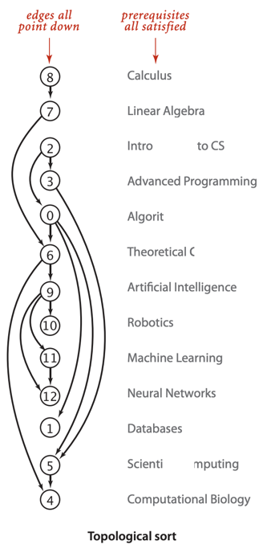

- 작업 스케줄링 : 작업 집합, 제약 집합이 있을 때 제약 조건을 만족시키도록 작업을 배치 (스케줄링)
- 제약조건 : 작업의 소요시간, 작업 간에 선행 관계, 자원 필요량 등
- e.g. 대학교에서 학생들의 수강 일정표 작성 프로그램
- **선행 제약 스케줄링 (Precedence-constrained scheduling)** : 작업 간의 선행 관계가 있는 스케줄링 문제
    - 정점 : 작업 / 간선 : 선행 관계
- **위상 정렬 (Topological sort)** : 방향 그래프의 정점들을 선형 순서로 나열하는 것
    - 가능/불가능 여부 판단
- 3단계 절차
    1. 작업 목록과 선행 제약 조건 정의
    2. 방향 그래프에 존재하는 순환을 모두 찾아 제거하여 DAG로 변환
    3. 위상 정렬을 사용해 스케줄린
- 스케줄에 변경 발생 시
    - 순환 검사 : `DirectedCycle` 사용
    - 새롭게 스케줄링 : `Topological` 사용

### 방향 그래프에서의 순환 경로

- 일반적으로 스케줄링 문제에서 방향순환이 존재한다는 것은 불가능한 스케줄링 문제를 의미
- **방향 순환 탐지 (Directed cycle detection)** : 주어진 방향 그래프에 방향 순환 존재 여부 판단
    - 존재한다면 순환 순서대로 나열해라 (간선을 따라가며 자기 자신으로 되돌아오는)
    - 순환이 많다면 그중 하나만 찾아도 됨

#### **비순환 방향 그래프 (Directed Acyclic Graph, DAG)** : 방향 그래프에서 방향 순환이 없는 그래프

- 주어진 방향그래프가 DAG인가? 로 치환 가능
- 깊이 우선 탐색 DFS를 사용하여 방향 순환을 찾음
- 재귀 호출 동안 스택에 의해 현재 탐색 중인 방향 경로가 유지된다는 사실을 이용
    - e.g. v->w 방향 간선을 만났을 때 스택에 이미 w가 존재한다면 순환 탐지

<table>
    <tr>
        <th>public class DirectedCycle</th>
    </tr>
    <tr>
        <td>DirectedCycle(Digraph G)</td>
        <td>G에 방향 순환 존재 여부 판단</td>
    </tr>
    <tr>
        <td>boolean hasCycle()</td>
        <td>방향 순환 존재 여부</td>
    </tr>
    <tr>
        <td>Iterable&lt;Integer&gt; cycle()</td>
        <td>방향 순환 경로</td>
    </tr>
</table>

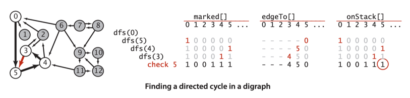

```java
public class DirectedCycle {
    private boolean[] marked; // 방문 여부
    private int[] edgeTo; // 경로
    private Stack<Integer> cycle; // 순환 경로
    private boolean[] onStack; // 재귀 호출 스택의 정점들

    public DirectedCycle(Digraph G) {
        onStack = new boolean[G.V()];
        edgeTo = new int[G.V()];
        marked = new boolean[G.V()];
        for (int v = 0; v < G.V(); v++) {
            if (!marked[v]) {
                dfs(G, v);
            }
        }
    }

    private void dfs(Digraph G, int v) {
        onStack[v] = true; // 스택에 추가
        marked[v] = true; // 방문 표시
        for (int w : G.adj(v)) {
            if (this.hasCycle()) {
                return;
            } else if (!marked[w]) {
                edgeTo[w] = v;
                dfs(G, w);
            } else if (onStack[w]) {
                cycle = new Stack<Integer>();
                for (int x = v; x != w; x = edgeTo[x]) {
                    cycle.push(x);
                }
                cycle.push(w);
                cycle.push(v);
            }
        }
        onStack[v] = false; // 스택에서 제거
    }

    public boolean hasCycle() {
        return cycle != null;
    }

    public Iterable<Integer> cycle() {
        return cycle;
    }
}
```

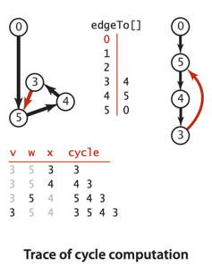

- `dfs(G, V)` : 원점에서 v로 가는 방향 경로를 찾음
- `onStack[]` : 재귀 호출 스택에 있는 정점들을 표시
    - true로 세팅하고 탈출 시점에 false로 변경

### 깊이 우선 순서와 위상 정렬

- 선행 제약 스케줄링은 DAG에서 정점들의 위상 순서를 구함

```html

<table>
    <tr>
        <th>
            public class Topological
        </th>
    </tr>
    <tr>
        <td>
            Topological(Digraph G)
        </td>
        <td>
            G가 DAG인지 판단하고, DAG라면 위상 정렬을 수행
        </td>
    </tr>
    <tr>
        <td>
            boolean isDAG()
        </td>
        <td>
            G가 DAG인지 여부
        </td>
    </tr>
    <tr>
        <td>
            Iterable&lt;Integer&gt; order()
        </td>
        <td>
            DAG의 위상 정렬
        </td>
    </tr>
</table>
```

#### 방향 그래프가 DAG라는 것은 위상 정렬 순서를 가지기 위한 필요충분조건이다

- 방향그래프가 방향 순환 경로를 가진다면 위상 정렬 순서를 가질 수 없음
- 반대로 DAG에서 위상 정렬 순서를 찾을 수 있음

```java
public class DepthFirstOrder {
    private boolean[] marked;
    private Queue<Integer> pre; // 선행 순서
    private Queue<Integer> post; // 후행 순서
    private Stack<Integer> reversePost; // 역행 순서

    public DepthFirstOrder(Digraph G) {
        pre = new Queue<Integer>();
        post = new Queue<Integer>();
        reversePost = new Stack<Integer>();
        marked = new boolean[G.V()];
        for (int v = 0; v < G.V(); v++) {
            if (!marked[v]) {
                dfs(G, v);
            }
        }
    }

    private void dfs(Digraph G, int v) {
        pre.enqueue(v);
        marked[v] = true;
        for (int w : G.adj(v)) {
            if (!marked[w]) {
                dfs(G, w);
            }
        }
        post.enqueue(v);
        reversePost.push(v);
    }

    public Iterable<Integer> pre() {
        return pre;
    }

    public Iterable<Integer> post() {
        return post;
    }

    public Iterable<Integer> reversePost() {
        return reversePost;
    }
}

```

- 깊이 우선 탐색이 각 정점을 한번씩만 방문한다는 아이디어에 기반
- 재귀 함수 `dfs()`가 호출될때마다 정점을 어떤 데이터 구조에 저장해둠
- 나중에 해당 데이터 구조로 그래프의 모든 정점들을 다시 순회 가능
- 순회 순서는 선행 순서, 후행 순서, 역행 순서로 나뉨
    - 선행 (Preorder) : 재귀 호출 전에 큐에 정점을 저장
    - 후행 (Postorder) : 재귀 호출 후에 큐에 정점을 저장
    - 역행 (Reverse postorder) : 재귀 호출 후에 스택에 정점을 저장

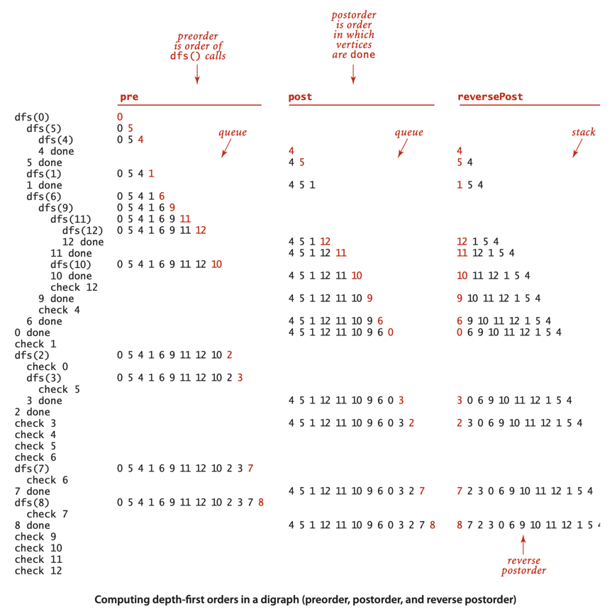

#### 명제 : DAG에서 반전된 후행 순서는 위상 정렬 순서이다

- `dfs(v)` 가 호출된디면 모든 간선 v->w에 대해 다음 세가지중 하나가 만족
    - `dfs(w)` 가 이미 실행되었고, `w`에 방문 표시가 되어있음
    - `dfs(w)` 가 이미 실행 되었지만, `dfs(v)` 호출 시점에 아직 리턴한 상태가 아님
        - 이미 재귀 호출체인으로 `w->v` 방향 경로가 존재
        - 즉 DAG가 불가능
    - `dfs(w)` 가 실행되지 않았음 -> `dfs(v)` 가 리턴되기 전에 `dfs(w)` 가 호출됨

```java
public class Topological {
    private Iterable<Integer> order; // 위상 정렬

    public Topological(Digraph G) {
        DirectedCycle cyclefinder = new DirectedCycle(G);
        if (!cyclefinder.hasCycle()) {
            DepthFirstOrder dfs = new DepthFirstOrder(G);
            order = dfs.reversePost();
        }
    }

    public Iterable<Integer> order() {
        return order;
    }

    public boolean isDAG() {
        return order != null;
    }
}
```

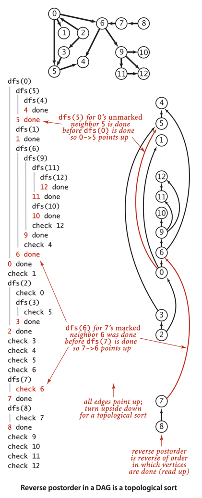

#### 명제 : DFS를 사용한 DAG 위상 정렬은 V+ E 시간 복잡도

- V = 정점의 수, E = 간선의 수
- 방향 순환이 없다는 것을 확인하기 위해 DFS가 한번 수행되고, 반전된 후행 순서 (위상 정렬)을 찾기 위해 DFS가 한번 더 수행
- 두 경우 모두 모든 간선과 정점을 검사하므로 V + E 시간 복잡도

## 방향 그래프와 강한 연결성

## 요약